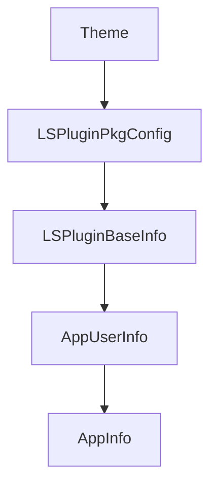

# Chapter 7: Bi-Directional Links

Welcome to **Chapter 7: Bi-Directional Links**. In this part of **Logseq: Deep Dive Tutorial**, you will build an intuitive mental model first, then move into concrete implementation details and practical production tradeoffs.


Bi-directional links transform notes from isolated documents into a navigable knowledge graph.

## Link Lifecycle

1. user creates inline reference (for example `[[Page]]`)
2. parser detects outbound relation
3. index updates backlinks for target entity/page
4. search and graph views expose both directions

## Why Bi-Directional Links Matter

- discovery of related ideas without manual cross-indexing
- emergent structure from everyday note-taking
- contextual navigation through backlinks and linked references

## Consistency Concerns

- renamed pages must retain link integrity
- deleted targets need clear broken-link handling
- partial file edits should not produce stale backlink indexes

## Scaling Considerations

- backlink queries should be incremental and cached
- graph updates should avoid full reindex on small edits
- visualization should limit edge rendering for large graphs

## Summary

You now understand how Logseq derives connected knowledge structure directly from inline references.

Next: [Chapter 8: Graph Visualization](08-graph-visualization.md)

## What Problem Does This Solve?

Most teams struggle here because the hard part is not writing more code, but deciding clear boundaries for core abstractions in this chapter so behavior stays predictable as complexity grows.

In practical terms, this chapter helps you avoid three common failures:

- coupling core logic too tightly to one implementation path
- missing the handoff boundaries between setup, execution, and validation
- shipping changes without clear rollback or observability strategy

After working through this chapter, you should be able to reason about `Chapter 7: Bi-Directional Links` as an operating subsystem inside **Logseq: Deep Dive Tutorial**, with explicit contracts for inputs, state transitions, and outputs.

Use the implementation notes around execution and reliability details as your checklist when adapting these patterns to your own repository.

## How it Works Under the Hood

Under the hood, `Chapter 7: Bi-Directional Links` usually follows a repeatable control path:

1. **Context bootstrap**: initialize runtime config and prerequisites for `core component`.
2. **Input normalization**: shape incoming data so `execution layer` receives stable contracts.
3. **Core execution**: run the main logic branch and propagate intermediate state through `state model`.
4. **Policy and safety checks**: enforce limits, auth scopes, and failure boundaries.
5. **Output composition**: return canonical result payloads for downstream consumers.
6. **Operational telemetry**: emit logs/metrics needed for debugging and performance tuning.

When debugging, walk this sequence in order and confirm each stage has explicit success/failure conditions.

## Source Walkthrough

Use the following upstream sources to verify implementation details while reading this chapter:

- [Logseq](https://github.com/logseq/logseq)
  Why it matters: authoritative reference on `Logseq` (github.com).

Suggested trace strategy:
- search upstream code for `Bi-Directional` and `Links` to map concrete implementation paths
- compare docs claims against actual runtime/config code before reusing patterns in production

## Chapter Connections

- [Tutorial Index](README.md)
- [Previous Chapter: Chapter 6: Block Editor](06-block-editor.md)
- [Next Chapter: Chapter 8: Graph Visualization](08-graph-visualization.md)
- [Main Catalog](../../README.md#-tutorial-catalog)
- [A-Z Tutorial Directory](../../discoverability/tutorial-directory.md)

## Depth Expansion Playbook

## Source Code Walkthrough

### `libs/src/LSPlugin.ts`

The `Theme` interface in [`libs/src/LSPlugin.ts`](https://github.com/logseq/logseq/blob/HEAD/libs/src/LSPlugin.ts) handles a key part of this chapter's functionality:

```ts
export type PluginLocalIdentity = string

export type ThemeMode = 'light' | 'dark'

export interface LegacyTheme {
  name: string
  url: string
  description?: string
  mode?: ThemeMode
  pid: PluginLocalIdentity
}

export interface Theme extends LegacyTheme {
  mode: ThemeMode
}

export type StyleString = string
export type StyleOptions = {
  key?: string
  style: StyleString
}

export type UIContainerAttrs = {
  draggable: boolean
  resizable: boolean
}

export type UIBaseOptions = {
  key?: string
  replace?: boolean
  template: string | null
  style?: CSS.Properties
```

This interface is important because it defines how Logseq: Deep Dive Tutorial implements the patterns covered in this chapter.

### `libs/src/LSPlugin.ts`

The `LSPluginPkgConfig` interface in [`libs/src/LSPlugin.ts`](https://github.com/logseq/logseq/blob/HEAD/libs/src/LSPlugin.ts) handles a key part of this chapter's functionality:

```ts
export type UIOptions = UIBaseOptions | UIPathOptions | UISlotOptions

export interface LSPluginPkgConfig {
  id: PluginLocalIdentity
  main: string
  entry: string // alias of main
  title: string
  mode: 'shadow' | 'iframe'
  themes: Theme[]
  icon: string
  /**
   * Alternative entrypoint for development.
   */
  devEntry: string
  /**
   * For legacy themes, do not use.
   */
  theme: unknown
}

export interface LSPluginBaseInfo {
  /**
   * Must be unique.
   */
  id: string
  mode: 'shadow' | 'iframe'
  settings: {
    disabled: boolean
  } & Record<string, unknown>
  effect: boolean
  /**
   * For internal use only. Indicates if plugin is installed in dot root.
```

This interface is important because it defines how Logseq: Deep Dive Tutorial implements the patterns covered in this chapter.

### `libs/src/LSPlugin.ts`

The `LSPluginBaseInfo` interface in [`libs/src/LSPlugin.ts`](https://github.com/logseq/logseq/blob/HEAD/libs/src/LSPlugin.ts) handles a key part of this chapter's functionality:

```ts
}

export interface LSPluginBaseInfo {
  /**
   * Must be unique.
   */
  id: string
  mode: 'shadow' | 'iframe'
  settings: {
    disabled: boolean
  } & Record<string, unknown>
  effect: boolean
  /**
   * For internal use only. Indicates if plugin is installed in dot root.
   */
  iir: boolean
  /**
   * For internal use only.
   */
  lsr: string
}

export type IHookEvent = {
  [key: string]: any
}

export type IUserOffHook = () => void
export type IUserHook<E = any, R = IUserOffHook> = (
  callback: (e: IHookEvent & E) => void
) => IUserOffHook
export type IUserSlotHook<E = any> = (
  callback: (e: IHookEvent & UISlotIdentity & E) => void
```

This interface is important because it defines how Logseq: Deep Dive Tutorial implements the patterns covered in this chapter.

### `libs/src/LSPlugin.ts`

The `AppUserInfo` interface in [`libs/src/LSPlugin.ts`](https://github.com/logseq/logseq/blob/HEAD/libs/src/LSPlugin.ts) handles a key part of this chapter's functionality:

```ts
export type IGitResult = { stdout: string; stderr: string; exitCode: number }

export interface AppUserInfo {
  [key: string]: any
}

export interface AppInfo {
  version: string
  supportDb: boolean

  [key: string]: unknown
}

/**
 * User's app configurations
 */
export interface AppUserConfigs {
  preferredThemeMode: ThemeMode
  preferredFormat: 'markdown' | 'org'
  preferredDateFormat: string
  preferredStartOfWeek: string
  preferredLanguage: string
  preferredWorkflow: string

  currentGraph: string
  showBracket: boolean
  enabledFlashcards: boolean
  enabledJournals: boolean

  [key: string]: unknown
}

```

This interface is important because it defines how Logseq: Deep Dive Tutorial implements the patterns covered in this chapter.


## How These Components Connect


