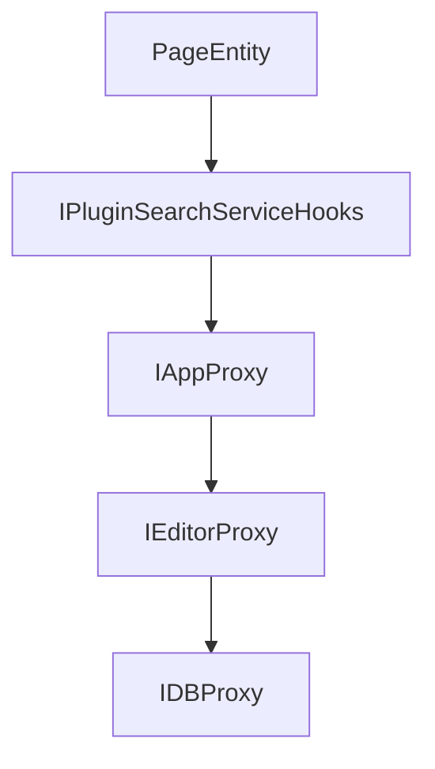

# Chapter 8: Graph Visualization

Welcome to **Chapter 8: Graph Visualization**. In this part of **Logseq: Deep Dive Tutorial**, you will build an intuitive mental model first, then move into concrete implementation details and practical production tradeoffs.


Graph visualization turns underlying note relationships into interactive exploration tools.

## Visualization Pipeline

1. select graph scope (global or local neighborhood)
2. resolve nodes/edges from index
3. compute layout positions
4. render and apply interaction filters

## Performance Controls

- cap node/edge count per frame
- progressively expand neighborhoods on demand
- cache layout coordinates for repeated views
- debounce expensive recomputations during rapid interactions

## Interaction Design

Useful controls include:

- depth filters
- tag/type filters
- pin/focus nodes
- path highlighting between selected pages

## Large-Graph Usability

| Problem | Mitigation |
|:--------|:-----------|
| visual clutter | local graph mode + filtering |
| slow rendering | progressive loading and caching |
| hard-to-find context | focus mode and search-linked navigation |

## Final Summary

You now have complete Logseq coverage from architecture and local-first data to graph visualization behavior at scale.

Related:
- [Logseq Index](README.md)

## What Problem Does This Solve?

Most teams struggle here because the hard part is not writing more code, but deciding clear boundaries for core abstractions in this chapter so behavior stays predictable as complexity grows.

In practical terms, this chapter helps you avoid three common failures:

- coupling core logic too tightly to one implementation path
- missing the handoff boundaries between setup, execution, and validation
- shipping changes without clear rollback or observability strategy

After working through this chapter, you should be able to reason about `Chapter 8: Graph Visualization` as an operating subsystem inside **Logseq: Deep Dive Tutorial**, with explicit contracts for inputs, state transitions, and outputs.

Use the implementation notes around execution and reliability details as your checklist when adapting these patterns to your own repository.

## How it Works Under the Hood

Under the hood, `Chapter 8: Graph Visualization` usually follows a repeatable control path:

1. **Context bootstrap**: initialize runtime config and prerequisites for `core component`.
2. **Input normalization**: shape incoming data so `execution layer` receives stable contracts.
3. **Core execution**: run the main logic branch and propagate intermediate state through `state model`.
4. **Policy and safety checks**: enforce limits, auth scopes, and failure boundaries.
5. **Output composition**: return canonical result payloads for downstream consumers.
6. **Operational telemetry**: emit logs/metrics needed for debugging and performance tuning.

When debugging, walk this sequence in order and confirm each stage has explicit success/failure conditions.

## Source Walkthrough

Use the following upstream sources to verify implementation details while reading this chapter:

- [Logseq](https://github.com/logseq/logseq)
  Why it matters: authoritative reference on `Logseq` (github.com).

Suggested trace strategy:
- search upstream code for `Graph` and `Visualization` to map concrete implementation paths
- compare docs claims against actual runtime/config code before reusing patterns in production

## Chapter Connections

- [Tutorial Index](README.md)
- [Previous Chapter: Chapter 7: Bi-Directional Links](07-bidirectional-links.md)
- [Main Catalog](../../README.md#-tutorial-catalog)
- [A-Z Tutorial Directory](../../discoverability/tutorial-directory.md)

## Depth Expansion Playbook

## Source Code Walkthrough

### `libs/src/LSPlugin.ts`

The `PageEntity` interface in [`libs/src/LSPlugin.ts`](https://github.com/logseq/logseq/blob/HEAD/libs/src/LSPlugin.ts) handles a key part of this chapter's functionality:

```ts
 * Page is just a block with some specific properties.
 */
export interface PageEntity {
  id: EntityID
  uuid: BlockUUID
  name: string
  format: 'markdown' | 'org'
  type: 'page' | 'journal' | 'whiteboard' | 'class' | 'property' | 'hidden'
  updatedAt: number
  createdAt: number
  'journal?': boolean

  title?: string
  file?: IEntityID
  originalName?: string
  namespace?: IEntityID
  children?: Array<PageEntity>
  properties?: Record<string, any>
  journalDay?: number
  ident?: string

  [key: string]: unknown
}

export type BlockIdentity = BlockUUID | Pick<BlockEntity, 'uuid'>
export type BlockPageName = string
export type PageIdentity = BlockPageName | BlockIdentity
export type SlashCommandActionCmd =
  | 'editor/input'
  | 'editor/hook'
  | 'editor/clear-current-slash'
  | 'editor/restore-saved-cursor'
```

This interface is important because it defines how Logseq: Deep Dive Tutorial implements the patterns covered in this chapter.

### `libs/src/LSPlugin.ts`

The `IPluginSearchServiceHooks` interface in [`libs/src/LSPlugin.ts`](https://github.com/logseq/logseq/blob/HEAD/libs/src/LSPlugin.ts) handles a key part of this chapter's functionality:

```ts
}

export interface IPluginSearchServiceHooks {
  name: string
  options?: Record<string, any>

  onQuery: (
    graph: string,
    key: string,
    opts: Partial<{ limit: number }>
  ) => Promise<{
    graph: string
    key: string
    blocks?: Array<Partial<SearchBlockItem>>
    pages?: Array<SearchPageItem>
    files?: Array<SearchFileItem>
  }>

  onIndiceInit: (graph: string) => Promise<SearchIndiceInitStatus>
  onIndiceReset: (graph: string) => Promise<void>
  onBlocksChanged: (
    graph: string,
    changes: {
      added: Array<SearchBlockItem>
      removed: Array<EntityID>
    }
  ) => Promise<void>
  onGraphRemoved: (graph: string, opts?: {}) => Promise<any>
}

/**
 * App level APIs
```

This interface is important because it defines how Logseq: Deep Dive Tutorial implements the patterns covered in this chapter.

### `libs/src/LSPlugin.ts`

The `IAppProxy` interface in [`libs/src/LSPlugin.ts`](https://github.com/logseq/logseq/blob/HEAD/libs/src/LSPlugin.ts) handles a key part of this chapter's functionality:

```ts
 * App level APIs
 */
export interface IAppProxy {
  /**
   * @added 0.0.4
   * @param key
   */
  getInfo: (key?: keyof AppInfo) => Promise<AppInfo | any>

  getUserInfo: () => Promise<AppUserInfo | null>
  getUserConfigs: () => Promise<AppUserConfigs>

  // services
  registerSearchService<T extends IPluginSearchServiceHooks>(s: T): void

  // commands
  registerCommand: (
    type: string,
    opts: {
      key: string
      label: string
      desc?: string
      palette?: boolean
      keybinding?: SimpleCommandKeybinding
    },
    action: SimpleCommandCallback
  ) => void

  registerCommandPalette: (
    opts: {
      key: string
      label: string
```

This interface is important because it defines how Logseq: Deep Dive Tutorial implements the patterns covered in this chapter.

### `libs/src/LSPlugin.ts`

The `IEditorProxy` interface in [`libs/src/LSPlugin.ts`](https://github.com/logseq/logseq/blob/HEAD/libs/src/LSPlugin.ts) handles a key part of this chapter's functionality:

```ts
 * Editor related APIs
 */
export interface IEditorProxy extends Record<string, any> {
  /**
   * register a custom command which will be added to the Logseq slash command list
   * @param tag - displayed name of command
   * @param action - can be a single callback function to run when the command is called, or an array of fixed commands with arguments
   *
   *
   * @example https://github.com/logseq/logseq-plugin-samples/tree/master/logseq-slash-commands
   *
   * @example
   * ```ts
   * logseq.Editor.registerSlashCommand("Say Hi", () => {
   *   console.log('Hi!')
   * })
   * ```
   *
   * @example
   * ```ts
   * logseq.Editor.registerSlashCommand("💥 Big Bang", [
   *   ["editor/hook", "customCallback"],
   *   ["editor/clear-current-slash"],
   * ]);
   * ```
   */
  registerSlashCommand: (
    tag: string,
    action: BlockCommandCallback | Array<SlashCommandAction>
  ) => unknown

  /**
```

This interface is important because it defines how Logseq: Deep Dive Tutorial implements the patterns covered in this chapter.


## How These Components Connect


