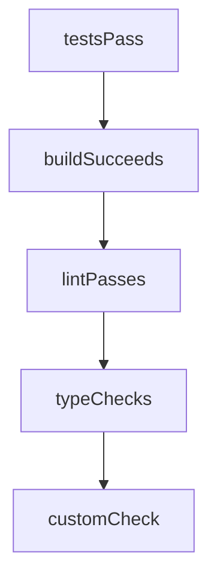

# Chapter 1: Getting Started

Welcome to **Chapter 1: Getting Started**. In this part of **Mastra Tutorial: TypeScript Framework for AI Agents and Workflows**, you will build an intuitive mental model first, then move into concrete implementation details and practical production tradeoffs.


This chapter gets your first Mastra project running and ready for real agent experimentation.

## Learning Goals

- bootstrap a new Mastra app with CLI
- run a local agent flow
- understand basic project structure
- verify provider credentials and environment setup

## Quick Start

```bash
npm create mastra@latest
cd <your-project>
npm install
npm run dev
```

Follow the generated prompts and load provider credentials before first agent execution.

## First Validation Checklist

- project boots without runtime errors
- sample agent responds correctly
- local tool invocation path works
- logs are visible for debugging

## Source References

- [Mastra Getting Started](https://mastra.ai/docs/getting-started/installation)
- [Mastra Repository](https://github.com/mastra-ai/mastra)

## Summary

You now have a working Mastra project baseline for deeper architecture work.

Next: [Chapter 2: System Architecture](02-system-architecture.md)

## Depth Expansion Playbook

## Source Code Walkthrough

### `explorations/network-validation-bridge.ts`

The `testsPass` function in [`explorations/network-validation-bridge.ts`](https://github.com/mastra-ai/mastra/blob/HEAD/explorations/network-validation-bridge.ts) handles a key part of this chapter's functionality:

```ts
 * Check if tests pass
 */
export function testsPass(command = 'npm test', options?: { timeout?: number; cwd?: string }): ValidationCheck {
  return {
    id: 'tests-pass',
    name: 'Tests Pass',
    async check() {
      const start = Date.now();
      try {
        const { stdout, stderr } = await execAsync(command, {
          timeout: options?.timeout ?? 300000,
          cwd: options?.cwd,
        });
        return {
          success: true,
          message: 'All tests passed',
          details: { stdout: stdout.slice(-1000), stderr: stderr.slice(-500) },
          duration: Date.now() - start,
        };
      } catch (error: any) {
        return {
          success: false,
          message: `Tests failed: ${error.message}`,
          details: {
            stdout: error.stdout?.slice(-1000),
            stderr: error.stderr?.slice(-1000),
            exitCode: error.code,
          },
          duration: Date.now() - start,
        };
      }
    },
```

This function is important because it defines how Mastra Tutorial: TypeScript Framework for AI Agents and Workflows implements the patterns covered in this chapter.

### `explorations/network-validation-bridge.ts`

The `buildSucceeds` function in [`explorations/network-validation-bridge.ts`](https://github.com/mastra-ai/mastra/blob/HEAD/explorations/network-validation-bridge.ts) handles a key part of this chapter's functionality:

```ts
 * Check if build succeeds
 */
export function buildSucceeds(
  command = 'npm run build',
  options?: { timeout?: number; cwd?: string },
): ValidationCheck {
  return {
    id: 'build-succeeds',
    name: 'Build Succeeds',
    async check() {
      const start = Date.now();
      try {
        const { stdout, stderr } = await execAsync(command, {
          timeout: options?.timeout ?? 600000,
          cwd: options?.cwd,
        });
        return {
          success: true,
          message: 'Build completed successfully',
          details: { stdout: stdout.slice(-500), stderr: stderr.slice(-500) },
          duration: Date.now() - start,
        };
      } catch (error: any) {
        return {
          success: false,
          message: `Build failed: ${error.message}`,
          details: {
            stdout: error.stdout?.slice(-1000),
            stderr: error.stderr?.slice(-1000),
          },
          duration: Date.now() - start,
        };
```

This function is important because it defines how Mastra Tutorial: TypeScript Framework for AI Agents and Workflows implements the patterns covered in this chapter.

### `explorations/network-validation-bridge.ts`

The `lintPasses` function in [`explorations/network-validation-bridge.ts`](https://github.com/mastra-ai/mastra/blob/HEAD/explorations/network-validation-bridge.ts) handles a key part of this chapter's functionality:

```ts
 * Check if lint passes
 */
export function lintPasses(command = 'npm run lint', options?: { timeout?: number; cwd?: string }): ValidationCheck {
  return {
    id: 'lint-passes',
    name: 'Lint Passes',
    async check() {
      const start = Date.now();
      try {
        const { stdout, stderr } = await execAsync(command, {
          timeout: options?.timeout ?? 120000,
          cwd: options?.cwd,
        });
        return {
          success: true,
          message: 'No lint errors',
          details: { stdout: stdout.slice(-500) },
          duration: Date.now() - start,
        };
      } catch (error: any) {
        return {
          success: false,
          message: `Lint errors found: ${error.message}`,
          details: {
            stdout: error.stdout?.slice(-1000),
            stderr: error.stderr?.slice(-1000),
          },
          duration: Date.now() - start,
        };
      }
    },
  };
```

This function is important because it defines how Mastra Tutorial: TypeScript Framework for AI Agents and Workflows implements the patterns covered in this chapter.

### `explorations/network-validation-bridge.ts`

The `typeChecks` function in [`explorations/network-validation-bridge.ts`](https://github.com/mastra-ai/mastra/blob/HEAD/explorations/network-validation-bridge.ts) handles a key part of this chapter's functionality:

```ts
 * Check if TypeScript compiles without errors
 */
export function typeChecks(
  command = 'npx tsc --noEmit',
  options?: { timeout?: number; cwd?: string },
): ValidationCheck {
  return {
    id: 'type-checks',
    name: 'TypeScript Compiles',
    async check() {
      const start = Date.now();
      try {
        const { stdout, stderr } = await execAsync(command, {
          timeout: options?.timeout ?? 300000,
          cwd: options?.cwd,
        });
        return {
          success: true,
          message: 'No type errors',
          details: { stdout: stdout.slice(-500) },
          duration: Date.now() - start,
        };
      } catch (error: any) {
        return {
          success: false,
          message: `Type errors found`,
          details: {
            stdout: error.stdout?.slice(-2000),
            stderr: error.stderr?.slice(-1000),
          },
          duration: Date.now() - start,
        };
```

This function is important because it defines how Mastra Tutorial: TypeScript Framework for AI Agents and Workflows implements the patterns covered in this chapter.


## How These Components Connect


