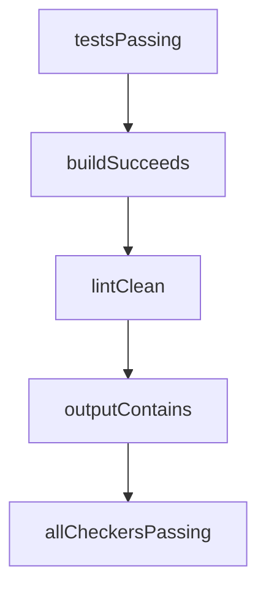

# Chapter 1: Getting Started

Welcome to **Chapter 1: Getting Started**. In this part of **Mastra Tutorial: TypeScript Framework for AI Agents and Workflows**, you will build an intuitive mental model first, then move into concrete implementation details and practical production tradeoffs.


This chapter gets your first Mastra project running and ready for real agent experimentation.

## Learning Goals

- bootstrap a new Mastra app with CLI
- run a local agent flow
- understand basic project structure
- verify provider credentials and environment setup

## Quick Start

```bash
npm create mastra@latest
cd <your-project>
npm install
npm run dev
```

Follow the generated prompts and load provider credentials before first agent execution.

## First Validation Checklist

- project boots without runtime errors
- sample agent responds correctly
- local tool invocation path works
- logs are visible for debugging

## Source References

- [Mastra Getting Started](https://mastra.ai/docs/getting-started/installation)
- [Mastra Repository](https://github.com/mastra-ai/mastra)

## Summary

You now have a working Mastra project baseline for deeper architecture work.

Next: [Chapter 2: System Architecture](02-system-architecture.md)

## Source Code Walkthrough

### `explorations/ralph-wiggum-loop-prototype.ts`

The `testsPassing` function in [`explorations/ralph-wiggum-loop-prototype.ts`](https://github.com/mastra-ai/mastra/blob/HEAD/explorations/ralph-wiggum-loop-prototype.ts) handles a key part of this chapter's functionality:

```ts
 * Check if tests pass
 */
export function testsPassing(testCommand = 'npm test'): CompletionChecker {
  return {
    async check() {
      try {
        const { stdout, stderr } = await execAsync(testCommand, { timeout: 300000 });
        return {
          success: true,
          message: 'All tests passed',
          data: { stdout, stderr },
        };
      } catch (error: any) {
        return {
          success: false,
          message: error.message,
          data: { stdout: error.stdout, stderr: error.stderr },
        };
      }
    },
  };
}

/**
 * Check if build succeeds
 */
export function buildSucceeds(buildCommand = 'npm run build'): CompletionChecker {
  return {
    async check() {
      try {
        const { stdout, stderr } = await execAsync(buildCommand, { timeout: 600000 });
        return {
```

This function is important because it defines how Mastra Tutorial: TypeScript Framework for AI Agents and Workflows implements the patterns covered in this chapter.

### `explorations/ralph-wiggum-loop-prototype.ts`

The `buildSucceeds` function in [`explorations/ralph-wiggum-loop-prototype.ts`](https://github.com/mastra-ai/mastra/blob/HEAD/explorations/ralph-wiggum-loop-prototype.ts) handles a key part of this chapter's functionality:

```ts
 * Check if build succeeds
 */
export function buildSucceeds(buildCommand = 'npm run build'): CompletionChecker {
  return {
    async check() {
      try {
        const { stdout, stderr } = await execAsync(buildCommand, { timeout: 600000 });
        return {
          success: true,
          message: 'Build succeeded',
          data: { stdout, stderr },
        };
      } catch (error: any) {
        return {
          success: false,
          message: error.message,
          data: { stdout: error.stdout, stderr: error.stderr },
        };
      }
    },
  };
}

/**
 * Check if lint passes
 */
export function lintClean(lintCommand = 'npm run lint'): CompletionChecker {
  return {
    async check() {
      try {
        const { stdout, stderr } = await execAsync(lintCommand, { timeout: 120000 });
        return {
```

This function is important because it defines how Mastra Tutorial: TypeScript Framework for AI Agents and Workflows implements the patterns covered in this chapter.

### `explorations/ralph-wiggum-loop-prototype.ts`

The `lintClean` function in [`explorations/ralph-wiggum-loop-prototype.ts`](https://github.com/mastra-ai/mastra/blob/HEAD/explorations/ralph-wiggum-loop-prototype.ts) handles a key part of this chapter's functionality:

```ts
 * Check if lint passes
 */
export function lintClean(lintCommand = 'npm run lint'): CompletionChecker {
  return {
    async check() {
      try {
        const { stdout, stderr } = await execAsync(lintCommand, { timeout: 120000 });
        return {
          success: true,
          message: 'No lint errors',
          data: { stdout, stderr },
        };
      } catch (error: any) {
        return {
          success: false,
          message: error.message,
          data: { stdout: error.stdout, stderr: error.stderr },
        };
      }
    },
  };
}

/**
 * Check if output contains a specific string/pattern
 */
export function outputContains(pattern: string | RegExp): CompletionChecker {
  let lastOutput = '';
  return {
    async check() {
      const matches = typeof pattern === 'string' ? lastOutput.includes(pattern) : pattern.test(lastOutput);

```

This function is important because it defines how Mastra Tutorial: TypeScript Framework for AI Agents and Workflows implements the patterns covered in this chapter.

### `explorations/ralph-wiggum-loop-prototype.ts`

The `outputContains` function in [`explorations/ralph-wiggum-loop-prototype.ts`](https://github.com/mastra-ai/mastra/blob/HEAD/explorations/ralph-wiggum-loop-prototype.ts) handles a key part of this chapter's functionality:

```ts
 * Check if output contains a specific string/pattern
 */
export function outputContains(pattern: string | RegExp): CompletionChecker {
  let lastOutput = '';
  return {
    async check() {
      const matches = typeof pattern === 'string' ? lastOutput.includes(pattern) : pattern.test(lastOutput);

      return {
        success: matches,
        message: matches ? `Output contains pattern` : `Output does not contain pattern`,
      };
    },
    // Helper to set output for checking
    setOutput: (output: string) => {
      lastOutput = output;
    },
  } as CompletionChecker & { setOutput: (output: string) => void };
}

/**
 * Combine multiple checkers (all must pass)
 */
export function allCheckersPassing(...checkers: CompletionChecker[]): CompletionChecker {
  return {
    async check() {
      const results = await Promise.all(checkers.map(c => c.check()));
      const allPassed = results.every(r => r.success);

      return {
        success: allPassed,
        message: results.map(r => r.message).join('; '),
```

This function is important because it defines how Mastra Tutorial: TypeScript Framework for AI Agents and Workflows implements the patterns covered in this chapter.


## How These Components Connect


