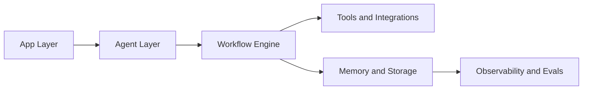

# Chapter 2: System Architecture

Mastra combines agents, workflows, memory, and runtime services into a coherent TypeScript-first platform.

## Architecture Overview

## Core Building Blocks

| Block | Responsibility |
|:------|:---------------|
| agents | autonomous reasoning and tool decisions |
| workflows | explicit orchestration and control flow |
| memory | conversation, working, and semantic context |
| integrations | model providers, MCP, and external APIs |

## Design Guidance

- use agents for open-ended tasks
- use workflows for deterministic multi-step control
- isolate memory concerns from business logic

## Source References

- [Mastra Docs Overview](https://mastra.ai/docs)
- [Mastra Repository](https://github.com/mastra-ai/mastra)

## Summary

You now understand where to place logic in Mastra without mixing concerns.

Next: [Chapter 3: Agents and Tools](03-agents-and-tools.md)
