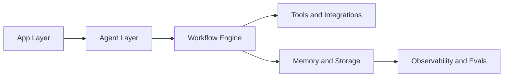
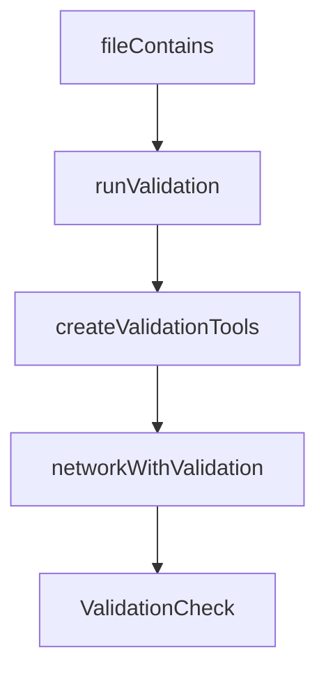

# Chapter 2: System Architecture

Welcome to **Chapter 2: System Architecture**. In this part of **Mastra Tutorial: TypeScript Framework for AI Agents and Workflows**, you will build an intuitive mental model first, then move into concrete implementation details and practical production tradeoffs.


Mastra combines agents, workflows, memory, and runtime services into a coherent TypeScript-first platform.

## Architecture Overview


```mermaid
flowchart LR
    A[App Layer] --> B[Agent Layer]
    B --> C[Workflow Engine]
    C --> D[Tools and Integrations]
    C --> E[Memory and Storage]
    E --> F[Observability and Evals]
```

## Core Building Blocks

| Block | Responsibility |
|:------|:---------------|
| agents | autonomous reasoning and tool decisions |
| workflows | explicit orchestration and control flow |
| memory | conversation, working, and semantic context |
| integrations | model providers, MCP, and external APIs |

## Design Guidance

- use agents for open-ended tasks
- use workflows for deterministic multi-step control
- isolate memory concerns from business logic

## Source References

- [Mastra Docs Overview](https://mastra.ai/docs)
- [Mastra Repository](https://github.com/mastra-ai/mastra)

## Summary

You now understand where to place logic in Mastra without mixing concerns.

Next: [Chapter 3: Agents and Tools](03-agents-and-tools.md)

## Depth Expansion Playbook

## Source Code Walkthrough

### `explorations/network-validation-bridge.ts`

The `fileContains` function in [`explorations/network-validation-bridge.ts`](https://github.com/mastra-ai/mastra/blob/HEAD/explorations/network-validation-bridge.ts) handles a key part of this chapter's functionality:

```ts
 * File contains pattern check
 */
export function fileContains(path: string, pattern: string | RegExp): ValidationCheck {
  return {
    id: `file-contains-${path}`,
    name: `File Contains Pattern: ${path}`,
    async check() {
      const start = Date.now();
      try {
        const fs = await import('fs/promises');
        const content = await fs.readFile(path, 'utf-8');
        const matches = typeof pattern === 'string' ? content.includes(pattern) : pattern.test(content);

        return {
          success: matches,
          message: matches
            ? `File ${path} contains expected pattern`
            : `File ${path} does not contain expected pattern`,
          duration: Date.now() - start,
        };
      } catch (error: any) {
        return {
          success: false,
          message: `Could not read file ${path}: ${error.message}`,
          duration: Date.now() - start,
        };
      }
    },
  };
}

// ============================================================================
```

This function is important because it defines how Mastra Tutorial: TypeScript Framework for AI Agents and Workflows implements the patterns covered in this chapter.

### `explorations/network-validation-bridge.ts`

The `runValidation` function in [`explorations/network-validation-bridge.ts`](https://github.com/mastra-ai/mastra/blob/HEAD/explorations/network-validation-bridge.ts) handles a key part of this chapter's functionality:

```ts
// ============================================================================

async function runValidation(
  config: NetworkValidationConfig,
): Promise<{ passed: boolean; results: ValidationResult[] }> {
  const results: ValidationResult[] = [];

  if (config.parallel) {
    // Run all checks in parallel
    const checkResults = await Promise.all(config.checks.map(check => check.check()));
    results.push(...checkResults);
  } else {
    // Run checks sequentially (can short-circuit on failure for 'all' strategy)
    for (const check of config.checks) {
      const result = await check.check();
      results.push(result);

      // Short-circuit for 'all' strategy if a check fails
      if (config.strategy === 'all' && !result.success) {
        break;
      }
      // Short-circuit for 'any' strategy if a check passes
      if (config.strategy === 'any' && result.success) {
        break;
      }
    }
  }

  const passed = config.strategy === 'all' ? results.every(r => r.success) : results.some(r => r.success);

  return { passed, results };
}
```

This function is important because it defines how Mastra Tutorial: TypeScript Framework for AI Agents and Workflows implements the patterns covered in this chapter.

### `explorations/network-validation-bridge.ts`

The `createValidationTools` function in [`explorations/network-validation-bridge.ts`](https://github.com/mastra-ai/mastra/blob/HEAD/explorations/network-validation-bridge.ts) handles a key part of this chapter's functionality:

```ts
 * This allows the routing agent to call validation as a primitive
 */
export function createValidationTools() {
  return {
    runTests: createTool({
      id: 'run-tests',
      description:
        'Run the project test suite to verify changes work correctly. Call this after making code changes to ensure tests pass.',
      inputSchema: z.object({
        command: z.string().default('npm test').describe('The test command to run'),
        timeout: z.number().default(300000).describe('Timeout in milliseconds'),
      }),
      execute: async ({ command, timeout }) => {
        const check = testsPass(command, { timeout });
        return check.check();
      },
    }),

    runBuild: createTool({
      id: 'run-build',
      description: 'Build the project to verify there are no compilation errors. Call this after making code changes.',
      inputSchema: z.object({
        command: z.string().default('npm run build').describe('The build command to run'),
        timeout: z.number().default(600000).describe('Timeout in milliseconds'),
      }),
      execute: async ({ command, timeout }) => {
        const check = buildSucceeds(command, { timeout });
        return check.check();
      },
    }),

    runLint: createTool({
```

This function is important because it defines how Mastra Tutorial: TypeScript Framework for AI Agents and Workflows implements the patterns covered in this chapter.

### `explorations/network-validation-bridge.ts`

The `networkWithValidation` function in [`explorations/network-validation-bridge.ts`](https://github.com/mastra-ai/mastra/blob/HEAD/explorations/network-validation-bridge.ts) handles a key part of this chapter's functionality:

```ts
 * to the existing Agent Network loop.
 */
export async function networkWithValidation(
  agent: Agent,
  messages: MessageListInput,
  options: ValidatedNetworkOptions,
) {
  const { maxIterations, validation, onIteration, ...networkOptions } = options;

  let iteration = 0;
  let isComplete = false;
  let lastResult: any = null;

  // Track validation feedback to pass to next iteration
  let validationFeedback: string | null = null;

  while (!isComplete && iteration < maxIterations) {
    iteration++;
    const iterationStart = Date.now();

    // Prepare messages with validation feedback from previous iteration
    let iterationMessages = messages;
    if (validationFeedback && iteration > 1) {
      // Append validation feedback to help the agent learn from failures
      const feedbackMessage = `
[VALIDATION FEEDBACK FROM PREVIOUS ITERATION]
The previous attempt was reviewed with automated validation.
${validationFeedback}

Please address these issues and continue working on the task.
`;

```

This function is important because it defines how Mastra Tutorial: TypeScript Framework for AI Agents and Workflows implements the patterns covered in this chapter.


## How These Components Connect


```mermaid
flowchart TD
    A[fileContains]
    B[runValidation]
    C[createValidationTools]
    D[networkWithValidation]
    E[ValidationCheck]
    A --> B
    B --> C
    C --> D
    D --> E
```
