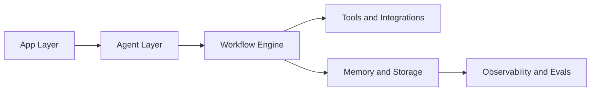
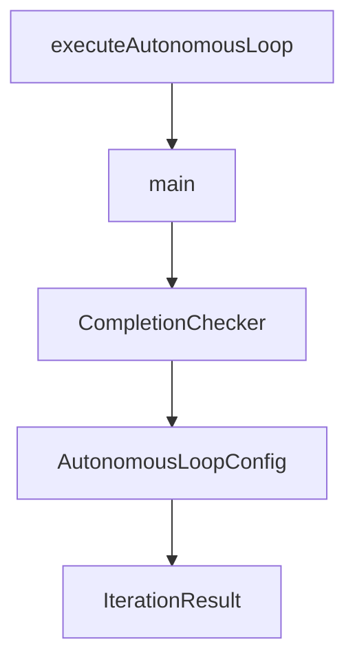

# Chapter 2: System Architecture

Welcome to **Chapter 2: System Architecture**. In this part of **Mastra Tutorial: TypeScript Framework for AI Agents and Workflows**, you will build an intuitive mental model first, then move into concrete implementation details and practical production tradeoffs.


Mastra combines agents, workflows, memory, and runtime services into a coherent TypeScript-first platform.

## Architecture Overview


```mermaid
flowchart LR
    A[App Layer] --> B[Agent Layer]
    B --> C[Workflow Engine]
    C --> D[Tools and Integrations]
    C --> E[Memory and Storage]
    E --> F[Observability and Evals]
```

## Core Building Blocks

| Block | Responsibility |
|:------|:---------------|
| agents | autonomous reasoning and tool decisions |
| workflows | explicit orchestration and control flow |
| memory | conversation, working, and semantic context |
| integrations | model providers, MCP, and external APIs |

## Design Guidance

- use agents for open-ended tasks
- use workflows for deterministic multi-step control
- isolate memory concerns from business logic

## Source References

- [Mastra Docs Overview](https://mastra.ai/docs)
- [Mastra Repository](https://github.com/mastra-ai/mastra)

## Summary

You now understand where to place logic in Mastra without mixing concerns.

Next: [Chapter 3: Agents and Tools](03-agents-and-tools.md)

## Source Code Walkthrough

### `explorations/ralph-wiggum-loop-prototype.ts`

The `executeAutonomousLoop` function in [`explorations/ralph-wiggum-loop-prototype.ts`](https://github.com/mastra-ai/mastra/blob/HEAD/explorations/ralph-wiggum-loop-prototype.ts) handles a key part of this chapter's functionality:

```ts
 * Executes an autonomous loop with the given agent and configuration.
 */
export async function executeAutonomousLoop(
  agent: Agent,
  config: AutonomousLoopConfig,
  mastra?: Mastra,
): Promise<AutonomousLoopResult> {
  const iterations: IterationResult[] = [];
  let totalTokens = 0;
  const startTime = Date.now();

  const contextWindow = config.contextWindow ?? 5;

  for (let i = 0; i < config.maxIterations; i++) {
    const iterationStartTime = Date.now();

    // Notify iteration start
    await config.onIterationStart?.(i + 1);

    // Build context from previous iterations
    const previousResults = iterations.slice(-contextWindow).map(r => ({
      iteration: r.iteration,
      success: r.success,
      output: r.agentOutput,
      error: r.error?.message,
    }));

    let contextualPrompt = config.prompt;
    if (previousResults.length > 0) {
      const historyContext = previousResults
        .map(
          r => `
```

This function is important because it defines how Mastra Tutorial: TypeScript Framework for AI Agents and Workflows implements the patterns covered in this chapter.

### `explorations/ralph-wiggum-loop-prototype.ts`

The `main` function in [`explorations/ralph-wiggum-loop-prototype.ts`](https://github.com/mastra-ai/mastra/blob/HEAD/explorations/ralph-wiggum-loop-prototype.ts) handles a key part of this chapter's functionality:

```ts
});

async function main() {
  const result = await executeAutonomousLoop(migrationAgent, {
    prompt: 'Migrate all tests in src/__tests__ from Jest to Vitest',
    completion: testsPassing('npm run test'),
    maxIterations: 20,
    iterationDelay: 1000,
    onIterationStart: (i) => console.log(`\n🔄 Starting iteration ${i}...`),
    onIteration: (r) => {
      console.log(`   ${r.success ? '✅' : '❌'} Iteration ${r.iteration}`);
      console.log(`   Tokens: ${r.tokensUsed}, Duration: ${r.duration}ms`);
      if (r.completionCheck.message) {
        console.log(`   Message: ${r.completionCheck.message}`);
      }
    },
  });

  console.log('\n' + '='.repeat(50));
  console.log(`Result: ${result.success ? '✅ SUCCESS' : '❌ FAILED'}`);
  console.log(`Total iterations: ${result.iterations.length}`);
  console.log(`Total tokens: ${result.totalTokens}`);
  console.log(`Total duration: ${result.totalDuration}ms`);
  if (result.completionMessage) {
    console.log(`Message: ${result.completionMessage}`);
  }
}

main().catch(console.error);
*/

```

This function is important because it defines how Mastra Tutorial: TypeScript Framework for AI Agents and Workflows implements the patterns covered in this chapter.

### `explorations/ralph-wiggum-loop-prototype.ts`

The `CompletionChecker` interface in [`explorations/ralph-wiggum-loop-prototype.ts`](https://github.com/mastra-ai/mastra/blob/HEAD/explorations/ralph-wiggum-loop-prototype.ts) handles a key part of this chapter's functionality:

```ts
// ============================================================================

export interface CompletionChecker {
  check: () => Promise<{ success: boolean; message?: string; data?: any }>;
}

export interface AutonomousLoopConfig {
  /** The task prompt to send to the agent */
  prompt: string;

  /** How to determine if the task is complete */
  completion: CompletionChecker;

  /** Maximum number of iterations before giving up */
  maxIterations: number;

  /** Optional: Maximum tokens to spend */
  maxTokens?: number;

  /** Optional: Delay between iterations in ms */
  iterationDelay?: number;

  /** Optional: How many previous iteration results to include in context */
  contextWindow?: number;

  /** Optional: Called after each iteration */
  onIteration?: (result: IterationResult) => void | Promise<void>;

  /** Optional: Called when starting an iteration */
  onIterationStart?: (iteration: number) => void | Promise<void>;
}

```

This interface is important because it defines how Mastra Tutorial: TypeScript Framework for AI Agents and Workflows implements the patterns covered in this chapter.

### `explorations/ralph-wiggum-loop-prototype.ts`

The `AutonomousLoopConfig` interface in [`explorations/ralph-wiggum-loop-prototype.ts`](https://github.com/mastra-ai/mastra/blob/HEAD/explorations/ralph-wiggum-loop-prototype.ts) handles a key part of this chapter's functionality:

```ts
}

export interface AutonomousLoopConfig {
  /** The task prompt to send to the agent */
  prompt: string;

  /** How to determine if the task is complete */
  completion: CompletionChecker;

  /** Maximum number of iterations before giving up */
  maxIterations: number;

  /** Optional: Maximum tokens to spend */
  maxTokens?: number;

  /** Optional: Delay between iterations in ms */
  iterationDelay?: number;

  /** Optional: How many previous iteration results to include in context */
  contextWindow?: number;

  /** Optional: Called after each iteration */
  onIteration?: (result: IterationResult) => void | Promise<void>;

  /** Optional: Called when starting an iteration */
  onIterationStart?: (iteration: number) => void | Promise<void>;
}

export interface IterationResult {
  iteration: number;
  success: boolean;
  agentOutput: string;
```

This interface is important because it defines how Mastra Tutorial: TypeScript Framework for AI Agents and Workflows implements the patterns covered in this chapter.


## How These Components Connect


```mermaid
flowchart TD
    A[executeAutonomousLoop]
    B[main]
    C[CompletionChecker]
    D[AutonomousLoopConfig]
    E[IterationResult]
    A --> B
    B --> C
    C --> D
    D --> E
```
