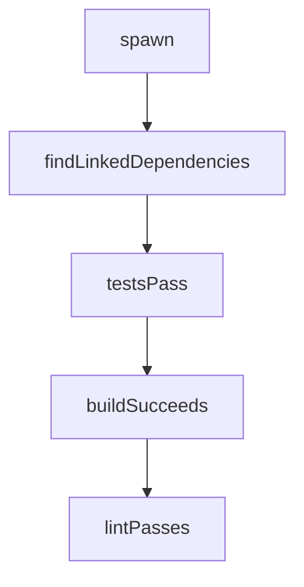

# Chapter 3: Agents and Tools

Welcome to **Chapter 3: Agents and Tools**. In this part of **Mastra Tutorial: TypeScript Framework for AI Agents and Workflows**, you will build an intuitive mental model first, then move into concrete implementation details and practical production tradeoffs.


Agents are most useful when tool boundaries are explicit and observable.

## Agent Design Pattern

| Step | Action |
|:-----|:-------|
| define objective | clear role and expected output |
| constrain tools | only required tools per agent |
| enforce schema | typed input/output contracts |
| log behavior | action-level traces for debugging |

## Tool Safety Practices

- validate inputs and authorization before execution
- return structured results instead of free-form text
- classify tools by side-effect risk
- enforce timeout and retry policy

## Source References

- [Mastra Agents Docs](https://mastra.ai/docs/agents/overview)
- [Mastra Model Routing](https://mastra.ai/models)

## Summary

You now have a practical framework for building strong, bounded agents in Mastra.

Next: [Chapter 4: Workflows and Control Flow](04-workflows-and-control-flow.md)

## Source Code Walkthrough

### `scripts/ignore-example.js`

The `spawn` function in [`scripts/ignore-example.js`](https://github.com/mastra-ai/mastra/blob/HEAD/scripts/ignore-example.js) handles a key part of this chapter's functionality:

```js
import { spawn as nodeSpawn } from 'child_process';
import { readFileSync } from 'fs';
import { dirname, join } from 'path';
import { fileURLToPath } from 'url';

const dir = process.argv[2];
if (!dir) {
  console.error('Usage: node scripts/ignore-example.js <directory>');
  process.exit(1);
}

/**
 * Promisified version of Node.js spawn function
 *
 * @param {string} command - The command to run
 * @param {string[]} args - List of string arguments
 * @param {import('child_process').SpawnOptions} options - Spawn options
 * @returns {Promise<void>} Promise that resolves with the exit code when the process completes
 */
function spawn(command, args = [], options = {}) {
  return new Promise((resolve, reject) => {
    const childProcess = nodeSpawn(command, args, {
      // stdio: 'inherit',
      ...options,
    });

    childProcess.on('error', error => {
      reject(error);
    });

```

This function is important because it defines how Mastra Tutorial: TypeScript Framework for AI Agents and Workflows implements the patterns covered in this chapter.

### `scripts/ignore-example.js`

The `findLinkedDependencies` function in [`scripts/ignore-example.js`](https://github.com/mastra-ai/mastra/blob/HEAD/scripts/ignore-example.js) handles a key part of this chapter's functionality:

```js
 * @returns {Object} An object containing all linked dependencies
 */
function findLinkedDependencies(dir, protocol = 'link:') {
  try {
    // Read package.json from current working directory
    const packageJson = JSON.parse(readFileSync(`${dir}/package.json`, 'utf8'));

    // Initialize an object to store linked dependencies
    const linkedDependencies = {};

    // Check regular dependencies
    if (packageJson.dependencies) {
      for (const [name, version] of Object.entries(packageJson.dependencies)) {
        if (typeof version === 'string' && version.startsWith(protocol)) {
          linkedDependencies[name] = version;
        }
      }
    }

    // Check dev dependencies
    if (packageJson.devDependencies) {
      for (const [name, version] of Object.entries(packageJson.devDependencies)) {
        if (typeof version === 'string' && version.startsWith(protocol)) {
          linkedDependencies[name] = version;
        }
      }
    }

    // Check peer dependencies
    if (packageJson.peerDependencies) {
      for (const [name, version] of Object.entries(packageJson.peerDependencies)) {
        if (typeof version === 'string' && version.startsWith(protocol)) {
```

This function is important because it defines how Mastra Tutorial: TypeScript Framework for AI Agents and Workflows implements the patterns covered in this chapter.

### `explorations/network-validation-bridge.ts`

The `testsPass` function in [`explorations/network-validation-bridge.ts`](https://github.com/mastra-ai/mastra/blob/HEAD/explorations/network-validation-bridge.ts) handles a key part of this chapter's functionality:

```ts
 * Check if tests pass
 */
export function testsPass(command = 'npm test', options?: { timeout?: number; cwd?: string }): ValidationCheck {
  return {
    id: 'tests-pass',
    name: 'Tests Pass',
    async check() {
      const start = Date.now();
      try {
        const { stdout, stderr } = await execAsync(command, {
          timeout: options?.timeout ?? 300000,
          cwd: options?.cwd,
        });
        return {
          success: true,
          message: 'All tests passed',
          details: { stdout: stdout.slice(-1000), stderr: stderr.slice(-500) },
          duration: Date.now() - start,
        };
      } catch (error: any) {
        return {
          success: false,
          message: `Tests failed: ${error.message}`,
          details: {
            stdout: error.stdout?.slice(-1000),
            stderr: error.stderr?.slice(-1000),
            exitCode: error.code,
          },
          duration: Date.now() - start,
        };
      }
    },
```

This function is important because it defines how Mastra Tutorial: TypeScript Framework for AI Agents and Workflows implements the patterns covered in this chapter.

### `explorations/network-validation-bridge.ts`

The `buildSucceeds` function in [`explorations/network-validation-bridge.ts`](https://github.com/mastra-ai/mastra/blob/HEAD/explorations/network-validation-bridge.ts) handles a key part of this chapter's functionality:

```ts
 * Check if build succeeds
 */
export function buildSucceeds(
  command = 'npm run build',
  options?: { timeout?: number; cwd?: string },
): ValidationCheck {
  return {
    id: 'build-succeeds',
    name: 'Build Succeeds',
    async check() {
      const start = Date.now();
      try {
        const { stdout, stderr } = await execAsync(command, {
          timeout: options?.timeout ?? 600000,
          cwd: options?.cwd,
        });
        return {
          success: true,
          message: 'Build completed successfully',
          details: { stdout: stdout.slice(-500), stderr: stderr.slice(-500) },
          duration: Date.now() - start,
        };
      } catch (error: any) {
        return {
          success: false,
          message: `Build failed: ${error.message}`,
          details: {
            stdout: error.stdout?.slice(-1000),
            stderr: error.stderr?.slice(-1000),
          },
          duration: Date.now() - start,
        };
```

This function is important because it defines how Mastra Tutorial: TypeScript Framework for AI Agents and Workflows implements the patterns covered in this chapter.


## How These Components Connect


