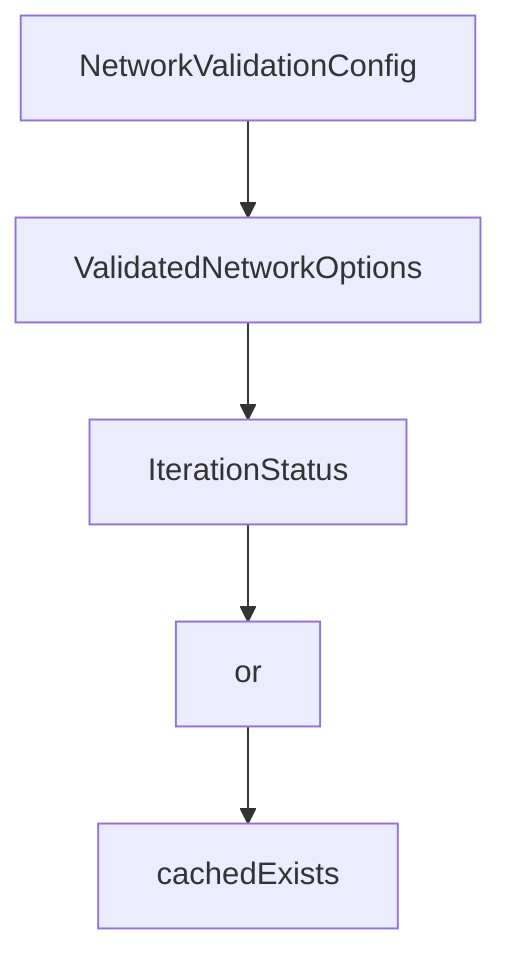

# Chapter 3: Agents and Tools

Welcome to **Chapter 3: Agents and Tools**. In this part of **Mastra Tutorial: TypeScript Framework for AI Agents and Workflows**, you will build an intuitive mental model first, then move into concrete implementation details and practical production tradeoffs.


Agents are most useful when tool boundaries are explicit and observable.

## Agent Design Pattern

| Step | Action |
|:-----|:-------|
| define objective | clear role and expected output |
| constrain tools | only required tools per agent |
| enforce schema | typed input/output contracts |
| log behavior | action-level traces for debugging |

## Tool Safety Practices

- validate inputs and authorization before execution
- return structured results instead of free-form text
- classify tools by side-effect risk
- enforce timeout and retry policy

## Source References

- [Mastra Agents Docs](https://mastra.ai/docs/agents/overview)
- [Mastra Model Routing](https://mastra.ai/models)

## Summary

You now have a practical framework for building strong, bounded agents in Mastra.

Next: [Chapter 4: Workflows and Control Flow](04-workflows-and-control-flow.md)

## Depth Expansion Playbook

## Source Code Walkthrough

### `explorations/network-validation-bridge.ts`

The `NetworkValidationConfig` interface in [`explorations/network-validation-bridge.ts`](https://github.com/mastra-ai/mastra/blob/HEAD/explorations/network-validation-bridge.ts) handles a key part of this chapter's functionality:

```ts
}

export interface NetworkValidationConfig {
  /**
   * Array of validation checks to run
   */
  checks: ValidationCheck[];

  /**
   * How to combine check results:
   * - 'all': All checks must pass
   * - 'any': At least one check must pass
   * - 'weighted': Use weights (future)
   */
  strategy: 'all' | 'any';

  /**
   * How validation interacts with LLM completion assessment:
   * - 'verify': LLM says complete AND validation passes
   * - 'override': Only validation matters, ignore LLM
   * - 'llm-fallback': Try validation first, use LLM if no checks configured
   */
  mode: 'verify' | 'override' | 'llm-fallback';

  /**
   * Maximum time for all validation checks (ms)
   */
  timeout?: number;

  /**
   * Run validation in parallel or sequentially
   */
```

This interface is important because it defines how Mastra Tutorial: TypeScript Framework for AI Agents and Workflows implements the patterns covered in this chapter.

### `explorations/network-validation-bridge.ts`

The `ValidatedNetworkOptions` interface in [`explorations/network-validation-bridge.ts`](https://github.com/mastra-ai/mastra/blob/HEAD/explorations/network-validation-bridge.ts) handles a key part of this chapter's functionality:

```ts
}

export interface ValidatedNetworkOptions {
  /**
   * Maximum iterations before stopping
   */
  maxIterations: number;

  /**
   * Validation configuration
   */
  validation?: NetworkValidationConfig;

  /**
   * Called after each iteration with validation results
   */
  onIteration?: (result: IterationStatus) => void | Promise<void>;

  /**
   * Thread ID for memory
   */
  threadId?: string;

  /**
   * Resource ID for memory
   */
  resourceId?: string;
}

export interface IterationStatus {
  iteration: number;
  llmSaysComplete: boolean;
```

This interface is important because it defines how Mastra Tutorial: TypeScript Framework for AI Agents and Workflows implements the patterns covered in this chapter.

### `explorations/network-validation-bridge.ts`

The `IterationStatus` interface in [`explorations/network-validation-bridge.ts`](https://github.com/mastra-ai/mastra/blob/HEAD/explorations/network-validation-bridge.ts) handles a key part of this chapter's functionality:

```ts
   * Called after each iteration with validation results
   */
  onIteration?: (result: IterationStatus) => void | Promise<void>;

  /**
   * Thread ID for memory
   */
  threadId?: string;

  /**
   * Resource ID for memory
   */
  resourceId?: string;
}

export interface IterationStatus {
  iteration: number;
  llmSaysComplete: boolean;
  validationPassed: boolean | null;
  validationResults: ValidationResult[];
  isComplete: boolean;
  primitive: {
    type: 'agent' | 'workflow' | 'tool' | 'none';
    id: string;
  };
  duration: number;
}

// ============================================================================
// Validation Check Factories
// ============================================================================

```

This interface is important because it defines how Mastra Tutorial: TypeScript Framework for AI Agents and Workflows implements the patterns covered in this chapter.

### `scripts/generate-package-docs.ts`

The `or` class in [`scripts/generate-package-docs.ts`](https://github.com/mastra-ai/mastra/blob/HEAD/scripts/generate-package-docs.ts) handles a key part of this chapter's functionality:

```ts
#!/usr/bin/env npx tsx
/**
 * Generates embedded documentation for Mastra packages.
 *
 * Uses docs/build/llms-manifest.json as the data source and copies llms.txt files to a flat structure in each package's dist/docs/references/ directory.
 *
 * Usage:
 * Add "build:docs": "pnpx tsx ../../scripts/generate-package-docs.ts", to your package.json scripts.
 * (Adjust the file path as needed based on your package location)
 */

import fs from 'node:fs';
import path from 'node:path';
import { fileURLToPath } from 'node:url';

const __filename = fileURLToPath(import.meta.url);
const __dirname = path.dirname(__filename);
const MONOREPO_ROOT = path.join(__dirname, '..');

interface ExportInfo {
  types: string;
  implementation: string;
  line?: number;
}

interface ModuleInfo {
  index: string;
  chunks: string[];
}

interface SourceMap {
  version: string;
```

This class is important because it defines how Mastra Tutorial: TypeScript Framework for AI Agents and Workflows implements the patterns covered in this chapter.


## How These Components Connect


