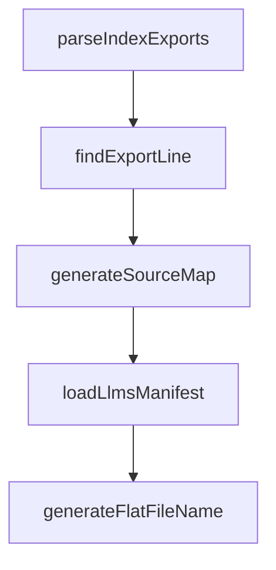

# Chapter 4: Workflows and Control Flow

Welcome to **Chapter 4: Workflows and Control Flow**. In this part of **Mastra Tutorial: TypeScript Framework for AI Agents and Workflows**, you will build an intuitive mental model first, then move into concrete implementation details and practical production tradeoffs.


Mastra workflows provide deterministic orchestration when autonomous loops are not enough.

## Workflow Controls

| Control | Use Case |
|:--------|:---------|
| `.then()` | linear stage execution |
| `.branch()` | conditional routing |
| `.parallel()` | independent concurrent tasks |
| suspend/resume | human approval or async wait states |

## Decision Rule

Use workflows when you need strict ordering, approvals, or compliance constraints.

## Production Pattern

1. agent drafts plan
2. workflow runs approval gates
3. tools execute with policy checks
4. workflow commits output and telemetry

## Source References

- [Mastra Workflows Docs](https://mastra.ai/docs/workflows/overview)
- [Suspend and Resume](https://mastra.ai/docs/workflows/suspend-and-resume)

## Summary

You now know when and how to move from free-form agents to deterministic workflow control.

Next: [Chapter 5: Memory, RAG, and Context](05-memory-rag-and-context.md)

## Depth Expansion Playbook

## Source Code Walkthrough

### `scripts/generate-package-docs.ts`

The `parseIndexExports` function in [`scripts/generate-package-docs.ts`](https://github.com/mastra-ai/mastra/blob/HEAD/scripts/generate-package-docs.ts) handles a key part of this chapter's functionality:

```ts
}

function parseIndexExports(indexPath: string): Map<string, { chunk: string; exportName: string }> {
  const exports = new Map<string, { chunk: string; exportName: string }>();

  if (!cachedExists(indexPath)) {
    return exports;
  }

  const content = fs.readFileSync(indexPath, 'utf-8');

  // Parse: export { Agent, TripWire } from '../chunk-IDD63DWQ.js';
  const regex = /export\s*\{\s*([^}]+)\s*\}\s*from\s*['"]([^'"]+)['"]/g;
  let match;

  while ((match = regex.exec(content)) !== null) {
    const names = match[1].split(',').map(n => n.trim().split(' as ')[0].trim());
    const chunkPath = match[2];
    const chunk = path.basename(chunkPath);

    for (const name of names) {
      if (name) {
        exports.set(name, { chunk, exportName: name });
      }
    }
  }

  return exports;
}

function findExportLine(chunkPath: string, exportName: string): number | undefined {
  const lines = getChunkLines(chunkPath);
```

This function is important because it defines how Mastra Tutorial: TypeScript Framework for AI Agents and Workflows implements the patterns covered in this chapter.

### `scripts/generate-package-docs.ts`

The `findExportLine` function in [`scripts/generate-package-docs.ts`](https://github.com/mastra-ai/mastra/blob/HEAD/scripts/generate-package-docs.ts) handles a key part of this chapter's functionality:

```ts
}

function findExportLine(chunkPath: string, exportName: string): number | undefined {
  const lines = getChunkLines(chunkPath);
  if (!lines) return undefined;

  // Look for class or function definition
  const patterns = [
    new RegExp(`^var ${exportName} = class`),
    new RegExp(`^function ${exportName}\\s*\\(`),
    new RegExp(`^var ${exportName} = function`),
    new RegExp(`^var ${exportName} = \\(`), // Arrow function
    new RegExp(`^const ${exportName} = `),
    new RegExp(`^let ${exportName} = `),
  ];

  for (let i = 0; i < lines.length; i++) {
    for (const pattern of patterns) {
      if (pattern.test(lines[i])) {
        return i + 1; // 1-indexed
      }
    }
  }

  return undefined;
}

function generateSourceMap(packageRoot: string): SourceMap {
  const distDir = path.join(packageRoot, 'dist');
  const packageJson = getPackageJson(packageRoot);

  const sourceMap: SourceMap = {
```

This function is important because it defines how Mastra Tutorial: TypeScript Framework for AI Agents and Workflows implements the patterns covered in this chapter.

### `scripts/generate-package-docs.ts`

The `generateSourceMap` function in [`scripts/generate-package-docs.ts`](https://github.com/mastra-ai/mastra/blob/HEAD/scripts/generate-package-docs.ts) handles a key part of this chapter's functionality:

```ts
}

function generateSourceMap(packageRoot: string): SourceMap {
  const distDir = path.join(packageRoot, 'dist');
  const packageJson = getPackageJson(packageRoot);

  const sourceMap: SourceMap = {
    version: packageJson.version,
    package: packageJson.name,
    exports: {},
    modules: {},
  };

  // Default modules to analyze
  const modules = [
    'agent',
    'tools',
    'workflows',
    'memory',
    'stream',
    'llm',
    'mastra',
    'mcp',
    'evals',
    'processors',
    'storage',
    'vector',
    'voice',
  ];

  for (const mod of modules) {
    const indexPath = path.join(distDir, mod, 'index.js');
```

This function is important because it defines how Mastra Tutorial: TypeScript Framework for AI Agents and Workflows implements the patterns covered in this chapter.

### `scripts/generate-package-docs.ts`

The `loadLlmsManifest` function in [`scripts/generate-package-docs.ts`](https://github.com/mastra-ai/mastra/blob/HEAD/scripts/generate-package-docs.ts) handles a key part of this chapter's functionality:

```ts
}

function loadLlmsManifest(): LlmsManifest {
  const manifestPath = path.join(MONOREPO_ROOT, 'docs/build/llms-manifest.json');
  if (!cachedExists(manifestPath)) {
    throw new Error('docs/build/llms-manifest.json not found. Run docs build first.');
  }
  return JSON.parse(fs.readFileSync(manifestPath, 'utf-8'));
}

function generateFlatFileName(entry: ManifestEntry): string {
  // Convert: { category: "docs", folderPath: "agents/adding-voice" }
  // To: "docs-agents-adding-voice.md"

  if (!entry.folderPath) {
    // Root level doc: just use category
    return `${entry.category}.md`;
  }

  const pathPart = entry.folderPath.replace(/\//g, '-');
  return `${entry.category}-${pathPart}.md`;
}

function generateSkillMd(packageName: string, version: string, entries: ManifestEntry[]): string {
  // Generate compliant name: lowercase, hyphens, max 64 chars
  // "@mastra/core" -> "mastra-core"
  const skillName = packageName.replace('@', '').replace('/', '-').toLowerCase();

  // Generate description (max 1024 chars)
  const description = `Documentation for ${packageName}. Use when working with ${packageName} APIs, configuration, or implementation.`;

  // Group entries by category
```

This function is important because it defines how Mastra Tutorial: TypeScript Framework for AI Agents and Workflows implements the patterns covered in this chapter.


## How These Components Connect


