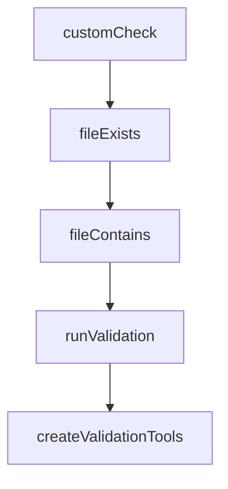

# Chapter 4: Workflows and Control Flow

Welcome to **Chapter 4: Workflows and Control Flow**. In this part of **Mastra Tutorial: TypeScript Framework for AI Agents and Workflows**, you will build an intuitive mental model first, then move into concrete implementation details and practical production tradeoffs.


Mastra workflows provide deterministic orchestration when autonomous loops are not enough.

## Workflow Controls

| Control | Use Case |
|:--------|:---------|
| `.then()` | linear stage execution |
| `.branch()` | conditional routing |
| `.parallel()` | independent concurrent tasks |
| suspend/resume | human approval or async wait states |

## Decision Rule

Use workflows when you need strict ordering, approvals, or compliance constraints.

## Production Pattern

1. agent drafts plan
2. workflow runs approval gates
3. tools execute with policy checks
4. workflow commits output and telemetry

## Source References

- [Mastra Workflows Docs](https://mastra.ai/docs/workflows/overview)
- [Suspend and Resume](https://mastra.ai/docs/workflows/suspend-and-resume)

## Summary

You now know when and how to move from free-form agents to deterministic workflow control.

Next: [Chapter 5: Memory, RAG, and Context](05-memory-rag-and-context.md)

## Source Code Walkthrough

### `explorations/network-validation-bridge.ts`

The `customCheck` function in [`explorations/network-validation-bridge.ts`](https://github.com/mastra-ai/mastra/blob/HEAD/explorations/network-validation-bridge.ts) handles a key part of this chapter's functionality:

```ts
 * Custom validation check from a function
 */
export function customCheck(
  id: string,
  name: string,
  fn: () => Promise<{ success: boolean; message: string; details?: Record<string, unknown> }>,
): ValidationCheck {
  return {
    id,
    name,
    async check() {
      const start = Date.now();
      const result = await fn();
      return { ...result, duration: Date.now() - start };
    },
  };
}

/**
 * File exists check
 */
export function fileExists(path: string): ValidationCheck {
  return {
    id: `file-exists-${path}`,
    name: `File Exists: ${path}`,
    async check() {
      const start = Date.now();
      try {
        const fs = await import('fs/promises');
        await fs.access(path);
        return {
          success: true,
```

This function is important because it defines how Mastra Tutorial: TypeScript Framework for AI Agents and Workflows implements the patterns covered in this chapter.

### `explorations/network-validation-bridge.ts`

The `fileExists` function in [`explorations/network-validation-bridge.ts`](https://github.com/mastra-ai/mastra/blob/HEAD/explorations/network-validation-bridge.ts) handles a key part of this chapter's functionality:

```ts
 * File exists check
 */
export function fileExists(path: string): ValidationCheck {
  return {
    id: `file-exists-${path}`,
    name: `File Exists: ${path}`,
    async check() {
      const start = Date.now();
      try {
        const fs = await import('fs/promises');
        await fs.access(path);
        return {
          success: true,
          message: `File ${path} exists`,
          duration: Date.now() - start,
        };
      } catch {
        return {
          success: false,
          message: `File ${path} does not exist`,
          duration: Date.now() - start,
        };
      }
    },
  };
}

/**
 * File contains pattern check
 */
export function fileContains(path: string, pattern: string | RegExp): ValidationCheck {
  return {
```

This function is important because it defines how Mastra Tutorial: TypeScript Framework for AI Agents and Workflows implements the patterns covered in this chapter.

### `explorations/network-validation-bridge.ts`

The `fileContains` function in [`explorations/network-validation-bridge.ts`](https://github.com/mastra-ai/mastra/blob/HEAD/explorations/network-validation-bridge.ts) handles a key part of this chapter's functionality:

```ts
 * File contains pattern check
 */
export function fileContains(path: string, pattern: string | RegExp): ValidationCheck {
  return {
    id: `file-contains-${path}`,
    name: `File Contains Pattern: ${path}`,
    async check() {
      const start = Date.now();
      try {
        const fs = await import('fs/promises');
        const content = await fs.readFile(path, 'utf-8');
        const matches = typeof pattern === 'string' ? content.includes(pattern) : pattern.test(content);

        return {
          success: matches,
          message: matches
            ? `File ${path} contains expected pattern`
            : `File ${path} does not contain expected pattern`,
          duration: Date.now() - start,
        };
      } catch (error: any) {
        return {
          success: false,
          message: `Could not read file ${path}: ${error.message}`,
          duration: Date.now() - start,
        };
      }
    },
  };
}

// ============================================================================
```

This function is important because it defines how Mastra Tutorial: TypeScript Framework for AI Agents and Workflows implements the patterns covered in this chapter.

### `explorations/network-validation-bridge.ts`

The `runValidation` function in [`explorations/network-validation-bridge.ts`](https://github.com/mastra-ai/mastra/blob/HEAD/explorations/network-validation-bridge.ts) handles a key part of this chapter's functionality:

```ts
// ============================================================================

async function runValidation(
  config: NetworkValidationConfig,
): Promise<{ passed: boolean; results: ValidationResult[] }> {
  const results: ValidationResult[] = [];

  if (config.parallel) {
    // Run all checks in parallel
    const checkResults = await Promise.all(config.checks.map(check => check.check()));
    results.push(...checkResults);
  } else {
    // Run checks sequentially (can short-circuit on failure for 'all' strategy)
    for (const check of config.checks) {
      const result = await check.check();
      results.push(result);

      // Short-circuit for 'all' strategy if a check fails
      if (config.strategy === 'all' && !result.success) {
        break;
      }
      // Short-circuit for 'any' strategy if a check passes
      if (config.strategy === 'any' && result.success) {
        break;
      }
    }
  }

  const passed = config.strategy === 'all' ? results.every(r => r.success) : results.some(r => r.success);

  return { passed, results };
}
```

This function is important because it defines how Mastra Tutorial: TypeScript Framework for AI Agents and Workflows implements the patterns covered in this chapter.


## How These Components Connect


