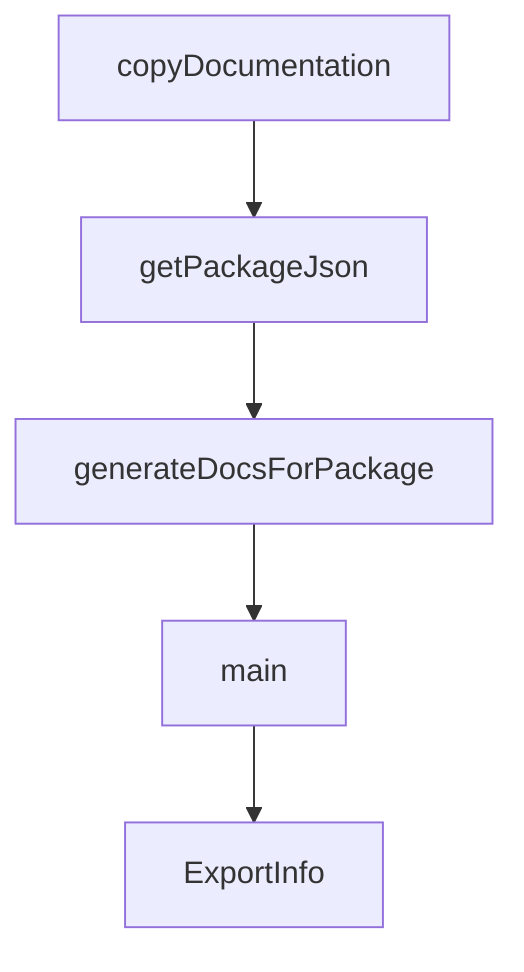

# Chapter 5: Memory, RAG, and Context

Welcome to **Chapter 5: Memory, RAG, and Context**. In this part of **Mastra Tutorial: TypeScript Framework for AI Agents and Workflows**, you will build an intuitive mental model first, then move into concrete implementation details and practical production tradeoffs.


Reliable agents depend on structured context, not ever-growing transcripts.

## Context Layers

| Layer | Purpose |
|:------|:--------|
| conversation history | short-term turn continuity |
| working memory | active task state |
| semantic recall | long-term retrieval of prior knowledge |
| RAG context | external knowledge grounding |

## Best Practices

- summarize stale history into compact state
- keep memory writes explicit and scoped
- validate retrieval quality before response generation

## Source References

- [Mastra Memory Docs](https://mastra.ai/docs/memory/conversation-history)
- [Mastra RAG Overview](https://mastra.ai/docs/rag/overview)

## Summary

You now have a maintainable context strategy for long-lived Mastra systems.

Next: [Chapter 6: MCP and Integration Patterns](06-mcp-and-integration-patterns.md)

## Depth Expansion Playbook

## Source Code Walkthrough

### `scripts/generate-package-docs.ts`

The `copyDocumentation` function in [`scripts/generate-package-docs.ts`](https://github.com/mastra-ai/mastra/blob/HEAD/scripts/generate-package-docs.ts) handles a key part of this chapter's functionality:

```ts
}

function copyDocumentation(manifest: LlmsManifest, packageName: string, docsOutputDir: string): void {
  const entries = manifest.packages[packageName] || [];
  const referencesDir = path.join(docsOutputDir, 'references');

  fs.mkdirSync(referencesDir, { recursive: true });

  for (const entry of entries) {
    const sourcePath = path.join(MONOREPO_ROOT, 'docs/build', entry.path);
    const targetFileName = generateFlatFileName(entry);
    const targetPath = path.join(referencesDir, targetFileName);

    if (cachedExists(sourcePath)) {
      fs.copyFileSync(sourcePath, targetPath);
    } else {
      console.warn(`  Warning: Source not found: ${sourcePath}`);
    }
  }
}

// Cache for package.json contents
const packageJsonCache = new Map<string, { name: string; version: string }>();

function getPackageJson(packageRoot: string): { name: string; version: string } {
  const cached = packageJsonCache.get(packageRoot);
  if (cached) return cached;

  const packageJsonPath = path.join(packageRoot, 'package.json');
  if (!cachedExists(packageJsonPath)) {
    throw new Error(`package.json not found in ${packageRoot}`);
  }
```

This function is important because it defines how Mastra Tutorial: TypeScript Framework for AI Agents and Workflows implements the patterns covered in this chapter.

### `scripts/generate-package-docs.ts`

The `getPackageJson` function in [`scripts/generate-package-docs.ts`](https://github.com/mastra-ai/mastra/blob/HEAD/scripts/generate-package-docs.ts) handles a key part of this chapter's functionality:

```ts
function generateSourceMap(packageRoot: string): SourceMap {
  const distDir = path.join(packageRoot, 'dist');
  const packageJson = getPackageJson(packageRoot);

  const sourceMap: SourceMap = {
    version: packageJson.version,
    package: packageJson.name,
    exports: {},
    modules: {},
  };

  // Default modules to analyze
  const modules = [
    'agent',
    'tools',
    'workflows',
    'memory',
    'stream',
    'llm',
    'mastra',
    'mcp',
    'evals',
    'processors',
    'storage',
    'vector',
    'voice',
  ];

  for (const mod of modules) {
    const indexPath = path.join(distDir, mod, 'index.js');

    if (!cachedExists(indexPath)) {
```

This function is important because it defines how Mastra Tutorial: TypeScript Framework for AI Agents and Workflows implements the patterns covered in this chapter.

### `scripts/generate-package-docs.ts`

The `generateDocsForPackage` function in [`scripts/generate-package-docs.ts`](https://github.com/mastra-ai/mastra/blob/HEAD/scripts/generate-package-docs.ts) handles a key part of this chapter's functionality:

```ts
}

function generateDocsForPackage(packageName: string, packageRoot: string, manifest: LlmsManifest): void {
  const packageJson = getPackageJson(packageRoot);
  const docsOutputDir = path.join(packageRoot, 'dist', 'docs');
  const entries = manifest.packages[packageName];

  if (!entries || entries.length === 0) {
    console.warn(`No documentation found for ${packageName} in manifest`);
    return;
  }

  console.info(`\nGenerating documentation for ${packageName} (${entries.length} files)\n`);

  // Clean and create directory structure
  if (cachedExists(docsOutputDir)) {
    fs.rmSync(docsOutputDir, { recursive: true });
    // Clear from cache since we deleted it
    existsCache.delete(docsOutputDir);
  }
  fs.mkdirSync(path.join(docsOutputDir, 'references'), { recursive: true });
  fs.mkdirSync(path.join(docsOutputDir, 'assets'), { recursive: true });

  // Step 1: Generate SOURCE_MAP.json in assets/
  const sourcemap = generateSourceMap(packageRoot);
  fs.writeFileSync(path.join(docsOutputDir, 'assets', 'SOURCE_MAP.json'), JSON.stringify(sourcemap, null, 2), 'utf-8');

  // Step 2: Copy documentation files
  copyDocumentation(manifest, packageName, docsOutputDir);

  // Step 3: Generate SKILL.md
  const skillMd = generateSkillMd(packageName, packageJson.version, entries);
```

This function is important because it defines how Mastra Tutorial: TypeScript Framework for AI Agents and Workflows implements the patterns covered in this chapter.

### `scripts/generate-package-docs.ts`

The `main` function in [`scripts/generate-package-docs.ts`](https://github.com/mastra-ai/mastra/blob/HEAD/scripts/generate-package-docs.ts) handles a key part of this chapter's functionality:

```ts
## When to use

Use this skill whenever you are working with ${packageName} to obtain the domain-specific knowledge.

## How to use

Read the individual reference documents for detailed explanations and code examples.
${docList}

Read [assets/SOURCE_MAP.json](assets/SOURCE_MAP.json) for source code references.`;
}

function copyDocumentation(manifest: LlmsManifest, packageName: string, docsOutputDir: string): void {
  const entries = manifest.packages[packageName] || [];
  const referencesDir = path.join(docsOutputDir, 'references');

  fs.mkdirSync(referencesDir, { recursive: true });

  for (const entry of entries) {
    const sourcePath = path.join(MONOREPO_ROOT, 'docs/build', entry.path);
    const targetFileName = generateFlatFileName(entry);
    const targetPath = path.join(referencesDir, targetFileName);

    if (cachedExists(sourcePath)) {
      fs.copyFileSync(sourcePath, targetPath);
    } else {
      console.warn(`  Warning: Source not found: ${sourcePath}`);
    }
  }
}

// Cache for package.json contents
```

This function is important because it defines how Mastra Tutorial: TypeScript Framework for AI Agents and Workflows implements the patterns covered in this chapter.


## How These Components Connect


