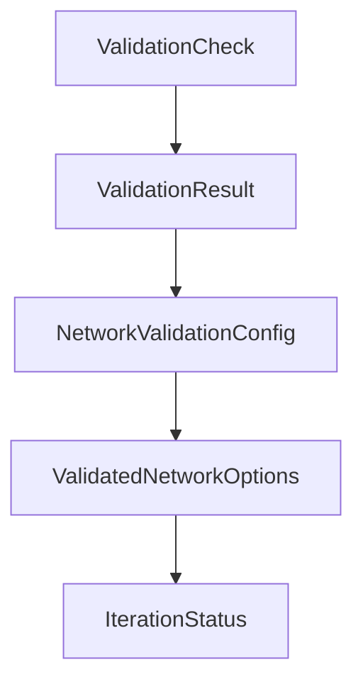

# Chapter 5: Memory, RAG, and Context

Welcome to **Chapter 5: Memory, RAG, and Context**. In this part of **Mastra Tutorial: TypeScript Framework for AI Agents and Workflows**, you will build an intuitive mental model first, then move into concrete implementation details and practical production tradeoffs.


Reliable agents depend on structured context, not ever-growing transcripts.

## Context Layers

| Layer | Purpose |
|:------|:--------|
| conversation history | short-term turn continuity |
| working memory | active task state |
| semantic recall | long-term retrieval of prior knowledge |
| RAG context | external knowledge grounding |

## Best Practices

- summarize stale history into compact state
- keep memory writes explicit and scoped
- validate retrieval quality before response generation

## Source References

- [Mastra Memory Docs](https://mastra.ai/docs/memory/conversation-history)
- [Mastra RAG Overview](https://mastra.ai/docs/rag/overview)

## Summary

You now have a maintainable context strategy for long-lived Mastra systems.

Next: [Chapter 6: MCP and Integration Patterns](06-mcp-and-integration-patterns.md)

## Source Code Walkthrough

### `explorations/network-validation-bridge.ts`

The `ValidationCheck` interface in [`explorations/network-validation-bridge.ts`](https://github.com/mastra-ai/mastra/blob/HEAD/explorations/network-validation-bridge.ts) handles a key part of this chapter's functionality:

```ts
// ============================================================================

export interface ValidationCheck {
  id: string;
  name: string;
  check: () => Promise<ValidationResult>;
}

export interface ValidationResult {
  success: boolean;
  message: string;
  details?: Record<string, unknown>;
  duration?: number;
}

export interface NetworkValidationConfig {
  /**
   * Array of validation checks to run
   */
  checks: ValidationCheck[];

  /**
   * How to combine check results:
   * - 'all': All checks must pass
   * - 'any': At least one check must pass
   * - 'weighted': Use weights (future)
   */
  strategy: 'all' | 'any';

  /**
   * How validation interacts with LLM completion assessment:
   * - 'verify': LLM says complete AND validation passes
```

This interface is important because it defines how Mastra Tutorial: TypeScript Framework for AI Agents and Workflows implements the patterns covered in this chapter.

### `explorations/network-validation-bridge.ts`

The `ValidationResult` interface in [`explorations/network-validation-bridge.ts`](https://github.com/mastra-ai/mastra/blob/HEAD/explorations/network-validation-bridge.ts) handles a key part of this chapter's functionality:

```ts
  id: string;
  name: string;
  check: () => Promise<ValidationResult>;
}

export interface ValidationResult {
  success: boolean;
  message: string;
  details?: Record<string, unknown>;
  duration?: number;
}

export interface NetworkValidationConfig {
  /**
   * Array of validation checks to run
   */
  checks: ValidationCheck[];

  /**
   * How to combine check results:
   * - 'all': All checks must pass
   * - 'any': At least one check must pass
   * - 'weighted': Use weights (future)
   */
  strategy: 'all' | 'any';

  /**
   * How validation interacts with LLM completion assessment:
   * - 'verify': LLM says complete AND validation passes
   * - 'override': Only validation matters, ignore LLM
   * - 'llm-fallback': Try validation first, use LLM if no checks configured
   */
```

This interface is important because it defines how Mastra Tutorial: TypeScript Framework for AI Agents and Workflows implements the patterns covered in this chapter.

### `explorations/network-validation-bridge.ts`

The `NetworkValidationConfig` interface in [`explorations/network-validation-bridge.ts`](https://github.com/mastra-ai/mastra/blob/HEAD/explorations/network-validation-bridge.ts) handles a key part of this chapter's functionality:

```ts
}

export interface NetworkValidationConfig {
  /**
   * Array of validation checks to run
   */
  checks: ValidationCheck[];

  /**
   * How to combine check results:
   * - 'all': All checks must pass
   * - 'any': At least one check must pass
   * - 'weighted': Use weights (future)
   */
  strategy: 'all' | 'any';

  /**
   * How validation interacts with LLM completion assessment:
   * - 'verify': LLM says complete AND validation passes
   * - 'override': Only validation matters, ignore LLM
   * - 'llm-fallback': Try validation first, use LLM if no checks configured
   */
  mode: 'verify' | 'override' | 'llm-fallback';

  /**
   * Maximum time for all validation checks (ms)
   */
  timeout?: number;

  /**
   * Run validation in parallel or sequentially
   */
```

This interface is important because it defines how Mastra Tutorial: TypeScript Framework for AI Agents and Workflows implements the patterns covered in this chapter.

### `explorations/network-validation-bridge.ts`

The `ValidatedNetworkOptions` interface in [`explorations/network-validation-bridge.ts`](https://github.com/mastra-ai/mastra/blob/HEAD/explorations/network-validation-bridge.ts) handles a key part of this chapter's functionality:

```ts
}

export interface ValidatedNetworkOptions {
  /**
   * Maximum iterations before stopping
   */
  maxIterations: number;

  /**
   * Validation configuration
   */
  validation?: NetworkValidationConfig;

  /**
   * Called after each iteration with validation results
   */
  onIteration?: (result: IterationStatus) => void | Promise<void>;

  /**
   * Thread ID for memory
   */
  threadId?: string;

  /**
   * Resource ID for memory
   */
  resourceId?: string;
}

export interface IterationStatus {
  iteration: number;
  llmSaysComplete: boolean;
```

This interface is important because it defines how Mastra Tutorial: TypeScript Framework for AI Agents and Workflows implements the patterns covered in this chapter.


## How These Components Connect


