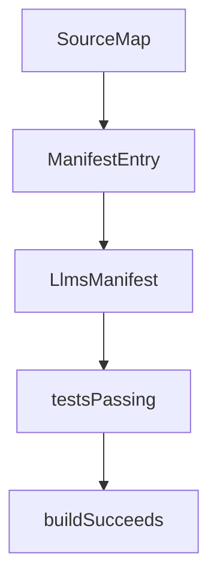

# Chapter 6: MCP and Integration Patterns

Welcome to **Chapter 6: MCP and Integration Patterns**. In this part of **Mastra Tutorial: TypeScript Framework for AI Agents and Workflows**, you will build an intuitive mental model first, then move into concrete implementation details and practical production tradeoffs.


Mastra can expose and consume MCP-compatible capabilities, making it a strong fit for multi-agent ecosystems.

## Integration Surfaces

| Surface | Outcome |
|:--------|:--------|
| MCP servers | structured tool/resource interoperability |
| frontend frameworks | interactive AI product experiences |
| backend runtimes | API and job-driven agent execution |

## Integration Checklist

- version and document each exposed tool contract
- enforce auth and tenancy boundaries
- monitor tool latency and failure rates

## Source References

- [Mastra MCP Overview](https://mastra.ai/docs/tools-mcp/mcp-overview)
- [Mastra Docs](https://mastra.ai/docs)

## Summary

You now understand how to connect Mastra agents to broader MCP and application ecosystems.

Next: [Chapter 7: Evals, Observability, and Quality](07-evals-observability-and-quality.md)

## Depth Expansion Playbook

## Source Code Walkthrough

### `scripts/generate-package-docs.ts`

The `SourceMap` interface in [`scripts/generate-package-docs.ts`](https://github.com/mastra-ai/mastra/blob/HEAD/scripts/generate-package-docs.ts) handles a key part of this chapter's functionality:

```ts
}

interface SourceMap {
  version: string;
  package: string;
  exports: Record<string, ExportInfo>;
  modules: Record<string, ModuleInfo>;
}

interface ManifestEntry {
  path: string; // e.g., "docs/agents/adding-voice/llms.txt"
  title: string;
  description?: string;
  category: string; // "docs", "reference", "guides", "models"
  folderPath: string; // e.g., "agents/adding-voice"
}

interface LlmsManifest {
  version: string;
  generatedAt: string;
  packages: Record<string, ManifestEntry[]>;
}

// Cache for chunk file contents and their pre-split lines
const chunkCache = new Map<string, string[] | null>();

// Cache for file existence checks
const existsCache = new Map<string, boolean>();

function cachedExists(filePath: string): boolean {
  const cached = existsCache.get(filePath);
  if (cached !== undefined) return cached;
```

This interface is important because it defines how Mastra Tutorial: TypeScript Framework for AI Agents and Workflows implements the patterns covered in this chapter.

### `scripts/generate-package-docs.ts`

The `ManifestEntry` interface in [`scripts/generate-package-docs.ts`](https://github.com/mastra-ai/mastra/blob/HEAD/scripts/generate-package-docs.ts) handles a key part of this chapter's functionality:

```ts
}

interface ManifestEntry {
  path: string; // e.g., "docs/agents/adding-voice/llms.txt"
  title: string;
  description?: string;
  category: string; // "docs", "reference", "guides", "models"
  folderPath: string; // e.g., "agents/adding-voice"
}

interface LlmsManifest {
  version: string;
  generatedAt: string;
  packages: Record<string, ManifestEntry[]>;
}

// Cache for chunk file contents and their pre-split lines
const chunkCache = new Map<string, string[] | null>();

// Cache for file existence checks
const existsCache = new Map<string, boolean>();

function cachedExists(filePath: string): boolean {
  const cached = existsCache.get(filePath);
  if (cached !== undefined) return cached;
  const exists = fs.existsSync(filePath);
  existsCache.set(filePath, exists);
  return exists;
}

function getChunkLines(chunkPath: string): string[] | null {
  const cached = chunkCache.get(chunkPath);
```

This interface is important because it defines how Mastra Tutorial: TypeScript Framework for AI Agents and Workflows implements the patterns covered in this chapter.

### `scripts/generate-package-docs.ts`

The `LlmsManifest` interface in [`scripts/generate-package-docs.ts`](https://github.com/mastra-ai/mastra/blob/HEAD/scripts/generate-package-docs.ts) handles a key part of this chapter's functionality:

```ts
}

interface LlmsManifest {
  version: string;
  generatedAt: string;
  packages: Record<string, ManifestEntry[]>;
}

// Cache for chunk file contents and their pre-split lines
const chunkCache = new Map<string, string[] | null>();

// Cache for file existence checks
const existsCache = new Map<string, boolean>();

function cachedExists(filePath: string): boolean {
  const cached = existsCache.get(filePath);
  if (cached !== undefined) return cached;
  const exists = fs.existsSync(filePath);
  existsCache.set(filePath, exists);
  return exists;
}

function getChunkLines(chunkPath: string): string[] | null {
  const cached = chunkCache.get(chunkPath);
  if (cached !== undefined) return cached;

  if (!cachedExists(chunkPath)) {
    chunkCache.set(chunkPath, null);
    return null;
  }

  try {
```

This interface is important because it defines how Mastra Tutorial: TypeScript Framework for AI Agents and Workflows implements the patterns covered in this chapter.

### `explorations/ralph-wiggum-loop-prototype.ts`

The `testsPassing` function in [`explorations/ralph-wiggum-loop-prototype.ts`](https://github.com/mastra-ai/mastra/blob/HEAD/explorations/ralph-wiggum-loop-prototype.ts) handles a key part of this chapter's functionality:

```ts
 * Check if tests pass
 */
export function testsPassing(testCommand = 'npm test'): CompletionChecker {
  return {
    async check() {
      try {
        const { stdout, stderr } = await execAsync(testCommand, { timeout: 300000 });
        return {
          success: true,
          message: 'All tests passed',
          data: { stdout, stderr },
        };
      } catch (error: any) {
        return {
          success: false,
          message: error.message,
          data: { stdout: error.stdout, stderr: error.stderr },
        };
      }
    },
  };
}

/**
 * Check if build succeeds
 */
export function buildSucceeds(buildCommand = 'npm run build'): CompletionChecker {
  return {
    async check() {
      try {
        const { stdout, stderr } = await execAsync(buildCommand, { timeout: 600000 });
        return {
```

This function is important because it defines how Mastra Tutorial: TypeScript Framework for AI Agents and Workflows implements the patterns covered in this chapter.


## How These Components Connect


