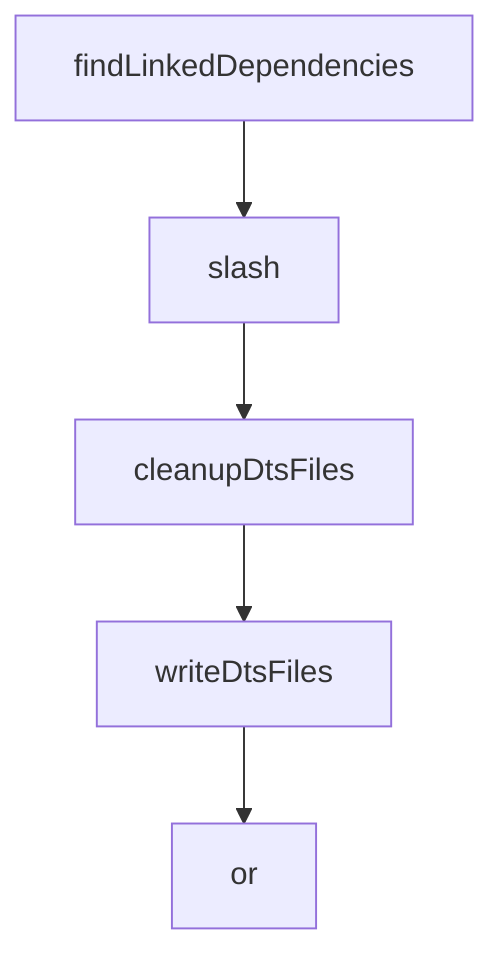

# Chapter 6: MCP and Integration Patterns

Welcome to **Chapter 6: MCP and Integration Patterns**. In this part of **Mastra Tutorial: TypeScript Framework for AI Agents and Workflows**, you will build an intuitive mental model first, then move into concrete implementation details and practical production tradeoffs.


Mastra can expose and consume MCP-compatible capabilities, making it a strong fit for multi-agent ecosystems.

## Integration Surfaces

| Surface | Outcome |
|:--------|:--------|
| MCP servers | structured tool/resource interoperability |
| frontend frameworks | interactive AI product experiences |
| backend runtimes | API and job-driven agent execution |

## Integration Checklist

- version and document each exposed tool contract
- enforce auth and tenancy boundaries
- monitor tool latency and failure rates

## Source References

- [Mastra MCP Overview](https://mastra.ai/docs/tools-mcp/mcp-overview)
- [Mastra Docs](https://mastra.ai/docs)

## Summary

You now understand how to connect Mastra agents to broader MCP and application ecosystems.

Next: [Chapter 7: Evals, Observability, and Quality](07-evals-observability-and-quality.md)

## Source Code Walkthrough

### `scripts/install-example.js`

The `findLinkedDependencies` function in [`scripts/install-example.js`](https://github.com/mastra-ai/mastra/blob/HEAD/scripts/install-example.js) handles a key part of this chapter's functionality:

```js
 * @returns {Object} An object containing all linked dependencies
 */
function findLinkedDependencies(dir, protocol = 'link:') {
  try {
    // Read package.json from current working directory
    const packageJson = JSON.parse(readFileSync(`${dir}/package.json`, 'utf8'));

    // Initialize an object to store linked dependencies
    const linkedDependencies = {};

    // Check regular dependencies
    if (packageJson.dependencies) {
      for (const [name, version] of Object.entries(packageJson.dependencies)) {
        if (typeof version === 'string' && version.startsWith(protocol)) {
          linkedDependencies[name] = version;
        }
      }
    }

    // Check dev dependencies
    if (packageJson.devDependencies) {
      for (const [name, version] of Object.entries(packageJson.devDependencies)) {
        if (typeof version === 'string' && version.startsWith(protocol)) {
          linkedDependencies[name] = version;
        }
      }
    }

    // Check peer dependencies
    if (packageJson.peerDependencies) {
      for (const [name, version] of Object.entries(packageJson.peerDependencies)) {
        if (typeof version === 'string' && version.startsWith(protocol)) {
```

This function is important because it defines how Mastra Tutorial: TypeScript Framework for AI Agents and Workflows implements the patterns covered in this chapter.

### `scripts/commonjs-tsc-fixer.js`

The `slash` function in [`scripts/commonjs-tsc-fixer.js`](https://github.com/mastra-ai/mastra/blob/HEAD/scripts/commonjs-tsc-fixer.js) handles a key part of this chapter's functionality:

```js
import { globby } from 'globby';

/** Convert Windows backslashes to posix forward slashes */
function slash(p) {
  return p.replaceAll('\\', '/');
}

async function cleanupDtsFiles() {
  const rootPath = process.cwd();
  const files = await globby('./*.d.ts', { cwd: rootPath });

  for (const file of files) {
    await rm(join(rootPath, file), { force: true });
  }
}

async function writeDtsFiles() {
  const rootPath = process.cwd();
  const packageJson = JSON.parse(await readFile(join(rootPath, 'package.json')));

  const exports = packageJson.exports;

  // Handle specific path exports
  for (const [key, value] of Object.entries(exports)) {
    if (key !== '.' && value.require?.types) {
      const pattern = value.require.types;
      const matches = await globby(pattern, {
        cwd: rootPath,
        absolute: true,
      });

      for (const file of matches) {
```

This function is important because it defines how Mastra Tutorial: TypeScript Framework for AI Agents and Workflows implements the patterns covered in this chapter.

### `scripts/commonjs-tsc-fixer.js`

The `cleanupDtsFiles` function in [`scripts/commonjs-tsc-fixer.js`](https://github.com/mastra-ai/mastra/blob/HEAD/scripts/commonjs-tsc-fixer.js) handles a key part of this chapter's functionality:

```js
}

async function cleanupDtsFiles() {
  const rootPath = process.cwd();
  const files = await globby('./*.d.ts', { cwd: rootPath });

  for (const file of files) {
    await rm(join(rootPath, file), { force: true });
  }
}

async function writeDtsFiles() {
  const rootPath = process.cwd();
  const packageJson = JSON.parse(await readFile(join(rootPath, 'package.json')));

  const exports = packageJson.exports;

  // Handle specific path exports
  for (const [key, value] of Object.entries(exports)) {
    if (key !== '.' && value.require?.types) {
      const pattern = value.require.types;
      const matches = await globby(pattern, {
        cwd: rootPath,
        absolute: true,
      });

      for (const file of matches) {
        if (key.endsWith('*')) {
          // For wildcard patterns, derive the subpath relative to dist/
          const dir = dirname(file);
          const distRoot = join(rootPath, 'dist');
          const subPath = slash(relative(distRoot, dir));
```

This function is important because it defines how Mastra Tutorial: TypeScript Framework for AI Agents and Workflows implements the patterns covered in this chapter.

### `scripts/commonjs-tsc-fixer.js`

The `writeDtsFiles` function in [`scripts/commonjs-tsc-fixer.js`](https://github.com/mastra-ai/mastra/blob/HEAD/scripts/commonjs-tsc-fixer.js) handles a key part of this chapter's functionality:

```js
}

async function writeDtsFiles() {
  const rootPath = process.cwd();
  const packageJson = JSON.parse(await readFile(join(rootPath, 'package.json')));

  const exports = packageJson.exports;

  // Handle specific path exports
  for (const [key, value] of Object.entries(exports)) {
    if (key !== '.' && value.require?.types) {
      const pattern = value.require.types;
      const matches = await globby(pattern, {
        cwd: rootPath,
        absolute: true,
      });

      for (const file of matches) {
        if (key.endsWith('*')) {
          // For wildcard patterns, derive the subpath relative to dist/
          const dir = dirname(file);
          const distRoot = join(rootPath, 'dist');
          const subPath = slash(relative(distRoot, dir));
          const filename = key.replace('*', subPath);

          const targetPath = join(rootPath, filename) + '.d.ts';
          await mkdir(dirname(targetPath), { recursive: true });

          const relPath = slash(relative(dirname(targetPath), file)).replace('/index.d.ts', '');
          await writeFile(targetPath, `export * from './${relPath}';`);
        } else {
          const targetPath = join(rootPath, key) + '.d.ts';
```

This function is important because it defines how Mastra Tutorial: TypeScript Framework for AI Agents and Workflows implements the patterns covered in this chapter.


## How These Components Connect


