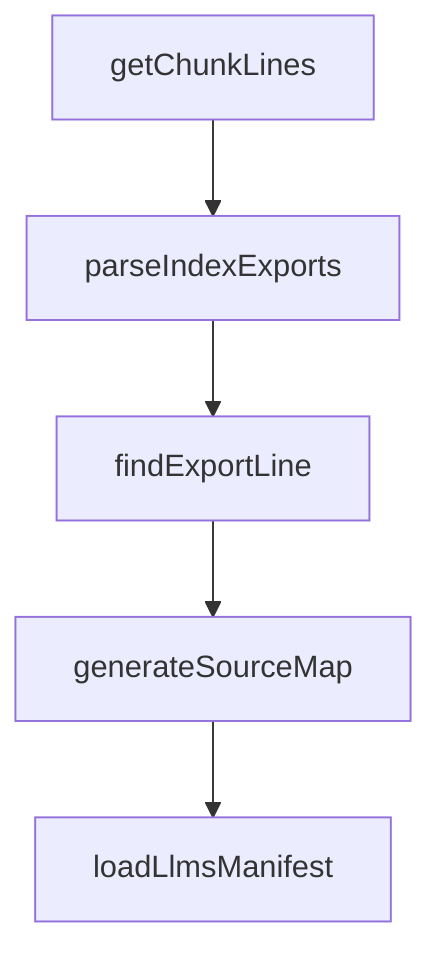

# Chapter 7: Evals, Observability, and Quality

Welcome to **Chapter 7: Evals, Observability, and Quality**. In this part of **Mastra Tutorial: TypeScript Framework for AI Agents and Workflows**, you will build an intuitive mental model first, then move into concrete implementation details and practical production tradeoffs.


Agent reliability improves only when quality and behavior are measured continuously.

## Quality System

| Layer | Metric |
|:------|:-------|
| evals | task success, safety compliance, regression deltas |
| traces | tool call path and latency distribution |
| logs | failure diagnosis and policy violations |

## Improvement Loop

1. define representative eval suite
2. run on every major prompt/workflow change
3. inspect failed traces
4. apply targeted fixes
5. rerun before release

## Source References

- [Mastra Evals Docs](https://mastra.ai/docs/evals/overview)
- [Mastra Observability Docs](https://mastra.ai/docs/observability/overview)

## Summary

You now have a measurable process for improving Mastra quality over time.

Next: [Chapter 8: Production Deployment and Scaling](08-production-deployment-and-scaling.md)

## Source Code Walkthrough

### `scripts/generate-package-docs.ts`

The `getChunkLines` function in [`scripts/generate-package-docs.ts`](https://github.com/mastra-ai/mastra/blob/HEAD/scripts/generate-package-docs.ts) handles a key part of this chapter's functionality:

```ts
}

function getChunkLines(chunkPath: string): string[] | null {
  const cached = chunkCache.get(chunkPath);
  if (cached !== undefined) return cached;

  if (!cachedExists(chunkPath)) {
    chunkCache.set(chunkPath, null);
    return null;
  }

  try {
    const stat = fs.statSync(chunkPath);
    if (!stat.isFile()) {
      chunkCache.set(chunkPath, null);
      return null;
    }
  } catch {
    chunkCache.set(chunkPath, null);
    return null;
  }

  const content = fs.readFileSync(chunkPath, 'utf-8');
  const lines = content.split('\n');
  chunkCache.set(chunkPath, lines);
  return lines;
}

function parseIndexExports(indexPath: string): Map<string, { chunk: string; exportName: string }> {
  const exports = new Map<string, { chunk: string; exportName: string }>();

  if (!cachedExists(indexPath)) {
```

This function is important because it defines how Mastra Tutorial: TypeScript Framework for AI Agents and Workflows implements the patterns covered in this chapter.

### `scripts/generate-package-docs.ts`

The `parseIndexExports` function in [`scripts/generate-package-docs.ts`](https://github.com/mastra-ai/mastra/blob/HEAD/scripts/generate-package-docs.ts) handles a key part of this chapter's functionality:

```ts
}

function parseIndexExports(indexPath: string): Map<string, { chunk: string; exportName: string }> {
  const exports = new Map<string, { chunk: string; exportName: string }>();

  if (!cachedExists(indexPath)) {
    return exports;
  }

  const content = fs.readFileSync(indexPath, 'utf-8');

  // Parse: export { Agent, TripWire } from '../chunk-IDD63DWQ.js';
  const regex = /export\s*\{\s*([^}]+)\s*\}\s*from\s*['"]([^'"]+)['"]/g;
  let match;

  while ((match = regex.exec(content)) !== null) {
    const names = match[1].split(',').map(n => n.trim().split(' as ')[0].trim());
    const chunkPath = match[2];
    const chunk = path.basename(chunkPath);

    for (const name of names) {
      if (name) {
        exports.set(name, { chunk, exportName: name });
      }
    }
  }

  return exports;
}

function findExportLine(chunkPath: string, exportName: string): number | undefined {
  const lines = getChunkLines(chunkPath);
```

This function is important because it defines how Mastra Tutorial: TypeScript Framework for AI Agents and Workflows implements the patterns covered in this chapter.

### `scripts/generate-package-docs.ts`

The `findExportLine` function in [`scripts/generate-package-docs.ts`](https://github.com/mastra-ai/mastra/blob/HEAD/scripts/generate-package-docs.ts) handles a key part of this chapter's functionality:

```ts
}

function findExportLine(chunkPath: string, exportName: string): number | undefined {
  const lines = getChunkLines(chunkPath);
  if (!lines) return undefined;

  // Look for class or function definition
  const patterns = [
    new RegExp(`^var ${exportName} = class`),
    new RegExp(`^function ${exportName}\\s*\\(`),
    new RegExp(`^var ${exportName} = function`),
    new RegExp(`^var ${exportName} = \\(`), // Arrow function
    new RegExp(`^const ${exportName} = `),
    new RegExp(`^let ${exportName} = `),
  ];

  for (let i = 0; i < lines.length; i++) {
    for (const pattern of patterns) {
      if (pattern.test(lines[i])) {
        return i + 1; // 1-indexed
      }
    }
  }

  return undefined;
}

function generateSourceMap(packageRoot: string): SourceMap {
  const distDir = path.join(packageRoot, 'dist');
  const packageJson = getPackageJson(packageRoot);

  const sourceMap: SourceMap = {
```

This function is important because it defines how Mastra Tutorial: TypeScript Framework for AI Agents and Workflows implements the patterns covered in this chapter.

### `scripts/generate-package-docs.ts`

The `generateSourceMap` function in [`scripts/generate-package-docs.ts`](https://github.com/mastra-ai/mastra/blob/HEAD/scripts/generate-package-docs.ts) handles a key part of this chapter's functionality:

```ts
}

function generateSourceMap(packageRoot: string): SourceMap {
  const distDir = path.join(packageRoot, 'dist');
  const packageJson = getPackageJson(packageRoot);

  const sourceMap: SourceMap = {
    version: packageJson.version,
    package: packageJson.name,
    exports: {},
    modules: {},
  };

  // Default modules to analyze
  const modules = [
    'agent',
    'tools',
    'workflows',
    'memory',
    'stream',
    'llm',
    'mastra',
    'mcp',
    'evals',
    'processors',
    'storage',
    'vector',
    'voice',
  ];

  for (const mod of modules) {
    const indexPath = path.join(distDir, mod, 'index.js');
```

This function is important because it defines how Mastra Tutorial: TypeScript Framework for AI Agents and Workflows implements the patterns covered in this chapter.


## How These Components Connect


