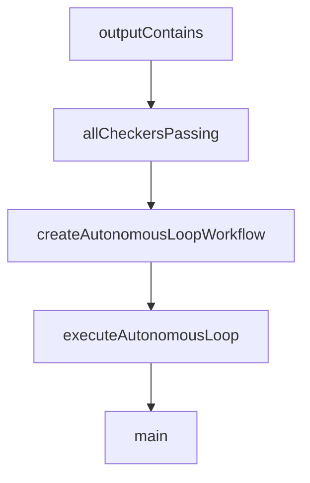

# Chapter 7: Evals, Observability, and Quality

Welcome to **Chapter 7: Evals, Observability, and Quality**. In this part of **Mastra Tutorial: TypeScript Framework for AI Agents and Workflows**, you will build an intuitive mental model first, then move into concrete implementation details and practical production tradeoffs.


Agent reliability improves only when quality and behavior are measured continuously.

## Quality System

| Layer | Metric |
|:------|:-------|
| evals | task success, safety compliance, regression deltas |
| traces | tool call path and latency distribution |
| logs | failure diagnosis and policy violations |

## Improvement Loop

1. define representative eval suite
2. run on every major prompt/workflow change
3. inspect failed traces
4. apply targeted fixes
5. rerun before release

## Source References

- [Mastra Evals Docs](https://mastra.ai/docs/evals/overview)
- [Mastra Observability Docs](https://mastra.ai/docs/observability/overview)

## Summary

You now have a measurable process for improving Mastra quality over time.

Next: [Chapter 8: Production Deployment and Scaling](08-production-deployment-and-scaling.md)

## Depth Expansion Playbook

## Source Code Walkthrough

### `explorations/ralph-wiggum-loop-prototype.ts`

The `outputContains` function in [`explorations/ralph-wiggum-loop-prototype.ts`](https://github.com/mastra-ai/mastra/blob/HEAD/explorations/ralph-wiggum-loop-prototype.ts) handles a key part of this chapter's functionality:

```ts
 * Check if output contains a specific string/pattern
 */
export function outputContains(pattern: string | RegExp): CompletionChecker {
  let lastOutput = '';
  return {
    async check() {
      const matches = typeof pattern === 'string' ? lastOutput.includes(pattern) : pattern.test(lastOutput);

      return {
        success: matches,
        message: matches ? `Output contains pattern` : `Output does not contain pattern`,
      };
    },
    // Helper to set output for checking
    setOutput: (output: string) => {
      lastOutput = output;
    },
  } as CompletionChecker & { setOutput: (output: string) => void };
}

/**
 * Combine multiple checkers (all must pass)
 */
export function allCheckersPassing(...checkers: CompletionChecker[]): CompletionChecker {
  return {
    async check() {
      const results = await Promise.all(checkers.map(c => c.check()));
      const allPassed = results.every(r => r.success);

      return {
        success: allPassed,
        message: results.map(r => r.message).join('; '),
```

This function is important because it defines how Mastra Tutorial: TypeScript Framework for AI Agents and Workflows implements the patterns covered in this chapter.

### `explorations/ralph-wiggum-loop-prototype.ts`

The `allCheckersPassing` function in [`explorations/ralph-wiggum-loop-prototype.ts`](https://github.com/mastra-ai/mastra/blob/HEAD/explorations/ralph-wiggum-loop-prototype.ts) handles a key part of this chapter's functionality:

```ts
 * Combine multiple checkers (all must pass)
 */
export function allCheckersPassing(...checkers: CompletionChecker[]): CompletionChecker {
  return {
    async check() {
      const results = await Promise.all(checkers.map(c => c.check()));
      const allPassed = results.every(r => r.success);

      return {
        success: allPassed,
        message: results.map(r => r.message).join('; '),
        data: { results },
      };
    },
  };
}

// ============================================================================
// Core Implementation
// ============================================================================

/**
 * Creates an autonomous loop workflow for an agent.
 *
 * This implements the Ralph Wiggum pattern: the agent iterates on a task
 * until completion criteria are met or max iterations are reached.
 */
export function createAutonomousLoopWorkflow(agent: Agent, mastra?: Mastra) {
  const iterationSchema = z.object({
    prompt: z.string(),
    iteration: z.number(),
    previousResults: z.array(
```

This function is important because it defines how Mastra Tutorial: TypeScript Framework for AI Agents and Workflows implements the patterns covered in this chapter.

### `explorations/ralph-wiggum-loop-prototype.ts`

The `createAutonomousLoopWorkflow` function in [`explorations/ralph-wiggum-loop-prototype.ts`](https://github.com/mastra-ai/mastra/blob/HEAD/explorations/ralph-wiggum-loop-prototype.ts) handles a key part of this chapter's functionality:

```ts
 * until completion criteria are met or max iterations are reached.
 */
export function createAutonomousLoopWorkflow(agent: Agent, mastra?: Mastra) {
  const iterationSchema = z.object({
    prompt: z.string(),
    iteration: z.number(),
    previousResults: z.array(
      z.object({
        iteration: z.number(),
        success: z.boolean(),
        output: z.string(),
        error: z.string().optional(),
      }),
    ),
    isComplete: z.boolean(),
    completionMessage: z.string().optional(),
  });

  const agentStep = createStep({
    id: 'agent-iteration',
    inputSchema: iterationSchema,
    outputSchema: z.object({
      text: z.string(),
      iteration: z.number(),
    }),
    execute: async ({ inputData }) => {
      // Build context from previous iterations
      let contextualPrompt = inputData.prompt;

      if (inputData.previousResults.length > 0) {
        const historyContext = inputData.previousResults
          .slice(-5) // Last 5 iterations
```

This function is important because it defines how Mastra Tutorial: TypeScript Framework for AI Agents and Workflows implements the patterns covered in this chapter.

### `explorations/ralph-wiggum-loop-prototype.ts`

The `executeAutonomousLoop` function in [`explorations/ralph-wiggum-loop-prototype.ts`](https://github.com/mastra-ai/mastra/blob/HEAD/explorations/ralph-wiggum-loop-prototype.ts) handles a key part of this chapter's functionality:

```ts
 * Executes an autonomous loop with the given agent and configuration.
 */
export async function executeAutonomousLoop(
  agent: Agent,
  config: AutonomousLoopConfig,
  mastra?: Mastra,
): Promise<AutonomousLoopResult> {
  const iterations: IterationResult[] = [];
  let totalTokens = 0;
  const startTime = Date.now();

  const contextWindow = config.contextWindow ?? 5;

  for (let i = 0; i < config.maxIterations; i++) {
    const iterationStartTime = Date.now();

    // Notify iteration start
    await config.onIterationStart?.(i + 1);

    // Build context from previous iterations
    const previousResults = iterations.slice(-contextWindow).map(r => ({
      iteration: r.iteration,
      success: r.success,
      output: r.agentOutput,
      error: r.error?.message,
    }));

    let contextualPrompt = config.prompt;
    if (previousResults.length > 0) {
      const historyContext = previousResults
        .map(
          r => `
```

This function is important because it defines how Mastra Tutorial: TypeScript Framework for AI Agents and Workflows implements the patterns covered in this chapter.


## How These Components Connect


