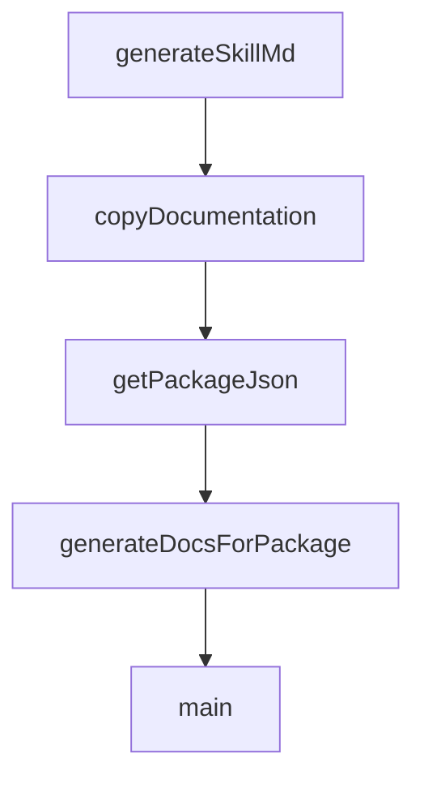

# Chapter 8: Production Deployment and Scaling

Welcome to **Chapter 8: Production Deployment and Scaling**. In this part of **Mastra Tutorial: TypeScript Framework for AI Agents and Workflows**, you will build an intuitive mental model first, then move into concrete implementation details and practical production tradeoffs.


This chapter turns Mastra apps from development projects into operated production systems.

## Production Checklist

- environment separation (dev/stage/prod)
- secret rotation and least-privilege access
- model/provider fallback strategy
- eval and trace gates in release pipeline
- incident and rollback runbooks

## Core Runtime Metrics

| Area | Metrics |
|:-----|:--------|
| quality | completion rate, regression rate |
| latency | p50/p95 response and tool times |
| reliability | timeout/retry/error rate |
| cost | model spend per successful task |

## Rollout Pattern

1. internal pilot with full telemetry
2. staged external rollout by risk tier
3. policy-gated expansion using SLO checks
4. continuous optimization from eval outcomes

## Source References

- [Mastra Docs](https://mastra.ai/docs)
- [Mastra Repository](https://github.com/mastra-ai/mastra)

## Summary

You now have a deployment and operations baseline for running Mastra systems at production quality.

## Source Code Walkthrough

### `scripts/generate-package-docs.ts`

The `generateSkillMd` function in [`scripts/generate-package-docs.ts`](https://github.com/mastra-ai/mastra/blob/HEAD/scripts/generate-package-docs.ts) handles a key part of this chapter's functionality:

```ts
}

function generateSkillMd(packageName: string, version: string, entries: ManifestEntry[]): string {
  // Generate compliant name: lowercase, hyphens, max 64 chars
  // "@mastra/core" -> "mastra-core"
  const skillName = packageName.replace('@', '').replace('/', '-').toLowerCase();

  // Generate description (max 1024 chars)
  const description = `Documentation for ${packageName}. Use when working with ${packageName} APIs, configuration, or implementation.`;

  // Group entries by category
  const grouped = new Map<string, ManifestEntry[]>();
  for (const entry of entries) {
    const cat = entry.category;
    if (!grouped.has(cat)) grouped.set(cat, []);
    grouped.get(cat)!.push(entry);
  }

  // Generate documentation list
  let docList = '';
  for (const [category, catEntries] of grouped) {
    docList += `\n### ${category.charAt(0).toUpperCase() + category.slice(1)}\n\n`;
    for (const entry of catEntries) {
      const fileName = generateFlatFileName(entry);
      docList += `- [${entry.title}](references/${fileName})${entry.description ? ` - ${entry.description}` : ''}\n`;
    }
  }

  return `---
name: ${skillName}
description: ${description}
metadata:
```

This function is important because it defines how Mastra Tutorial: TypeScript Framework for AI Agents and Workflows implements the patterns covered in this chapter.

### `scripts/generate-package-docs.ts`

The `copyDocumentation` function in [`scripts/generate-package-docs.ts`](https://github.com/mastra-ai/mastra/blob/HEAD/scripts/generate-package-docs.ts) handles a key part of this chapter's functionality:

```ts
}

function copyDocumentation(manifest: LlmsManifest, packageName: string, docsOutputDir: string): void {
  const entries = manifest.packages[packageName] || [];
  const referencesDir = path.join(docsOutputDir, 'references');

  fs.mkdirSync(referencesDir, { recursive: true });

  for (const entry of entries) {
    const sourcePath = path.join(MONOREPO_ROOT, 'docs/build', entry.path);
    const targetFileName = generateFlatFileName(entry);
    const targetPath = path.join(referencesDir, targetFileName);

    if (cachedExists(sourcePath)) {
      fs.copyFileSync(sourcePath, targetPath);
    } else {
      console.warn(`  Warning: Source not found: ${sourcePath}`);
    }
  }
}

// Cache for package.json contents
const packageJsonCache = new Map<string, { name: string; version: string }>();

function getPackageJson(packageRoot: string): { name: string; version: string } {
  const cached = packageJsonCache.get(packageRoot);
  if (cached) return cached;

  const packageJsonPath = path.join(packageRoot, 'package.json');
  if (!cachedExists(packageJsonPath)) {
    throw new Error(`package.json not found in ${packageRoot}`);
  }
```

This function is important because it defines how Mastra Tutorial: TypeScript Framework for AI Agents and Workflows implements the patterns covered in this chapter.

### `scripts/generate-package-docs.ts`

The `getPackageJson` function in [`scripts/generate-package-docs.ts`](https://github.com/mastra-ai/mastra/blob/HEAD/scripts/generate-package-docs.ts) handles a key part of this chapter's functionality:

```ts
function generateSourceMap(packageRoot: string): SourceMap {
  const distDir = path.join(packageRoot, 'dist');
  const packageJson = getPackageJson(packageRoot);

  const sourceMap: SourceMap = {
    version: packageJson.version,
    package: packageJson.name,
    exports: {},
    modules: {},
  };

  // Default modules to analyze
  const modules = [
    'agent',
    'tools',
    'workflows',
    'memory',
    'stream',
    'llm',
    'mastra',
    'mcp',
    'evals',
    'processors',
    'storage',
    'vector',
    'voice',
  ];

  for (const mod of modules) {
    const indexPath = path.join(distDir, mod, 'index.js');

    if (!cachedExists(indexPath)) {
```

This function is important because it defines how Mastra Tutorial: TypeScript Framework for AI Agents and Workflows implements the patterns covered in this chapter.

### `scripts/generate-package-docs.ts`

The `generateDocsForPackage` function in [`scripts/generate-package-docs.ts`](https://github.com/mastra-ai/mastra/blob/HEAD/scripts/generate-package-docs.ts) handles a key part of this chapter's functionality:

```ts
}

function generateDocsForPackage(packageName: string, packageRoot: string, manifest: LlmsManifest): void {
  const packageJson = getPackageJson(packageRoot);
  const docsOutputDir = path.join(packageRoot, 'dist', 'docs');
  const entries = manifest.packages[packageName];

  if (!entries || entries.length === 0) {
    console.warn(`No documentation found for ${packageName} in manifest`);
    return;
  }

  console.info(`\nGenerating documentation for ${packageName} (${entries.length} files)\n`);

  // Clean and create directory structure
  if (cachedExists(docsOutputDir)) {
    fs.rmSync(docsOutputDir, { recursive: true });
    // Clear from cache since we deleted it
    existsCache.delete(docsOutputDir);
  }
  fs.mkdirSync(path.join(docsOutputDir, 'references'), { recursive: true });
  fs.mkdirSync(path.join(docsOutputDir, 'assets'), { recursive: true });

  // Step 1: Generate SOURCE_MAP.json in assets/
  const sourcemap = generateSourceMap(packageRoot);
  fs.writeFileSync(path.join(docsOutputDir, 'assets', 'SOURCE_MAP.json'), JSON.stringify(sourcemap, null, 2), 'utf-8');

  // Step 2: Copy documentation files
  copyDocumentation(manifest, packageName, docsOutputDir);

  // Step 3: Generate SKILL.md
  const skillMd = generateSkillMd(packageName, packageJson.version, entries);
```

This function is important because it defines how Mastra Tutorial: TypeScript Framework for AI Agents and Workflows implements the patterns covered in this chapter.


## How These Components Connect


