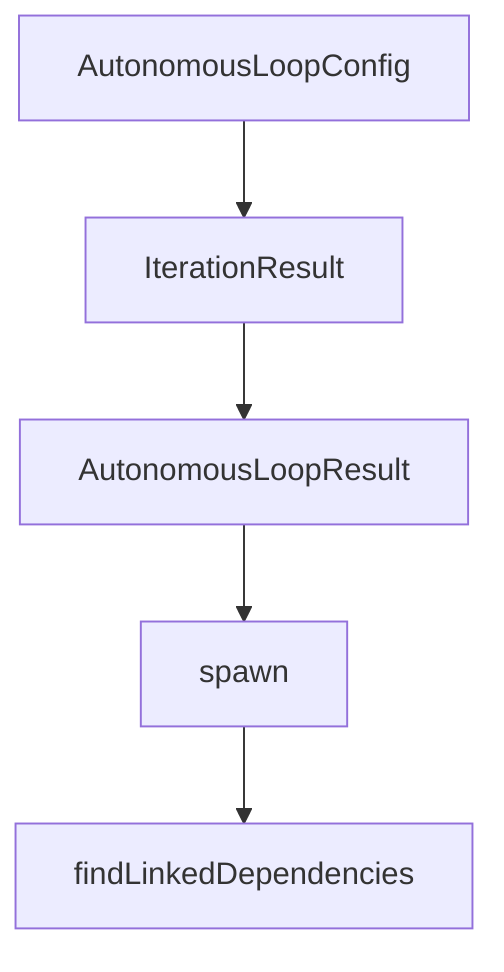

# Chapter 8: Production Deployment and Scaling

Welcome to **Chapter 8: Production Deployment and Scaling**. In this part of **Mastra Tutorial: TypeScript Framework for AI Agents and Workflows**, you will build an intuitive mental model first, then move into concrete implementation details and practical production tradeoffs.


This chapter turns Mastra apps from development projects into operated production systems.

## Production Checklist

- environment separation (dev/stage/prod)
- secret rotation and least-privilege access
- model/provider fallback strategy
- eval and trace gates in release pipeline
- incident and rollback runbooks

## Core Runtime Metrics

| Area | Metrics |
|:-----|:--------|
| quality | completion rate, regression rate |
| latency | p50/p95 response and tool times |
| reliability | timeout/retry/error rate |
| cost | model spend per successful task |

## Rollout Pattern

1. internal pilot with full telemetry
2. staged external rollout by risk tier
3. policy-gated expansion using SLO checks
4. continuous optimization from eval outcomes

## Source References

- [Mastra Docs](https://mastra.ai/docs)
- [Mastra Repository](https://github.com/mastra-ai/mastra)

## Summary

You now have a deployment and operations baseline for running Mastra systems at production quality.

## Depth Expansion Playbook

## Source Code Walkthrough

### `explorations/ralph-wiggum-loop-prototype.ts`

The `AutonomousLoopConfig` interface in [`explorations/ralph-wiggum-loop-prototype.ts`](https://github.com/mastra-ai/mastra/blob/HEAD/explorations/ralph-wiggum-loop-prototype.ts) handles a key part of this chapter's functionality:

```ts
}

export interface AutonomousLoopConfig {
  /** The task prompt to send to the agent */
  prompt: string;

  /** How to determine if the task is complete */
  completion: CompletionChecker;

  /** Maximum number of iterations before giving up */
  maxIterations: number;

  /** Optional: Maximum tokens to spend */
  maxTokens?: number;

  /** Optional: Delay between iterations in ms */
  iterationDelay?: number;

  /** Optional: How many previous iteration results to include in context */
  contextWindow?: number;

  /** Optional: Called after each iteration */
  onIteration?: (result: IterationResult) => void | Promise<void>;

  /** Optional: Called when starting an iteration */
  onIterationStart?: (iteration: number) => void | Promise<void>;
}

export interface IterationResult {
  iteration: number;
  success: boolean;
  agentOutput: string;
```

This interface is important because it defines how Mastra Tutorial: TypeScript Framework for AI Agents and Workflows implements the patterns covered in this chapter.

### `explorations/ralph-wiggum-loop-prototype.ts`

The `IterationResult` interface in [`explorations/ralph-wiggum-loop-prototype.ts`](https://github.com/mastra-ai/mastra/blob/HEAD/explorations/ralph-wiggum-loop-prototype.ts) handles a key part of this chapter's functionality:

```ts

  /** Optional: Called after each iteration */
  onIteration?: (result: IterationResult) => void | Promise<void>;

  /** Optional: Called when starting an iteration */
  onIterationStart?: (iteration: number) => void | Promise<void>;
}

export interface IterationResult {
  iteration: number;
  success: boolean;
  agentOutput: string;
  completionCheck: {
    success: boolean;
    message?: string;
  };
  tokensUsed?: number;
  duration: number;
  error?: Error;
}

export interface AutonomousLoopResult {
  success: boolean;
  iterations: IterationResult[];
  totalTokens: number;
  totalDuration: number;
  finalOutput: string;
  completionMessage?: string;
}

// ============================================================================
// Completion Checkers (Helpers)
```

This interface is important because it defines how Mastra Tutorial: TypeScript Framework for AI Agents and Workflows implements the patterns covered in this chapter.

### `explorations/ralph-wiggum-loop-prototype.ts`

The `AutonomousLoopResult` interface in [`explorations/ralph-wiggum-loop-prototype.ts`](https://github.com/mastra-ai/mastra/blob/HEAD/explorations/ralph-wiggum-loop-prototype.ts) handles a key part of this chapter's functionality:

```ts
}

export interface AutonomousLoopResult {
  success: boolean;
  iterations: IterationResult[];
  totalTokens: number;
  totalDuration: number;
  finalOutput: string;
  completionMessage?: string;
}

// ============================================================================
// Completion Checkers (Helpers)
// ============================================================================

/**
 * Check if tests pass
 */
export function testsPassing(testCommand = 'npm test'): CompletionChecker {
  return {
    async check() {
      try {
        const { stdout, stderr } = await execAsync(testCommand, { timeout: 300000 });
        return {
          success: true,
          message: 'All tests passed',
          data: { stdout, stderr },
        };
      } catch (error: any) {
        return {
          success: false,
          message: error.message,
```

This interface is important because it defines how Mastra Tutorial: TypeScript Framework for AI Agents and Workflows implements the patterns covered in this chapter.

### `scripts/ignore-example.js`

The `spawn` function in [`scripts/ignore-example.js`](https://github.com/mastra-ai/mastra/blob/HEAD/scripts/ignore-example.js) handles a key part of this chapter's functionality:

```js
import { spawn as nodeSpawn } from 'child_process';
import { readFileSync } from 'fs';
import { dirname, join } from 'path';
import { fileURLToPath } from 'url';

const dir = process.argv[2];
if (!dir) {
  console.error('Usage: node scripts/ignore-example.js <directory>');
  process.exit(1);
}

/**
 * Promisified version of Node.js spawn function
 *
 * @param {string} command - The command to run
 * @param {string[]} args - List of string arguments
 * @param {import('child_process').SpawnOptions} options - Spawn options
 * @returns {Promise<void>} Promise that resolves with the exit code when the process completes
 */
function spawn(command, args = [], options = {}) {
  return new Promise((resolve, reject) => {
    const childProcess = nodeSpawn(command, args, {
      // stdio: 'inherit',
      ...options,
    });

    childProcess.on('error', error => {
      reject(error);
    });

```

This function is important because it defines how Mastra Tutorial: TypeScript Framework for AI Agents and Workflows implements the patterns covered in this chapter.


## How These Components Connect


