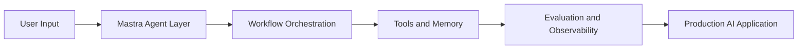

# Mastra Tutorial: TypeScript Framework for AI Agents and Workflows

> Learn how to build production AI applications with `mastra-ai/mastra`, including agents, workflows, memory, MCP tooling, and reliability operations.

## Why This Track Matters

Mastra is one of the strongest TypeScript-first frameworks for shipping AI agents beyond prototypes. It combines model routing, workflow control, memory systems, and production observability in one stack.

This track focuses on:

- agent and workflow architecture in TypeScript
- robust context, memory, and retrieval design
- MCP and ecosystem integration patterns
- evaluation and operations needed for reliable production launches

## Current Snapshot (auto-updated)

- repository: [`mastra-ai/mastra`](https://github.com/mastra-ai/mastra)
- stars: about **21.0k**
- latest release: [`mastra@1.3.0`](https://github.com/mastra-ai/mastra/releases/tag/mastra%401.3.0)
- development activity: very active with same-day updates
- project positioning: TypeScript AI framework for agents, workflows, memory, and production ops

## Mental Model

## Chapter Guide

| Chapter | Key Question | Outcome |
|:--------|:-------------|:--------|
| [01 - Getting Started](01-getting-started.md) | How do I bootstrap a Mastra project quickly? | Working local baseline |
| [02 - System Architecture](02-system-architecture.md) | How are core Mastra components organized? | Strong architecture model |
| [03 - Agents and Tools](03-agents-and-tools.md) | How do I design capable and safe agents? | Practical agent patterns |
| [04 - Workflows and Control Flow](04-workflows-and-control-flow.md) | When should I use workflows instead of free-form agents? | Better execution strategy |
| [05 - Memory, RAG, and Context](05-memory-rag-and-context.md) | How do I keep context useful over time? | Stable context architecture |
| [06 - MCP and Integration Patterns](06-mcp-and-integration-patterns.md) | How does Mastra integrate with broader agent ecosystems? | Integration blueprint |
| [07 - Evals, Observability, and Quality](07-evals-observability-and-quality.md) | How do I measure and improve reliability? | Continuous quality loop |
| [08 - Production Deployment and Scaling](08-production-deployment-and-scaling.md) | How do I run Mastra systems at production quality? | Deployment runbook baseline |

## What You Will Learn

- how to build and orchestrate Mastra agents and workflows
- how to design memory and retrieval strategies for long-lived systems
- how to integrate MCP capabilities and external toolchains
- how to evaluate, observe, and operate Mastra workloads in production

## Source References

- [Mastra Repository](https://github.com/mastra-ai/mastra)
- [Mastra Releases](https://github.com/mastra-ai/mastra/releases)
- [Mastra Documentation](https://mastra.ai/docs)
- [Mastra MCP Docs](https://mastra.ai/docs/tools-mcp/mcp-overview)

## Related Tutorials

- [Vercel AI Tutorial](../vercel-ai-tutorial/)
- [LangGraph Tutorial](../langgraph-tutorial/)
- [CrewAI Tutorial](../crewai-tutorial/)
- [MCP Servers Tutorial](../mcp-servers-tutorial/)

---

Start with [Chapter 1: Getting Started](01-getting-started.md).

## Navigation & Backlinks

- [Start Here: Chapter 1: Getting Started](01-getting-started.md)
- [Back to Main Catalog](../../README.md#-tutorial-catalog)
- [Browse A-Z Tutorial Directory](../../discoverability/tutorial-directory.md)
- [Search by Intent](../../discoverability/query-hub.md)
- [Explore Category Hubs](../../README.md#category-hubs)

## Full Chapter Map

1. [Chapter 1: Getting Started](01-getting-started.md)
2. [Chapter 2: System Architecture](02-system-architecture.md)
3. [Chapter 3: Agents and Tools](03-agents-and-tools.md)
4. [Chapter 4: Workflows and Control Flow](04-workflows-and-control-flow.md)
5. [Chapter 5: Memory, RAG, and Context](05-memory-rag-and-context.md)
6. [Chapter 6: MCP and Integration Patterns](06-mcp-and-integration-patterns.md)
7. [Chapter 7: Evals, Observability, and Quality](07-evals-observability-and-quality.md)
8. [Chapter 8: Production Deployment and Scaling](08-production-deployment-and-scaling.md)

*Generated by [AI Codebase Knowledge Builder](https://github.com/The-Pocket/Tutorial-Codebase-Knowledge)*
