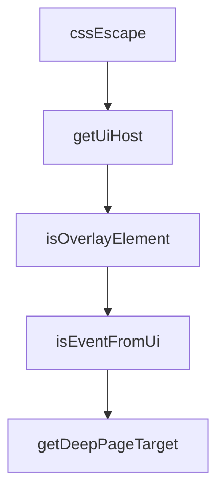

# Chapter 1: Getting Started and Native Bridge Setup

Welcome to **Chapter 1: Getting Started and Native Bridge Setup**. In this part of **MCP Chrome Tutorial: Control Your Real Chrome Browser Through MCP**, you will build an intuitive mental model first, then move into concrete implementation details and practical production tradeoffs.


This chapter establishes a stable local setup across native bridge install, extension loading, and MCP client connection.

## Learning Goals

- install `mcp-chrome-bridge` globally
- load the Chrome extension and verify connection
- connect an MCP client using streamable HTTP or stdio

## Baseline Install

```bash
npm install -g mcp-chrome-bridge
```

If needed, run manual registration:

```bash
mcp-chrome-bridge register
```

## Connection Checklist

1. extension is loaded in `chrome://extensions/`
2. extension UI shows connected bridge status
3. MCP client can call at least one basic tool
4. browser tab listing returns expected windows/tabs

## Source References

- [README Quick Start](https://github.com/hangwin/mcp-chrome/blob/master/README.md)
- [Native Install Guide](https://github.com/hangwin/mcp-chrome/blob/master/app/native-server/install.md)

## Summary

You now have MCP Chrome installed and reachable from an MCP client.

Next: [Chapter 2: Architecture and Component Boundaries](02-architecture-and-component-boundaries.md)

## Source Code Walkthrough

### `app/chrome-extension/inject-scripts/element-picker.js`

The `cssEscape` function in [`app/chrome-extension/inject-scripts/element-picker.js`](https://github.com/hangwin/mcp-chrome/blob/HEAD/app/chrome-extension/inject-scripts/element-picker.js) handles a key part of this chapter's functionality:

```js
  // ============================================================

  function cssEscape(value) {
    try {
      if (window.CSS && typeof window.CSS.escape === 'function') {
        return window.CSS.escape(value);
      }
    } catch {
      // Fallback
    }
    return String(value).replace(/[^a-zA-Z0-9_-]/g, (c) => `\\${c}`);
  }

  // ============================================================
  // UI Detection Helpers
  // ============================================================

  function getUiHost() {
    try {
      return document.getElementById(UI_HOST_ID);
    } catch {
      return null;
    }
  }

  function isOverlayElement(node) {
    if (!(node instanceof Node)) return false;
    const host = getUiHost();
    if (!host) return false;
    if (node === host) return true;
    const root = typeof node.getRootNode === 'function' ? node.getRootNode() : null;
    return root instanceof ShadowRoot && root.host === host;
```

This function is important because it defines how MCP Chrome Tutorial: Control Your Real Chrome Browser Through MCP implements the patterns covered in this chapter.

### `app/chrome-extension/inject-scripts/element-picker.js`

The `getUiHost` function in [`app/chrome-extension/inject-scripts/element-picker.js`](https://github.com/hangwin/mcp-chrome/blob/HEAD/app/chrome-extension/inject-scripts/element-picker.js) handles a key part of this chapter's functionality:

```js
  // ============================================================

  function getUiHost() {
    try {
      return document.getElementById(UI_HOST_ID);
    } catch {
      return null;
    }
  }

  function isOverlayElement(node) {
    if (!(node instanceof Node)) return false;
    const host = getUiHost();
    if (!host) return false;
    if (node === host) return true;
    const root = typeof node.getRootNode === 'function' ? node.getRootNode() : null;
    return root instanceof ShadowRoot && root.host === host;
  }

  function isEventFromUi(ev) {
    if (!ev) return false;
    try {
      if (typeof ev.composedPath === 'function') {
        const path = ev.composedPath();
        if (Array.isArray(path)) {
          return path.some((n) => isOverlayElement(n));
        }
      }
    } catch {
      // Fallback
    }
    return isOverlayElement(ev.target);
```

This function is important because it defines how MCP Chrome Tutorial: Control Your Real Chrome Browser Through MCP implements the patterns covered in this chapter.

### `app/chrome-extension/inject-scripts/element-picker.js`

The `isOverlayElement` function in [`app/chrome-extension/inject-scripts/element-picker.js`](https://github.com/hangwin/mcp-chrome/blob/HEAD/app/chrome-extension/inject-scripts/element-picker.js) handles a key part of this chapter's functionality:

```js
  }

  function isOverlayElement(node) {
    if (!(node instanceof Node)) return false;
    const host = getUiHost();
    if (!host) return false;
    if (node === host) return true;
    const root = typeof node.getRootNode === 'function' ? node.getRootNode() : null;
    return root instanceof ShadowRoot && root.host === host;
  }

  function isEventFromUi(ev) {
    if (!ev) return false;
    try {
      if (typeof ev.composedPath === 'function') {
        const path = ev.composedPath();
        if (Array.isArray(path)) {
          return path.some((n) => isOverlayElement(n));
        }
      }
    } catch {
      // Fallback
    }
    return isOverlayElement(ev.target);
  }

  /**
   * Get the deepest page target from an event, handling Shadow DOM.
   */
  function getDeepPageTarget(ev) {
    if (!ev) return null;
    try {
```

This function is important because it defines how MCP Chrome Tutorial: Control Your Real Chrome Browser Through MCP implements the patterns covered in this chapter.

### `app/chrome-extension/inject-scripts/element-picker.js`

The `isEventFromUi` function in [`app/chrome-extension/inject-scripts/element-picker.js`](https://github.com/hangwin/mcp-chrome/blob/HEAD/app/chrome-extension/inject-scripts/element-picker.js) handles a key part of this chapter's functionality:

```js
  }

  function isEventFromUi(ev) {
    if (!ev) return false;
    try {
      if (typeof ev.composedPath === 'function') {
        const path = ev.composedPath();
        if (Array.isArray(path)) {
          return path.some((n) => isOverlayElement(n));
        }
      }
    } catch {
      // Fallback
    }
    return isOverlayElement(ev.target);
  }

  /**
   * Get the deepest page target from an event, handling Shadow DOM.
   */
  function getDeepPageTarget(ev) {
    if (!ev) return null;
    try {
      const path = typeof ev.composedPath === 'function' ? ev.composedPath() : null;
      if (Array.isArray(path) && path.length > 0) {
        for (const node of path) {
          if (node instanceof Element && !isOverlayElement(node)) {
            return node;
          }
        }
      }
    } catch {
```

This function is important because it defines how MCP Chrome Tutorial: Control Your Real Chrome Browser Through MCP implements the patterns covered in this chapter.


## How These Components Connect


