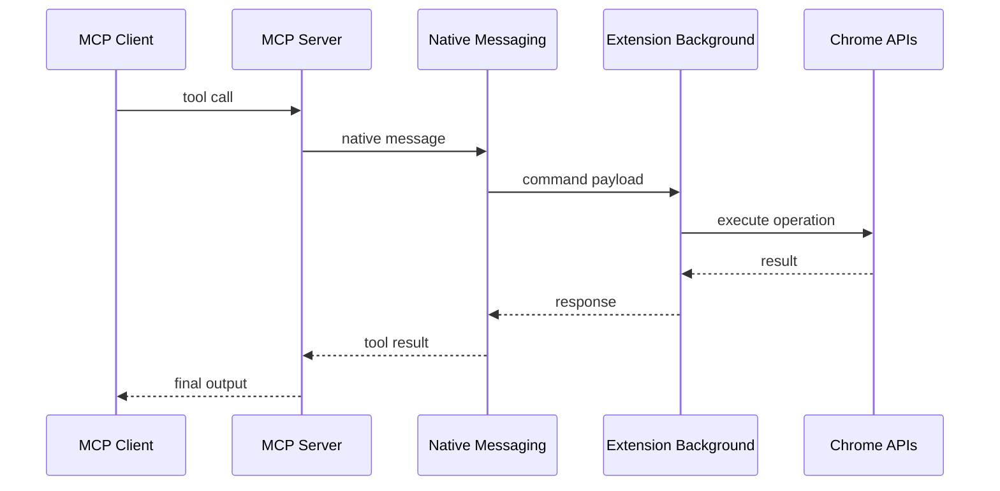

# Chapter 2: Architecture and Component Boundaries

MCP Chrome combines multiple layers: MCP protocol handling, native messaging, extension runtime, and AI vector processing.

## Learning Goals

- map each runtime layer and ownership boundary
- understand end-to-end tool call data flow
- identify where to add diagnostics and controls

## Layered Architecture

| Layer | Responsibility |
|:------|:---------------|
| MCP server | protocol transport and tool dispatch |
| native host | bridge communication with extension |
| extension background | executes Chrome API operations |
| content/offscreen workers | page interaction and AI processing |
| shared packages | tool schemas and common types |

## Tool Call Flow

## Source References

- [Architecture](https://github.com/hangwin/mcp-chrome/blob/master/docs/ARCHITECTURE.md)
- [Contributing Project Structure](https://github.com/hangwin/mcp-chrome/blob/master/docs/CONTRIBUTING.md)

## Summary

You now have a clear map of where browser actions, protocol logic, and AI processing live.

Next: [Chapter 3: Tool Surface: Browser, Network, and Interaction](03-tool-surface-browser-network-and-interaction.md)
