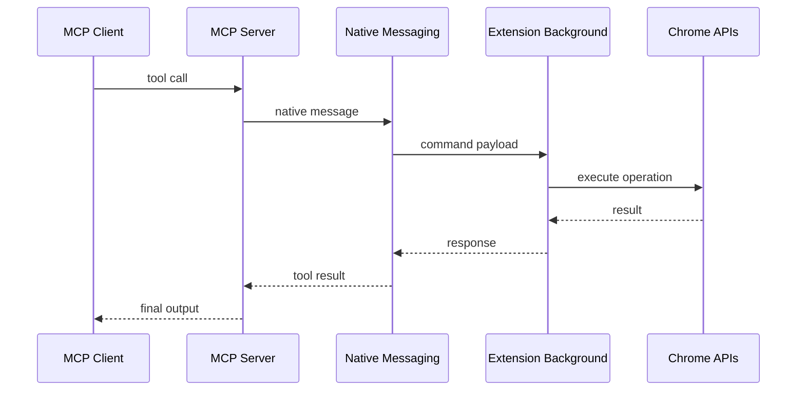
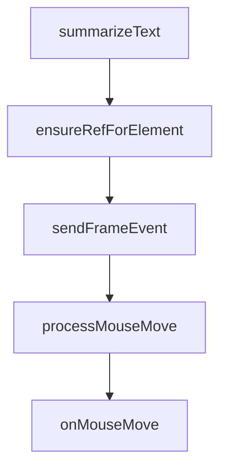

# Chapter 2: Architecture and Component Boundaries

Welcome to **Chapter 2: Architecture and Component Boundaries**. In this part of **MCP Chrome Tutorial: Control Your Real Chrome Browser Through MCP**, you will build an intuitive mental model first, then move into concrete implementation details and practical production tradeoffs.


MCP Chrome combines multiple layers: MCP protocol handling, native messaging, extension runtime, and AI vector processing.

## Learning Goals

- map each runtime layer and ownership boundary
- understand end-to-end tool call data flow
- identify where to add diagnostics and controls

## Layered Architecture

| Layer | Responsibility |
|:------|:---------------|
| MCP server | protocol transport and tool dispatch |
| native host | bridge communication with extension |
| extension background | executes Chrome API operations |
| content/offscreen workers | page interaction and AI processing |
| shared packages | tool schemas and common types |

## Tool Call Flow


```mermaid
sequenceDiagram
    participant Client as MCP Client
    participant MCP as MCP Server
    participant Bridge as Native Messaging
    participant Ext as Extension Background
    participant Chrome as Chrome APIs

    Client->>MCP: tool call
    MCP->>Bridge: native message
    Bridge->>Ext: command payload
    Ext->>Chrome: execute operation
    Chrome-->>Ext: result
    Ext-->>Bridge: response
    Bridge-->>MCP: tool result
    MCP-->>Client: final output
```

## Source References

- [Architecture](https://github.com/hangwin/mcp-chrome/blob/master/docs/ARCHITECTURE.md)
- [Contributing Project Structure](https://github.com/hangwin/mcp-chrome/blob/master/docs/CONTRIBUTING.md)

## Summary

You now have a clear map of where browser actions, protocol logic, and AI processing live.

Next: [Chapter 3: Tool Surface: Browser, Network, and Interaction](03-tool-surface-browser-network-and-interaction.md)

## Depth Expansion Playbook

## Source Code Walkthrough

### `app/chrome-extension/inject-scripts/element-picker.js`

The `summarizeText` function in [`app/chrome-extension/inject-scripts/element-picker.js`](https://github.com/hangwin/mcp-chrome/blob/HEAD/app/chrome-extension/inject-scripts/element-picker.js) handles a key part of this chapter's functionality:

```js
  // ============================================================

  function summarizeText(el) {
    if (!(el instanceof Element)) return '';
    try {
      const aria = el.getAttribute('aria-label');
      if (aria && aria.trim()) return aria.trim().slice(0, MAX_TEXT_LEN);
      const placeholder = el.getAttribute('placeholder');
      if (placeholder && placeholder.trim()) return placeholder.trim().slice(0, MAX_TEXT_LEN);
      const title = el.getAttribute('title');
      if (title && title.trim()) return title.trim().slice(0, MAX_TEXT_LEN);
      const alt = el.getAttribute('alt');
      if (alt && alt.trim()) return alt.trim().slice(0, MAX_TEXT_LEN);
    } catch {
      // Continue
    }
    try {
      const t = (el.textContent || '').trim().replace(/\s+/g, ' ');
      return t ? t.slice(0, MAX_TEXT_LEN) : '';
    } catch {
      return '';
    }
  }

  // ============================================================
  // Ref Management (Compatible with accessibility-tree-helper.js)
  // ============================================================

  function ensureRefForElement(el) {
    try {
      if (!window.__claudeElementMap) window.__claudeElementMap = {};
      if (!window.__claudeRefCounter) window.__claudeRefCounter = 0;
```

This function is important because it defines how MCP Chrome Tutorial: Control Your Real Chrome Browser Through MCP implements the patterns covered in this chapter.

### `app/chrome-extension/inject-scripts/element-picker.js`

The `ensureRefForElement` function in [`app/chrome-extension/inject-scripts/element-picker.js`](https://github.com/hangwin/mcp-chrome/blob/HEAD/app/chrome-extension/inject-scripts/element-picker.js) handles a key part of this chapter's functionality:

```js
  // ============================================================

  function ensureRefForElement(el) {
    try {
      if (!window.__claudeElementMap) window.__claudeElementMap = {};
      if (!window.__claudeRefCounter) window.__claudeRefCounter = 0;
    } catch {
      // Best effort
    }

    // Check if element already has a ref
    let refId = null;
    try {
      for (const k in window.__claudeElementMap) {
        const w = window.__claudeElementMap[k];
        if (w && w.deref && w.deref() === el) {
          refId = k;
          break;
        }
      }
    } catch {
      // Continue
    }

    // Create new ref if needed
    if (!refId) {
      try {
        refId = `ref_${++window.__claudeRefCounter}`;
        window.__claudeElementMap[refId] = new WeakRef(el);
      } catch {
        // Continue
      }
```

This function is important because it defines how MCP Chrome Tutorial: Control Your Real Chrome Browser Through MCP implements the patterns covered in this chapter.

### `app/chrome-extension/inject-scripts/element-picker.js`

The `sendFrameEvent` function in [`app/chrome-extension/inject-scripts/element-picker.js`](https://github.com/hangwin/mcp-chrome/blob/HEAD/app/chrome-extension/inject-scripts/element-picker.js) handles a key part of this chapter's functionality:

```js
  // ============================================================

  function sendFrameEvent(payload) {
    try {
      chrome.runtime.sendMessage(payload);
    } catch {
      // Best effort
    }
  }

  // ============================================================
  // Event Handlers
  // ============================================================

  function processMouseMove(ev) {
    if (!STATE.active) return;

    // Skip if event is from our UI
    if (isEventFromUi(ev)) {
      STATE.lastHoverEl = null;
      clearHighlighter();
      return;
    }

    const target = getDeepPageTarget(ev);
    if (!target) {
      STATE.lastHoverEl = null;
      clearHighlighter();
      return;
    }

    // Skip if same element
```

This function is important because it defines how MCP Chrome Tutorial: Control Your Real Chrome Browser Through MCP implements the patterns covered in this chapter.

### `app/chrome-extension/inject-scripts/element-picker.js`

The `processMouseMove` function in [`app/chrome-extension/inject-scripts/element-picker.js`](https://github.com/hangwin/mcp-chrome/blob/HEAD/app/chrome-extension/inject-scripts/element-picker.js) handles a key part of this chapter's functionality:

```js
  // ============================================================

  function processMouseMove(ev) {
    if (!STATE.active) return;

    // Skip if event is from our UI
    if (isEventFromUi(ev)) {
      STATE.lastHoverEl = null;
      clearHighlighter();
      return;
    }

    const target = getDeepPageTarget(ev);
    if (!target) {
      STATE.lastHoverEl = null;
      clearHighlighter();
      return;
    }

    // Skip if same element
    if (STATE.lastHoverEl === target) return;
    STATE.lastHoverEl = target;
    moveHighlighterTo(target);
  }

  function onMouseMove(ev) {
    if (!STATE.active) return;
    STATE.pendingHoverEvent = ev;
    if (STATE.hoverRafId != null) return;
    STATE.hoverRafId = requestAnimationFrame(() => {
      STATE.hoverRafId = null;
      const latest = STATE.pendingHoverEvent;
```

This function is important because it defines how MCP Chrome Tutorial: Control Your Real Chrome Browser Through MCP implements the patterns covered in this chapter.


## How These Components Connect


```mermaid
flowchart TD
    A[summarizeText]
    B[ensureRefForElement]
    C[sendFrameEvent]
    D[processMouseMove]
    E[onMouseMove]
    A --> B
    B --> C
    C --> D
    D --> E
```
