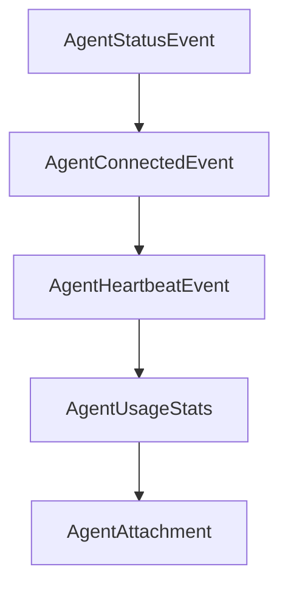

# Chapter 3: Tool Surface: Browser, Network, and Interaction

Welcome to **Chapter 3: Tool Surface: Browser, Network, and Interaction**. In this part of **MCP Chrome Tutorial: Control Your Real Chrome Browser Through MCP**, you will build an intuitive mental model first, then move into concrete implementation details and practical production tradeoffs.


MCP Chrome exposes a broad tool API that spans tab management, page interaction, network capture, and data operations.

## Learning Goals

- choose the right tool family for each task
- avoid over-broad automation sequences
- design safer multi-step browser workflows

## Tool Families

| Family | Example Tools |
|:-------|:--------------|
| browser management | `get_windows_and_tabs`, `chrome_navigate`, `chrome_switch_tab` |
| network monitoring | capture start/stop, debugger start/stop, custom request |
| content analysis | `chrome_get_web_content`, `search_tabs_content`, interactive element discovery |
| interaction | click, fill/select, keyboard operations |
| data management | history and bookmark operations |

## Selection Heuristics

1. use content extraction before interaction when you need grounding
2. prefer explicit tab targeting in multi-tab sessions
3. gate destructive actions (close/delete) with confirmations in client prompts

## Source References

- [Tools Reference](https://github.com/hangwin/mcp-chrome/blob/master/docs/TOOLS.md)
- [README Tool Summary](https://github.com/hangwin/mcp-chrome/blob/master/README.md)

## Summary

You now understand how to map tasks to the right MCP Chrome tool group with lower failure risk.

Next: [Chapter 4: Semantic Search and Vector Processing](04-semantic-search-and-vector-processing.md)

## Depth Expansion Playbook

## Source Code Walkthrough

### `packages/shared/src/agent-types.ts`

The `AgentStatusEvent` interface in [`packages/shared/src/agent-types.ts`](https://github.com/hangwin/mcp-chrome/blob/HEAD/packages/shared/src/agent-types.ts) handles a key part of this chapter's functionality:

```ts
export type StreamTransport = 'sse' | 'websocket';

export interface AgentStatusEvent {
  sessionId: string;
  status: 'starting' | 'ready' | 'running' | 'completed' | 'error' | 'cancelled';
  message?: string;
  requestId?: string;
}

export interface AgentConnectedEvent {
  sessionId: string;
  transport: StreamTransport;
  timestamp: string;
}

export interface AgentHeartbeatEvent {
  timestamp: string;
}

/** Usage statistics for a request */
export interface AgentUsageStats {
  sessionId: string;
  requestId?: string;
  inputTokens: number;
  outputTokens: number;
  cacheReadInputTokens?: number;
  cacheCreationInputTokens?: number;
  totalCostUsd: number;
  durationMs: number;
  numTurns: number;
}

```

This interface is important because it defines how MCP Chrome Tutorial: Control Your Real Chrome Browser Through MCP implements the patterns covered in this chapter.

### `packages/shared/src/agent-types.ts`

The `AgentConnectedEvent` interface in [`packages/shared/src/agent-types.ts`](https://github.com/hangwin/mcp-chrome/blob/HEAD/packages/shared/src/agent-types.ts) handles a key part of this chapter's functionality:

```ts
}

export interface AgentConnectedEvent {
  sessionId: string;
  transport: StreamTransport;
  timestamp: string;
}

export interface AgentHeartbeatEvent {
  timestamp: string;
}

/** Usage statistics for a request */
export interface AgentUsageStats {
  sessionId: string;
  requestId?: string;
  inputTokens: number;
  outputTokens: number;
  cacheReadInputTokens?: number;
  cacheCreationInputTokens?: number;
  totalCostUsd: number;
  durationMs: number;
  numTurns: number;
}

export type RealtimeEvent =
  | { type: 'message'; data: AgentMessage }
  | { type: 'status'; data: AgentStatusEvent }
  | { type: 'error'; error: string; data?: { sessionId?: string; requestId?: string } }
  | { type: 'connected'; data: AgentConnectedEvent }
  | { type: 'heartbeat'; data: AgentHeartbeatEvent }
  | { type: 'usage'; data: AgentUsageStats };
```

This interface is important because it defines how MCP Chrome Tutorial: Control Your Real Chrome Browser Through MCP implements the patterns covered in this chapter.

### `packages/shared/src/agent-types.ts`

The `AgentHeartbeatEvent` interface in [`packages/shared/src/agent-types.ts`](https://github.com/hangwin/mcp-chrome/blob/HEAD/packages/shared/src/agent-types.ts) handles a key part of this chapter's functionality:

```ts
}

export interface AgentHeartbeatEvent {
  timestamp: string;
}

/** Usage statistics for a request */
export interface AgentUsageStats {
  sessionId: string;
  requestId?: string;
  inputTokens: number;
  outputTokens: number;
  cacheReadInputTokens?: number;
  cacheCreationInputTokens?: number;
  totalCostUsd: number;
  durationMs: number;
  numTurns: number;
}

export type RealtimeEvent =
  | { type: 'message'; data: AgentMessage }
  | { type: 'status'; data: AgentStatusEvent }
  | { type: 'error'; error: string; data?: { sessionId?: string; requestId?: string } }
  | { type: 'connected'; data: AgentConnectedEvent }
  | { type: 'heartbeat'; data: AgentHeartbeatEvent }
  | { type: 'usage'; data: AgentUsageStats };

// ============================================================
// HTTP API Contracts
// ============================================================

export interface AgentAttachment {
```

This interface is important because it defines how MCP Chrome Tutorial: Control Your Real Chrome Browser Through MCP implements the patterns covered in this chapter.

### `packages/shared/src/agent-types.ts`

The `AgentUsageStats` interface in [`packages/shared/src/agent-types.ts`](https://github.com/hangwin/mcp-chrome/blob/HEAD/packages/shared/src/agent-types.ts) handles a key part of this chapter's functionality:

```ts

/** Usage statistics for a request */
export interface AgentUsageStats {
  sessionId: string;
  requestId?: string;
  inputTokens: number;
  outputTokens: number;
  cacheReadInputTokens?: number;
  cacheCreationInputTokens?: number;
  totalCostUsd: number;
  durationMs: number;
  numTurns: number;
}

export type RealtimeEvent =
  | { type: 'message'; data: AgentMessage }
  | { type: 'status'; data: AgentStatusEvent }
  | { type: 'error'; error: string; data?: { sessionId?: string; requestId?: string } }
  | { type: 'connected'; data: AgentConnectedEvent }
  | { type: 'heartbeat'; data: AgentHeartbeatEvent }
  | { type: 'usage'; data: AgentUsageStats };

// ============================================================
// HTTP API Contracts
// ============================================================

export interface AgentAttachment {
  type: 'file' | 'image';
  name: string;
  mimeType: string;
  dataBase64: string;
}
```

This interface is important because it defines how MCP Chrome Tutorial: Control Your Real Chrome Browser Through MCP implements the patterns covered in this chapter.


## How These Components Connect


