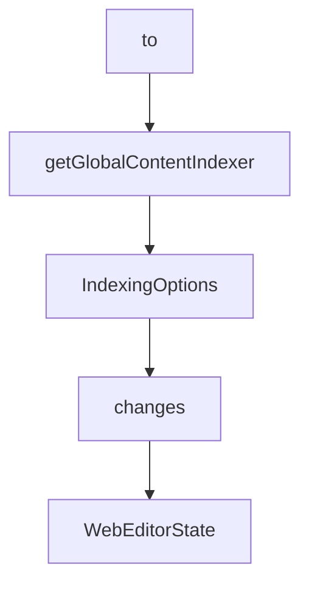

# Chapter 3: Tool Surface: Browser, Network, and Interaction

Welcome to **Chapter 3: Tool Surface: Browser, Network, and Interaction**. In this part of **MCP Chrome Tutorial: Control Your Real Chrome Browser Through MCP**, you will build an intuitive mental model first, then move into concrete implementation details and practical production tradeoffs.


MCP Chrome exposes a broad tool API that spans tab management, page interaction, network capture, and data operations.

## Learning Goals

- choose the right tool family for each task
- avoid over-broad automation sequences
- design safer multi-step browser workflows

## Tool Families

| Family | Example Tools |
|:-------|:--------------|
| browser management | `get_windows_and_tabs`, `chrome_navigate`, `chrome_switch_tab` |
| network monitoring | capture start/stop, debugger start/stop, custom request |
| content analysis | `chrome_get_web_content`, `search_tabs_content`, interactive element discovery |
| interaction | click, fill/select, keyboard operations |
| data management | history and bookmark operations |

## Selection Heuristics

1. use content extraction before interaction when you need grounding
2. prefer explicit tab targeting in multi-tab sessions
3. gate destructive actions (close/delete) with confirmations in client prompts

## Source References

- [Tools Reference](https://github.com/hangwin/mcp-chrome/blob/master/docs/TOOLS.md)
- [README Tool Summary](https://github.com/hangwin/mcp-chrome/blob/master/README.md)

## Summary

You now understand how to map tasks to the right MCP Chrome tool group with lower failure risk.

Next: [Chapter 4: Semantic Search and Vector Processing](04-semantic-search-and-vector-processing.md)

## Source Code Walkthrough

### `app/chrome-extension/utils/content-indexer.ts`

The `to` class in [`app/chrome-extension/utils/content-indexer.ts`](https://github.com/hangwin/mcp-chrome/blob/HEAD/app/chrome-extension/utils/content-indexer.ts) handles a key part of this chapter's functionality:

```ts
/**
 * Content index manager
 * Responsible for automatically extracting, chunking and indexing tab content
 */

import { TextChunker } from './text-chunker';
import { VectorDatabase, getGlobalVectorDatabase } from './vector-database';
import {
  SemanticSimilarityEngine,
  SemanticSimilarityEngineProxy,
  PREDEFINED_MODELS,
  type ModelPreset,
} from './semantic-similarity-engine';
import { TOOL_MESSAGE_TYPES } from '@/common/message-types';

export interface IndexingOptions {
  autoIndex?: boolean;
  maxChunksPerPage?: number;
  skipDuplicates?: boolean;
}

export class ContentIndexer {
  private textChunker: TextChunker;
  private vectorDatabase!: VectorDatabase;
  private semanticEngine!: SemanticSimilarityEngine | SemanticSimilarityEngineProxy;
  private isInitialized = false;
  private isInitializing = false;
  private initPromise: Promise<void> | null = null;
  private indexedPages = new Set<string>();
  private readonly options: Required<IndexingOptions>;

  constructor(options?: IndexingOptions) {
```

This class is important because it defines how MCP Chrome Tutorial: Control Your Real Chrome Browser Through MCP implements the patterns covered in this chapter.

### `app/chrome-extension/utils/content-indexer.ts`

The `getGlobalContentIndexer` function in [`app/chrome-extension/utils/content-indexer.ts`](https://github.com/hangwin/mcp-chrome/blob/HEAD/app/chrome-extension/utils/content-indexer.ts) handles a key part of this chapter's functionality:

```ts
 * Get global ContentIndexer instance
 */
export function getGlobalContentIndexer(): ContentIndexer {
  if (!globalContentIndexer) {
    globalContentIndexer = new ContentIndexer();
  }
  return globalContentIndexer;
}

```

This function is important because it defines how MCP Chrome Tutorial: Control Your Real Chrome Browser Through MCP implements the patterns covered in this chapter.

### `app/chrome-extension/utils/content-indexer.ts`

The `IndexingOptions` interface in [`app/chrome-extension/utils/content-indexer.ts`](https://github.com/hangwin/mcp-chrome/blob/HEAD/app/chrome-extension/utils/content-indexer.ts) handles a key part of this chapter's functionality:

```ts
import { TOOL_MESSAGE_TYPES } from '@/common/message-types';

export interface IndexingOptions {
  autoIndex?: boolean;
  maxChunksPerPage?: number;
  skipDuplicates?: boolean;
}

export class ContentIndexer {
  private textChunker: TextChunker;
  private vectorDatabase!: VectorDatabase;
  private semanticEngine!: SemanticSimilarityEngine | SemanticSimilarityEngineProxy;
  private isInitialized = false;
  private isInitializing = false;
  private initPromise: Promise<void> | null = null;
  private indexedPages = new Set<string>();
  private readonly options: Required<IndexingOptions>;

  constructor(options?: IndexingOptions) {
    this.options = {
      autoIndex: true,
      maxChunksPerPage: 50,
      skipDuplicates: true,
      ...options,
    };

    this.textChunker = new TextChunker();
  }

  /**
   * Get current selected model configuration
   */
```

This interface is important because it defines how MCP Chrome Tutorial: Control Your Real Chrome Browser Through MCP implements the patterns covered in this chapter.

### `app/chrome-extension/common/web-editor-types.ts`

The `changes` class in [`app/chrome-extension/common/web-editor-types.ts`](https://github.com/hangwin/mcp-chrome/blob/HEAD/app/chrome-extension/common/web-editor-types.ts) handles a key part of this chapter's functionality:

```ts
 *
 * Uses multiple strategies to locate elements, supporting:
 * - HMR/DOM changes recovery
 * - Cross-session persistence
 * - Framework-agnostic identification
 */
export interface ElementLocator {
  /** CSS selector candidates (ordered by specificity) */
  selectors: string[];
  /** Structural fingerprint for similarity matching */
  fingerprint: string;
  /** Framework debug information (React/Vue) */
  debugSource?: DebugSource;
  /** DOM tree path (child indices from root) */
  path: number[];
  /** iframe selector chain (from top to target frame) - Phase 4 */
  frameChain?: string[];
  /** Shadow DOM host selector chain - Phase 2 */
  shadowHostChain?: string[];
}

// =============================================================================
// Transaction System (Phase 1 - Basic Structure, Low Priority)
// =============================================================================

/** Transaction operation types */
export type TransactionType = 'style' | 'text' | 'class' | 'move' | 'structure';

/**
 * Transaction snapshot for undo/redo
 * Captures element state before/after changes
 */
```

This class is important because it defines how MCP Chrome Tutorial: Control Your Real Chrome Browser Through MCP implements the patterns covered in this chapter.


## How These Components Connect


