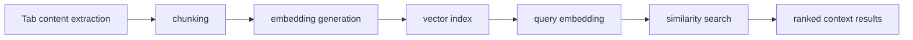
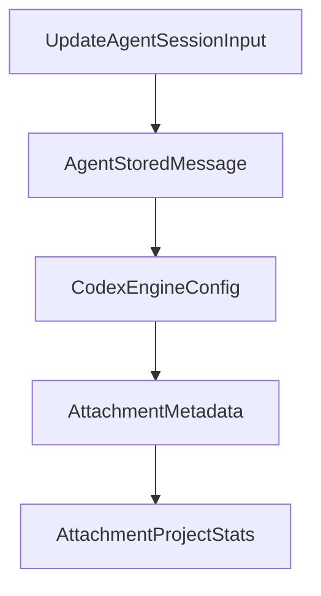

# Chapter 4: Semantic Search and Vector Processing

Welcome to **Chapter 4: Semantic Search and Vector Processing**. In this part of **MCP Chrome Tutorial: Control Your Real Chrome Browser Through MCP**, you will build an intuitive mental model first, then move into concrete implementation details and practical production tradeoffs.


MCP Chrome includes a semantic engine for intelligent tab-content discovery, powered by embeddings and vector search.

## Learning Goals

- understand semantic index architecture at a high level
- identify performance-sensitive parts of the vector pipeline
- plan retrieval quality checks for real workflows

## Semantic Pipeline



## Performance Signals from Architecture Docs

- WebAssembly SIMD is used for faster vector math operations.
- worker-based execution reduces UI blocking.
- vector database configuration controls recall, latency, and memory behavior.

## Source References

- [Architecture: AI Processing and Optimizations](https://github.com/hangwin/mcp-chrome/blob/master/docs/ARCHITECTURE.md)
- [Changelog](https://github.com/hangwin/mcp-chrome/blob/master/docs/CHANGELOG.md)

## Summary

You now have a functional mental model for how semantic tab search works and where tuning matters.

Next: [Chapter 5: Transport Modes and Client Configuration](05-transport-modes-and-client-configuration.md)

## Depth Expansion Playbook

## Source Code Walkthrough

### `packages/shared/src/agent-types.ts`

The `UpdateAgentSessionInput` interface in [`packages/shared/src/agent-types.ts`](https://github.com/hangwin/mcp-chrome/blob/HEAD/packages/shared/src/agent-types.ts) handles a key part of this chapter's functionality:

```ts
 * Options for updating a session.
 */
export interface UpdateAgentSessionInput {
  name?: string | null;
  model?: string | null;
  permissionMode?: string | null;
  allowDangerouslySkipPermissions?: boolean | null;
  systemPromptConfig?: AgentSystemPromptConfig | null;
  optionsConfig?: AgentSessionOptionsConfig | null;
}

// ============================================================
// Stored Message (for persistence)
// ============================================================

export interface AgentStoredMessage {
  id: string;
  projectId: string;
  sessionId: string;
  conversationId?: string | null;
  role: AgentRole;
  content: string;
  messageType: AgentMessage['messageType'];
  metadata?: Record<string, unknown>;
  cliSource?: string | null;
  createdAt?: string;
  requestId?: string;
}

// ============================================================
// Codex Engine Configuration
// ============================================================
```

This interface is important because it defines how MCP Chrome Tutorial: Control Your Real Chrome Browser Through MCP implements the patterns covered in this chapter.

### `packages/shared/src/agent-types.ts`

The `AgentStoredMessage` interface in [`packages/shared/src/agent-types.ts`](https://github.com/hangwin/mcp-chrome/blob/HEAD/packages/shared/src/agent-types.ts) handles a key part of this chapter's functionality:

```ts
// ============================================================

export interface AgentStoredMessage {
  id: string;
  projectId: string;
  sessionId: string;
  conversationId?: string | null;
  role: AgentRole;
  content: string;
  messageType: AgentMessage['messageType'];
  metadata?: Record<string, unknown>;
  cliSource?: string | null;
  createdAt?: string;
  requestId?: string;
}

// ============================================================
// Codex Engine Configuration
// ============================================================

/**
 * Sandbox mode for Codex CLI execution.
 */
export type CodexSandboxMode = 'read-only' | 'workspace-write' | 'danger-full-access';

/**
 * Reasoning effort for Codex models.
 * - low/medium/high: supported by all models
 * - xhigh: only supported by gpt-5.2 and gpt-5.1-codex-max
 */
export type CodexReasoningEffort = 'low' | 'medium' | 'high' | 'xhigh';

```

This interface is important because it defines how MCP Chrome Tutorial: Control Your Real Chrome Browser Through MCP implements the patterns covered in this chapter.

### `packages/shared/src/agent-types.ts`

The `CodexEngineConfig` interface in [`packages/shared/src/agent-types.ts`](https://github.com/hangwin/mcp-chrome/blob/HEAD/packages/shared/src/agent-types.ts) handles a key part of this chapter's functionality:

```ts
   * Only applicable when using CodexEngine.
   */
  codexConfig?: Partial<CodexEngineConfig>;
}

/**
 * Cached management information from Claude SDK.
 */
export interface AgentManagementInfo {
  tools?: string[];
  agents?: string[];
  plugins?: Array<{ name: string; path?: string }>;
  skills?: string[];
  mcpServers?: Array<{ name: string; status: string }>;
  slashCommands?: string[];
  model?: string;
  permissionMode?: string;
  cwd?: string;
  outputStyle?: string;
  betas?: string[];
  claudeCodeVersion?: string;
  apiKeySource?: string;
  lastUpdated?: string;
}

/**
 * Agent session - represents an independent conversation within a project.
 */
export interface AgentSession {
  id: string;
  projectId: string;
  engineName: AgentCliPreference;
```

This interface is important because it defines how MCP Chrome Tutorial: Control Your Real Chrome Browser Through MCP implements the patterns covered in this chapter.

### `packages/shared/src/agent-types.ts`

The `AttachmentMetadata` interface in [`packages/shared/src/agent-types.ts`](https://github.com/hangwin/mcp-chrome/blob/HEAD/packages/shared/src/agent-types.ts) handles a key part of this chapter's functionality:

```ts
 * Metadata for a persisted attachment file.
 */
export interface AttachmentMetadata {
  /** Schema version for forward compatibility */
  version: number;
  /** Kind of attachment (e.g., 'image', 'file') */
  kind: string;
  /** Project ID this attachment belongs to */
  projectId: string;
  /** Message ID this attachment is associated with */
  messageId: string;
  /** Index of this attachment in the message */
  index: number;
  /** Persisted filename under project dir */
  filename: string;
  /** URL path to access this attachment */
  urlPath: string;
  /** MIME type of the attachment */
  mimeType: string;
  /** File size in bytes */
  sizeBytes: number;
  /** Original filename from upload */
  originalName: string;
  /** Timestamp when attachment was created */
  createdAt: string;
}

/**
 * Statistics for attachments in a single project.
 */
export interface AttachmentProjectStats {
  projectId: string;
```

This interface is important because it defines how MCP Chrome Tutorial: Control Your Real Chrome Browser Through MCP implements the patterns covered in this chapter.


## How These Components Connect


