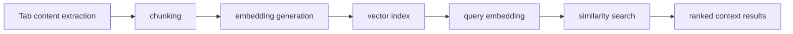
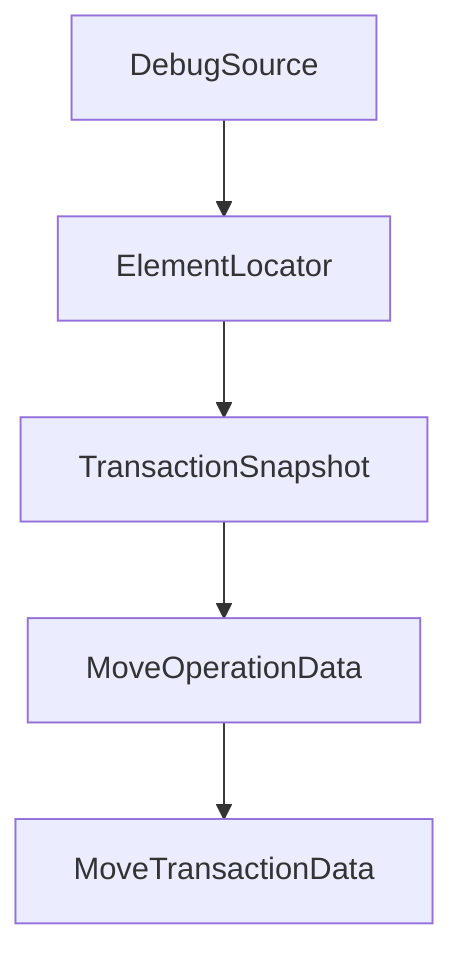

# Chapter 4: Semantic Search and Vector Processing

Welcome to **Chapter 4: Semantic Search and Vector Processing**. In this part of **MCP Chrome Tutorial: Control Your Real Chrome Browser Through MCP**, you will build an intuitive mental model first, then move into concrete implementation details and practical production tradeoffs.


MCP Chrome includes a semantic engine for intelligent tab-content discovery, powered by embeddings and vector search.

## Learning Goals

- understand semantic index architecture at a high level
- identify performance-sensitive parts of the vector pipeline
- plan retrieval quality checks for real workflows

## Semantic Pipeline



## Performance Signals from Architecture Docs

- WebAssembly SIMD is used for faster vector math operations.
- worker-based execution reduces UI blocking.
- vector database configuration controls recall, latency, and memory behavior.

## Source References

- [Architecture: AI Processing and Optimizations](https://github.com/hangwin/mcp-chrome/blob/master/docs/ARCHITECTURE.md)
- [Changelog](https://github.com/hangwin/mcp-chrome/blob/master/docs/CHANGELOG.md)

## Summary

You now have a functional mental model for how semantic tab search works and where tuning matters.

Next: [Chapter 5: Transport Modes and Client Configuration](05-transport-modes-and-client-configuration.md)

## Source Code Walkthrough

### `app/chrome-extension/common/web-editor-types.ts`

The `DebugSource` interface in [`app/chrome-extension/common/web-editor-types.ts`](https://github.com/hangwin/mcp-chrome/blob/HEAD/app/chrome-extension/common/web-editor-types.ts) handles a key part of this chapter's functionality:

```ts
 * Extracted from React Fiber or Vue component instance
 */
export interface DebugSource {
  /** Source file path */
  file: string;
  /** Line number (1-based) */
  line?: number;
  /** Column number (1-based) */
  column?: number;
  /** Component name (if available) */
  componentName?: string;
}

/**
 * Element Locator - Primary key for element identification
 *
 * Uses multiple strategies to locate elements, supporting:
 * - HMR/DOM changes recovery
 * - Cross-session persistence
 * - Framework-agnostic identification
 */
export interface ElementLocator {
  /** CSS selector candidates (ordered by specificity) */
  selectors: string[];
  /** Structural fingerprint for similarity matching */
  fingerprint: string;
  /** Framework debug information (React/Vue) */
  debugSource?: DebugSource;
  /** DOM tree path (child indices from root) */
  path: number[];
  /** iframe selector chain (from top to target frame) - Phase 4 */
  frameChain?: string[];
```

This interface is important because it defines how MCP Chrome Tutorial: Control Your Real Chrome Browser Through MCP implements the patterns covered in this chapter.

### `app/chrome-extension/common/web-editor-types.ts`

The `ElementLocator` interface in [`app/chrome-extension/common/web-editor-types.ts`](https://github.com/hangwin/mcp-chrome/blob/HEAD/app/chrome-extension/common/web-editor-types.ts) handles a key part of this chapter's functionality:

```ts
 * - Framework-agnostic identification
 */
export interface ElementLocator {
  /** CSS selector candidates (ordered by specificity) */
  selectors: string[];
  /** Structural fingerprint for similarity matching */
  fingerprint: string;
  /** Framework debug information (React/Vue) */
  debugSource?: DebugSource;
  /** DOM tree path (child indices from root) */
  path: number[];
  /** iframe selector chain (from top to target frame) - Phase 4 */
  frameChain?: string[];
  /** Shadow DOM host selector chain - Phase 2 */
  shadowHostChain?: string[];
}

// =============================================================================
// Transaction System (Phase 1 - Basic Structure, Low Priority)
// =============================================================================

/** Transaction operation types */
export type TransactionType = 'style' | 'text' | 'class' | 'move' | 'structure';

/**
 * Transaction snapshot for undo/redo
 * Captures element state before/after changes
 */
export interface TransactionSnapshot {
  /** Element locator for re-identification */
  locator: ElementLocator;
  /** innerHTML snapshot (for structure changes) */
```

This interface is important because it defines how MCP Chrome Tutorial: Control Your Real Chrome Browser Through MCP implements the patterns covered in this chapter.

### `app/chrome-extension/common/web-editor-types.ts`

The `TransactionSnapshot` interface in [`app/chrome-extension/common/web-editor-types.ts`](https://github.com/hangwin/mcp-chrome/blob/HEAD/app/chrome-extension/common/web-editor-types.ts) handles a key part of this chapter's functionality:

```ts
 * Captures element state before/after changes
 */
export interface TransactionSnapshot {
  /** Element locator for re-identification */
  locator: ElementLocator;
  /** innerHTML snapshot (for structure changes) */
  html?: string;
  /** Changed style properties */
  styles?: Record<string, string>;
  /** Class list tokens (from `class` attribute) */
  classes?: string[];
  /** Text content */
  text?: string;
}

/**
 * Move position data
 * Captures a concrete insertion point under a parent element
 */
export interface MoveOperationData {
  /** Target parent element locator */
  parentLocator: ElementLocator;
  /** Insert position index (among element children) */
  insertIndex: number;
  /** Anchor sibling element locator (for stable positioning) */
  anchorLocator?: ElementLocator;
  /** Position relative to anchor */
  anchorPosition: 'before' | 'after';
}

/**
 * Move transaction data
```

This interface is important because it defines how MCP Chrome Tutorial: Control Your Real Chrome Browser Through MCP implements the patterns covered in this chapter.

### `app/chrome-extension/common/web-editor-types.ts`

The `MoveOperationData` interface in [`app/chrome-extension/common/web-editor-types.ts`](https://github.com/hangwin/mcp-chrome/blob/HEAD/app/chrome-extension/common/web-editor-types.ts) handles a key part of this chapter's functionality:

```ts
 * Captures a concrete insertion point under a parent element
 */
export interface MoveOperationData {
  /** Target parent element locator */
  parentLocator: ElementLocator;
  /** Insert position index (among element children) */
  insertIndex: number;
  /** Anchor sibling element locator (for stable positioning) */
  anchorLocator?: ElementLocator;
  /** Position relative to anchor */
  anchorPosition: 'before' | 'after';
}

/**
 * Move transaction data
 * Captures both source and destination for undo/redo
 */
export interface MoveTransactionData {
  /** Original location before move */
  from: MoveOperationData;
  /** Target location after move */
  to: MoveOperationData;
}

/**
 * Structure operation data
 * For wrap/unwrap/delete/duplicate operations (Phase 5.5)
 */
export interface StructureOperationData {
  /** Structure action type */
  action: 'wrap' | 'unwrap' | 'delete' | 'duplicate';
  /** Wrapper tag for wrap/unwrap actions */
```

This interface is important because it defines how MCP Chrome Tutorial: Control Your Real Chrome Browser Through MCP implements the patterns covered in this chapter.


## How These Components Connect


