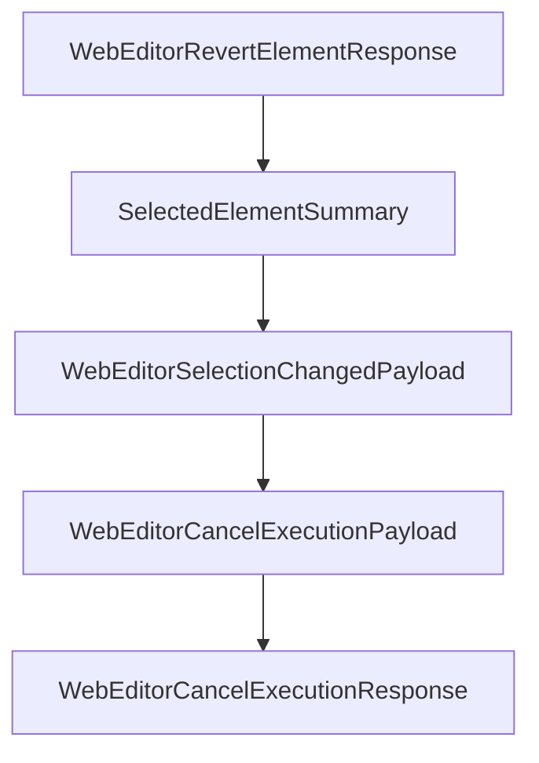

# Chapter 5: Transport Modes and Client Configuration

Welcome to **Chapter 5: Transport Modes and Client Configuration**. In this part of **MCP Chrome Tutorial: Control Your Real Chrome Browser Through MCP**, you will build an intuitive mental model first, then move into concrete implementation details and practical production tradeoffs.


This chapter covers streamable HTTP and stdio transport choices for integrating MCP Chrome with clients.

## Learning Goals

- choose transport mode per client capabilities
- configure connection settings correctly
- reduce path and registration-related integration failures

## Transport Comparison

| Mode | Best For |
|:-----|:---------|
| streamable HTTP | modern MCP clients with HTTP transport support |
| stdio | clients that only support command-process integration |

## Streamable HTTP Example

```json
{
  "mcpServers": {
    "chrome-mcp-server": {
      "type": "streamableHttp",
      "url": "http://127.0.0.1:12306/mcp"
    }
  }
}
```

## Source References

- [README Transport Setup](https://github.com/hangwin/mcp-chrome/blob/master/README.md)
- [MCP CLI Config](https://github.com/hangwin/mcp-chrome/blob/master/docs/mcp-cli-config.md)

## Summary

You now know how to align MCP Chrome transport configuration with client constraints.

Next: [Chapter 6: Visual Editor and Prompt Workflows](06-visual-editor-and-prompt-workflows.md)

## Source Code Walkthrough

### `app/chrome-extension/common/web-editor-types.ts`

The `WebEditorRevertElementResponse` interface in [`app/chrome-extension/common/web-editor-types.ts`](https://github.com/hangwin/mcp-chrome/blob/HEAD/app/chrome-extension/common/web-editor-types.ts) handles a key part of this chapter's functionality:

```ts
 * Revert element response from content script.
 */
export interface WebEditorRevertElementResponse {
  /** Whether the revert was successful */
  success: boolean;
  /** What was reverted (for UI feedback) */
  reverted?: {
    style?: boolean;
    text?: boolean;
    class?: boolean;
  };
  /** Error message if revert failed */
  error?: string;
}

// =============================================================================
// Selection Sync Types
// =============================================================================

/**
 * Summary of currently selected element.
 * Lightweight payload for selection sync (no transaction data).
 */
export interface SelectedElementSummary {
  /** Stable element identifier */
  elementKey: WebEditorElementKey;
  /** Locator for element identification and highlighting */
  locator: ElementLocator;
  /** Short display label (e.g., "div#app") */
  label: string;
  /** Full label with context (e.g., "body > div#app") */
  fullLabel: string;
```

This interface is important because it defines how MCP Chrome Tutorial: Control Your Real Chrome Browser Through MCP implements the patterns covered in this chapter.

### `app/chrome-extension/common/web-editor-types.ts`

The `SelectedElementSummary` interface in [`app/chrome-extension/common/web-editor-types.ts`](https://github.com/hangwin/mcp-chrome/blob/HEAD/app/chrome-extension/common/web-editor-types.ts) handles a key part of this chapter's functionality:

```ts
 * Lightweight payload for selection sync (no transaction data).
 */
export interface SelectedElementSummary {
  /** Stable element identifier */
  elementKey: WebEditorElementKey;
  /** Locator for element identification and highlighting */
  locator: ElementLocator;
  /** Short display label (e.g., "div#app") */
  label: string;
  /** Full label with context (e.g., "body > div#app") */
  fullLabel: string;
  /** Tag name of the element */
  tagName: string;
  /** Timestamp for deduplication */
  updatedAt: number;
}

/**
 * Selection change broadcast payload.
 * Sent immediately when user selects/deselects elements (no debounce).
 */
export interface WebEditorSelectionChangedPayload {
  /** Source tab ID (filled by background from sender.tab.id) */
  tabId: number;
  /** Currently selected element, or null if deselected */
  selected: SelectedElementSummary | null;
  /** Page URL for context */
  pageUrl?: string;
}

// =============================================================================
// Execution Cancel Types
```

This interface is important because it defines how MCP Chrome Tutorial: Control Your Real Chrome Browser Through MCP implements the patterns covered in this chapter.

### `app/chrome-extension/common/web-editor-types.ts`

The `WebEditorSelectionChangedPayload` interface in [`app/chrome-extension/common/web-editor-types.ts`](https://github.com/hangwin/mcp-chrome/blob/HEAD/app/chrome-extension/common/web-editor-types.ts) handles a key part of this chapter's functionality:

```ts
 * Sent immediately when user selects/deselects elements (no debounce).
 */
export interface WebEditorSelectionChangedPayload {
  /** Source tab ID (filled by background from sender.tab.id) */
  tabId: number;
  /** Currently selected element, or null if deselected */
  selected: SelectedElementSummary | null;
  /** Page URL for context */
  pageUrl?: string;
}

// =============================================================================
// Execution Cancel Types
// =============================================================================

/**
 * Payload for canceling an ongoing Apply execution.
 * Sent from web-editor toolbar or sidepanel to background.
 */
export interface WebEditorCancelExecutionPayload {
  /** Session ID of the execution to cancel */
  sessionId: string;
  /** Request ID of the execution to cancel */
  requestId: string;
}

/**
 * Response from cancel execution request.
 */
export interface WebEditorCancelExecutionResponse {
  /** Whether the cancel request was successful */
  success: boolean;
```

This interface is important because it defines how MCP Chrome Tutorial: Control Your Real Chrome Browser Through MCP implements the patterns covered in this chapter.

### `app/chrome-extension/common/web-editor-types.ts`

The `WebEditorCancelExecutionPayload` interface in [`app/chrome-extension/common/web-editor-types.ts`](https://github.com/hangwin/mcp-chrome/blob/HEAD/app/chrome-extension/common/web-editor-types.ts) handles a key part of this chapter's functionality:

```ts
 * Sent from web-editor toolbar or sidepanel to background.
 */
export interface WebEditorCancelExecutionPayload {
  /** Session ID of the execution to cancel */
  sessionId: string;
  /** Request ID of the execution to cancel */
  requestId: string;
}

/**
 * Response from cancel execution request.
 */
export interface WebEditorCancelExecutionResponse {
  /** Whether the cancel request was successful */
  success: boolean;
  /** Error message if cancellation failed */
  error?: string;
}

// =============================================================================
// Public API Interface
// =============================================================================

/**
 * Web Editor V2 Public API
 * Exposed on window.__MCP_WEB_EDITOR_V2__
 */
export interface WebEditorV2Api {
  /** Start the editor */
  start: () => void;
  /** Stop the editor */
  stop: () => void;
```

This interface is important because it defines how MCP Chrome Tutorial: Control Your Real Chrome Browser Through MCP implements the patterns covered in this chapter.


## How These Components Connect


