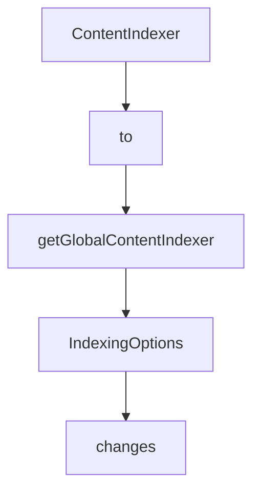

# Chapter 5: Transport Modes and Client Configuration

Welcome to **Chapter 5: Transport Modes and Client Configuration**. In this part of **MCP Chrome Tutorial: Control Your Real Chrome Browser Through MCP**, you will build an intuitive mental model first, then move into concrete implementation details and practical production tradeoffs.


This chapter covers streamable HTTP and stdio transport choices for integrating MCP Chrome with clients.

## Learning Goals

- choose transport mode per client capabilities
- configure connection settings correctly
- reduce path and registration-related integration failures

## Transport Comparison

| Mode | Best For |
|:-----|:---------|
| streamable HTTP | modern MCP clients with HTTP transport support |
| stdio | clients that only support command-process integration |

## Streamable HTTP Example

```json
{
  "mcpServers": {
    "chrome-mcp-server": {
      "type": "streamableHttp",
      "url": "http://127.0.0.1:12306/mcp"
    }
  }
}
```

## Source References

- [README Transport Setup](https://github.com/hangwin/mcp-chrome/blob/master/README.md)
- [MCP CLI Config](https://github.com/hangwin/mcp-chrome/blob/master/docs/mcp-cli-config.md)

## Summary

You now know how to align MCP Chrome transport configuration with client constraints.

Next: [Chapter 6: Visual Editor and Prompt Workflows](06-visual-editor-and-prompt-workflows.md)

## Depth Expansion Playbook

## Source Code Walkthrough

### `app/chrome-extension/utils/content-indexer.ts`

The `ContentIndexer` class in [`app/chrome-extension/utils/content-indexer.ts`](https://github.com/hangwin/mcp-chrome/blob/HEAD/app/chrome-extension/utils/content-indexer.ts) handles a key part of this chapter's functionality:

```ts
}

export class ContentIndexer {
  private textChunker: TextChunker;
  private vectorDatabase!: VectorDatabase;
  private semanticEngine!: SemanticSimilarityEngine | SemanticSimilarityEngineProxy;
  private isInitialized = false;
  private isInitializing = false;
  private initPromise: Promise<void> | null = null;
  private indexedPages = new Set<string>();
  private readonly options: Required<IndexingOptions>;

  constructor(options?: IndexingOptions) {
    this.options = {
      autoIndex: true,
      maxChunksPerPage: 50,
      skipDuplicates: true,
      ...options,
    };

    this.textChunker = new TextChunker();
  }

  /**
   * Get current selected model configuration
   */
  private async getCurrentModelConfig() {
    try {
      const result = await chrome.storage.local.get(['selectedModel', 'selectedVersion']);
      const selectedModel = (result.selectedModel as ModelPreset) || 'multilingual-e5-small';
      const selectedVersion =
        (result.selectedVersion as 'full' | 'quantized' | 'compressed') || 'quantized';
```

This class is important because it defines how MCP Chrome Tutorial: Control Your Real Chrome Browser Through MCP implements the patterns covered in this chapter.

### `app/chrome-extension/utils/content-indexer.ts`

The `to` class in [`app/chrome-extension/utils/content-indexer.ts`](https://github.com/hangwin/mcp-chrome/blob/HEAD/app/chrome-extension/utils/content-indexer.ts) handles a key part of this chapter's functionality:

```ts
/**
 * Content index manager
 * Responsible for automatically extracting, chunking and indexing tab content
 */

import { TextChunker } from './text-chunker';
import { VectorDatabase, getGlobalVectorDatabase } from './vector-database';
import {
  SemanticSimilarityEngine,
  SemanticSimilarityEngineProxy,
  PREDEFINED_MODELS,
  type ModelPreset,
} from './semantic-similarity-engine';
import { TOOL_MESSAGE_TYPES } from '@/common/message-types';

export interface IndexingOptions {
  autoIndex?: boolean;
  maxChunksPerPage?: number;
  skipDuplicates?: boolean;
}

export class ContentIndexer {
  private textChunker: TextChunker;
  private vectorDatabase!: VectorDatabase;
  private semanticEngine!: SemanticSimilarityEngine | SemanticSimilarityEngineProxy;
  private isInitialized = false;
  private isInitializing = false;
  private initPromise: Promise<void> | null = null;
  private indexedPages = new Set<string>();
  private readonly options: Required<IndexingOptions>;

  constructor(options?: IndexingOptions) {
```

This class is important because it defines how MCP Chrome Tutorial: Control Your Real Chrome Browser Through MCP implements the patterns covered in this chapter.

### `app/chrome-extension/utils/content-indexer.ts`

The `getGlobalContentIndexer` function in [`app/chrome-extension/utils/content-indexer.ts`](https://github.com/hangwin/mcp-chrome/blob/HEAD/app/chrome-extension/utils/content-indexer.ts) handles a key part of this chapter's functionality:

```ts
 * Get global ContentIndexer instance
 */
export function getGlobalContentIndexer(): ContentIndexer {
  if (!globalContentIndexer) {
    globalContentIndexer = new ContentIndexer();
  }
  return globalContentIndexer;
}

```

This function is important because it defines how MCP Chrome Tutorial: Control Your Real Chrome Browser Through MCP implements the patterns covered in this chapter.

### `app/chrome-extension/utils/content-indexer.ts`

The `IndexingOptions` interface in [`app/chrome-extension/utils/content-indexer.ts`](https://github.com/hangwin/mcp-chrome/blob/HEAD/app/chrome-extension/utils/content-indexer.ts) handles a key part of this chapter's functionality:

```ts
import { TOOL_MESSAGE_TYPES } from '@/common/message-types';

export interface IndexingOptions {
  autoIndex?: boolean;
  maxChunksPerPage?: number;
  skipDuplicates?: boolean;
}

export class ContentIndexer {
  private textChunker: TextChunker;
  private vectorDatabase!: VectorDatabase;
  private semanticEngine!: SemanticSimilarityEngine | SemanticSimilarityEngineProxy;
  private isInitialized = false;
  private isInitializing = false;
  private initPromise: Promise<void> | null = null;
  private indexedPages = new Set<string>();
  private readonly options: Required<IndexingOptions>;

  constructor(options?: IndexingOptions) {
    this.options = {
      autoIndex: true,
      maxChunksPerPage: 50,
      skipDuplicates: true,
      ...options,
    };

    this.textChunker = new TextChunker();
  }

  /**
   * Get current selected model configuration
   */
```

This interface is important because it defines how MCP Chrome Tutorial: Control Your Real Chrome Browser Through MCP implements the patterns covered in this chapter.


## How These Components Connect


