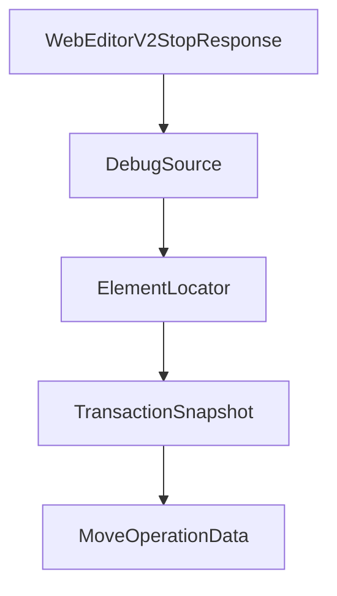

# Chapter 6: Visual Editor and Prompt Workflows

Welcome to **Chapter 6: Visual Editor and Prompt Workflows**. In this part of **MCP Chrome Tutorial: Control Your Real Chrome Browser Through MCP**, you will build an intuitive mental model first, then move into concrete implementation details and practical production tradeoffs.


MCP Chrome introduces visual workflows that help operators structure browser-automation prompts and reduce context loss.

## Learning Goals

- understand when visual workflows outperform raw prompt-only control
- use visual context to improve multi-step browser tasks
- combine visual and tool-driven execution safely

## Workflow Pattern

1. capture current browser state and intent
2. specify target UI state in visual editor
3. run tool sequence in small validated steps
4. inspect network/content outputs before proceeding

## Source References

- [Visual Editor Guide](https://github.com/hangwin/mcp-chrome/blob/master/docs/VisualEditor.md)
- [README Usage Examples](https://github.com/hangwin/mcp-chrome/blob/master/README.md)

## Summary

You now have a repeatable approach for combining visual planning and MCP tool execution.

Next: [Chapter 7: Troubleshooting, Permissions, and Security](07-troubleshooting-permissions-and-security.md)

## Depth Expansion Playbook

## Source Code Walkthrough

### `app/chrome-extension/common/web-editor-types.ts`

The `WebEditorV2StopResponse` interface in [`app/chrome-extension/common/web-editor-types.ts`](https://github.com/hangwin/mcp-chrome/blob/HEAD/app/chrome-extension/common/web-editor-types.ts) handles a key part of this chapter's functionality:

```ts

/** Stop response (V2) */
export interface WebEditorV2StopResponse {
  active: boolean;
}

/** Union types for V2 type-safe message handling */
export type WebEditorV2Request =
  | WebEditorV2PingRequest
  | WebEditorV2ToggleRequest
  | WebEditorV2StartRequest
  | WebEditorV2StopRequest;

export type WebEditorV2Response =
  | WebEditorV2PingResponse
  | WebEditorV2ToggleResponse
  | WebEditorV2StartResponse
  | WebEditorV2StopResponse;

// =============================================================================
// Element Locator (Phase 1 - Basic Structure)
// =============================================================================

/**
 * Framework debug source information
 * Extracted from React Fiber or Vue component instance
 */
export interface DebugSource {
  /** Source file path */
  file: string;
  /** Line number (1-based) */
  line?: number;
```

This interface is important because it defines how MCP Chrome Tutorial: Control Your Real Chrome Browser Through MCP implements the patterns covered in this chapter.

### `app/chrome-extension/common/web-editor-types.ts`

The `DebugSource` interface in [`app/chrome-extension/common/web-editor-types.ts`](https://github.com/hangwin/mcp-chrome/blob/HEAD/app/chrome-extension/common/web-editor-types.ts) handles a key part of this chapter's functionality:

```ts
 * Extracted from React Fiber or Vue component instance
 */
export interface DebugSource {
  /** Source file path */
  file: string;
  /** Line number (1-based) */
  line?: number;
  /** Column number (1-based) */
  column?: number;
  /** Component name (if available) */
  componentName?: string;
}

/**
 * Element Locator - Primary key for element identification
 *
 * Uses multiple strategies to locate elements, supporting:
 * - HMR/DOM changes recovery
 * - Cross-session persistence
 * - Framework-agnostic identification
 */
export interface ElementLocator {
  /** CSS selector candidates (ordered by specificity) */
  selectors: string[];
  /** Structural fingerprint for similarity matching */
  fingerprint: string;
  /** Framework debug information (React/Vue) */
  debugSource?: DebugSource;
  /** DOM tree path (child indices from root) */
  path: number[];
  /** iframe selector chain (from top to target frame) - Phase 4 */
  frameChain?: string[];
```

This interface is important because it defines how MCP Chrome Tutorial: Control Your Real Chrome Browser Through MCP implements the patterns covered in this chapter.

### `app/chrome-extension/common/web-editor-types.ts`

The `ElementLocator` interface in [`app/chrome-extension/common/web-editor-types.ts`](https://github.com/hangwin/mcp-chrome/blob/HEAD/app/chrome-extension/common/web-editor-types.ts) handles a key part of this chapter's functionality:

```ts
 * - Framework-agnostic identification
 */
export interface ElementLocator {
  /** CSS selector candidates (ordered by specificity) */
  selectors: string[];
  /** Structural fingerprint for similarity matching */
  fingerprint: string;
  /** Framework debug information (React/Vue) */
  debugSource?: DebugSource;
  /** DOM tree path (child indices from root) */
  path: number[];
  /** iframe selector chain (from top to target frame) - Phase 4 */
  frameChain?: string[];
  /** Shadow DOM host selector chain - Phase 2 */
  shadowHostChain?: string[];
}

// =============================================================================
// Transaction System (Phase 1 - Basic Structure, Low Priority)
// =============================================================================

/** Transaction operation types */
export type TransactionType = 'style' | 'text' | 'class' | 'move' | 'structure';

/**
 * Transaction snapshot for undo/redo
 * Captures element state before/after changes
 */
export interface TransactionSnapshot {
  /** Element locator for re-identification */
  locator: ElementLocator;
  /** innerHTML snapshot (for structure changes) */
```

This interface is important because it defines how MCP Chrome Tutorial: Control Your Real Chrome Browser Through MCP implements the patterns covered in this chapter.

### `app/chrome-extension/common/web-editor-types.ts`

The `TransactionSnapshot` interface in [`app/chrome-extension/common/web-editor-types.ts`](https://github.com/hangwin/mcp-chrome/blob/HEAD/app/chrome-extension/common/web-editor-types.ts) handles a key part of this chapter's functionality:

```ts
 * Captures element state before/after changes
 */
export interface TransactionSnapshot {
  /** Element locator for re-identification */
  locator: ElementLocator;
  /** innerHTML snapshot (for structure changes) */
  html?: string;
  /** Changed style properties */
  styles?: Record<string, string>;
  /** Class list tokens (from `class` attribute) */
  classes?: string[];
  /** Text content */
  text?: string;
}

/**
 * Move position data
 * Captures a concrete insertion point under a parent element
 */
export interface MoveOperationData {
  /** Target parent element locator */
  parentLocator: ElementLocator;
  /** Insert position index (among element children) */
  insertIndex: number;
  /** Anchor sibling element locator (for stable positioning) */
  anchorLocator?: ElementLocator;
  /** Position relative to anchor */
  anchorPosition: 'before' | 'after';
}

/**
 * Move transaction data
```

This interface is important because it defines how MCP Chrome Tutorial: Control Your Real Chrome Browser Through MCP implements the patterns covered in this chapter.


## How These Components Connect


