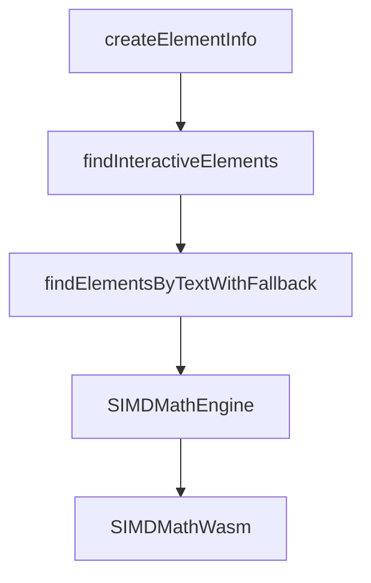

# Chapter 6: Visual Editor and Prompt Workflows

Welcome to **Chapter 6: Visual Editor and Prompt Workflows**. In this part of **MCP Chrome Tutorial: Control Your Real Chrome Browser Through MCP**, you will build an intuitive mental model first, then move into concrete implementation details and practical production tradeoffs.


MCP Chrome introduces visual workflows that help operators structure browser-automation prompts and reduce context loss.

## Learning Goals

- understand when visual workflows outperform raw prompt-only control
- use visual context to improve multi-step browser tasks
- combine visual and tool-driven execution safely

## Workflow Pattern

1. capture current browser state and intent
2. specify target UI state in visual editor
3. run tool sequence in small validated steps
4. inspect network/content outputs before proceeding

## Source References

- [Visual Editor Guide](https://github.com/hangwin/mcp-chrome/blob/master/docs/VisualEditor.md)
- [README Usage Examples](https://github.com/hangwin/mcp-chrome/blob/master/README.md)

## Summary

You now have a repeatable approach for combining visual planning and MCP tool execution.

Next: [Chapter 7: Troubleshooting, Permissions, and Security](07-troubleshooting-permissions-and-security.md)

## Source Code Walkthrough

### `app/chrome-extension/inject-scripts/interactive-elements-helper.js`

The `createElementInfo` function in [`app/chrome-extension/inject-scripts/interactive-elements-helper.js`](https://github.com/hangwin/mcp-chrome/blob/HEAD/app/chrome-extension/inject-scripts/interactive-elements-helper.js) handles a key part of this chapter's functionality:

```js
   * Modified to handle the new 'text' type from the final fallback.
   */
  function createElementInfo(el, type, includeCoordinates, isInteractiveOverride = null) {
    const isActuallyInteractive = isElementInteractive(el);
    const info = {
      type,
      selector: generateSelector(el),
      text: getAccessibleName(el) || el.textContent?.trim(),
      isInteractive: isInteractiveOverride !== null ? isInteractiveOverride : isActuallyInteractive,
      disabled: el.hasAttribute('disabled') || el.getAttribute('aria-disabled') === 'true',
    };
    if (includeCoordinates) {
      const rect = el.getBoundingClientRect();
      info.coordinates = {
        x: rect.left + rect.width / 2,
        y: rect.top + rect.height / 2,
        rect: {
          x: rect.x,
          y: rect.y,
          width: rect.width,
          height: rect.height,
          top: rect.top,
          right: rect.right,
          bottom: rect.bottom,
          left: rect.left,
        },
      };
    }
    return info;
  }

  /**
```

This function is important because it defines how MCP Chrome Tutorial: Control Your Real Chrome Browser Through MCP implements the patterns covered in this chapter.

### `app/chrome-extension/inject-scripts/interactive-elements-helper.js`

The `findInteractiveElements` function in [`app/chrome-extension/inject-scripts/interactive-elements-helper.js`](https://github.com/hangwin/mcp-chrome/blob/HEAD/app/chrome-extension/inject-scripts/interactive-elements-helper.js) handles a key part of this chapter's functionality:

```js
   * This is our high-performance Layer 1 search function.
   */
  function findInteractiveElements(options = {}) {
    const { textQuery, includeCoordinates = true, types = Object.keys(ELEMENT_CONFIG) } = options;

    const selectorsToFind = types
      .map((type) => ELEMENT_CONFIG[type])
      .filter(Boolean)
      .join(', ');
    if (!selectorsToFind) return [];

    const targetElements = querySelectorAllDeep(selectorsToFind);
    const uniqueElements = new Set(targetElements);
    const results = [];

    for (const el of uniqueElements) {
      if (!isElementVisible(el) || !isElementInteractive(el)) continue;

      const accessibleName = getAccessibleName(el);
      if (textQuery && !fuzzyMatch(accessibleName, textQuery)) continue;

      let elementType = 'unknown';
      for (const [type, typeSelector] of Object.entries(ELEMENT_CONFIG)) {
        if (el.matches(typeSelector)) {
          elementType = type;
          break;
        }
      }
      results.push(createElementInfo(el, elementType, includeCoordinates));
    }
    return results;
  }
```

This function is important because it defines how MCP Chrome Tutorial: Control Your Real Chrome Browser Through MCP implements the patterns covered in this chapter.

### `app/chrome-extension/inject-scripts/interactive-elements-helper.js`

The `findElementsByTextWithFallback` function in [`app/chrome-extension/inject-scripts/interactive-elements-helper.js`](https://github.com/hangwin/mcp-chrome/blob/HEAD/app/chrome-extension/inject-scripts/interactive-elements-helper.js) handles a key part of this chapter's functionality:

```js
   * @returns {ElementInfo[]}
   */
  function findElementsByTextWithFallback(options = {}) {
    const { textQuery, includeCoordinates = true } = options;

    if (!textQuery) {
      return findInteractiveElements({ ...options, types: Object.keys(ELEMENT_CONFIG) });
    }

    // --- Layer 1: High-reliability search for interactive elements matching text ---
    let results = findInteractiveElements({ ...options, types: Object.keys(ELEMENT_CONFIG) });
    if (results.length > 0) {
      return results;
    }

    // --- Layer 2: Find text, then find its interactive ancestor ---
    const lowerCaseText = textQuery.toLowerCase();
    const xPath = `//text()[contains(translate(., 'ABCDEFGHIJKLMNOPQRSTUVWXYZ', 'abcdefghijklmnopqrstuvwxyz'), '${lowerCaseText}')]`;
    const textNodes = document.evaluate(
      xPath,
      document,
      null,
      XPathResult.ORDERED_NODE_SNAPSHOT_TYPE,
      null,
    );

    const interactiveElements = new Set();
    if (textNodes.snapshotLength > 0) {
      for (let i = 0; i < textNodes.snapshotLength; i++) {
        const parentElement = textNodes.snapshotItem(i).parentElement;
        if (parentElement) {
          const interactiveAncestor = parentElement.closest(ANY_INTERACTIVE_SELECTOR);
```

This function is important because it defines how MCP Chrome Tutorial: Control Your Real Chrome Browser Through MCP implements the patterns covered in this chapter.

### `app/chrome-extension/utils/simd-math-engine.ts`

The `SIMDMathEngine` class in [`app/chrome-extension/utils/simd-math-engine.ts`](https://github.com/hangwin/mcp-chrome/blob/HEAD/app/chrome-extension/utils/simd-math-engine.ts) handles a key part of this chapter's functionality:

```ts
}

export class SIMDMathEngine {
  private wasmModule: WasmModule | null = null;
  private simdMath: SIMDMathWasm | null = null;
  private isInitialized = false;
  private isInitializing = false;
  private initPromise: Promise<void> | null = null;

  private alignedBufferPool: Map<number, Float32Array[]> = new Map();
  private maxPoolSize = 5;

  async initialize(): Promise<void> {
    if (this.isInitialized) return;
    if (this.isInitializing && this.initPromise) return this.initPromise;

    this.isInitializing = true;
    this.initPromise = this._doInitialize().finally(() => {
      this.isInitializing = false;
    });

    return this.initPromise;
  }

  private async _doInitialize(): Promise<void> {
    try {
      console.log('SIMDMathEngine: Initializing WebAssembly module...');

      const wasmUrl = chrome.runtime.getURL('workers/simd_math.js');
      const wasmModule = await import(wasmUrl);

      const wasmInstance = await wasmModule.default();
```

This class is important because it defines how MCP Chrome Tutorial: Control Your Real Chrome Browser Through MCP implements the patterns covered in this chapter.


## How These Components Connect


