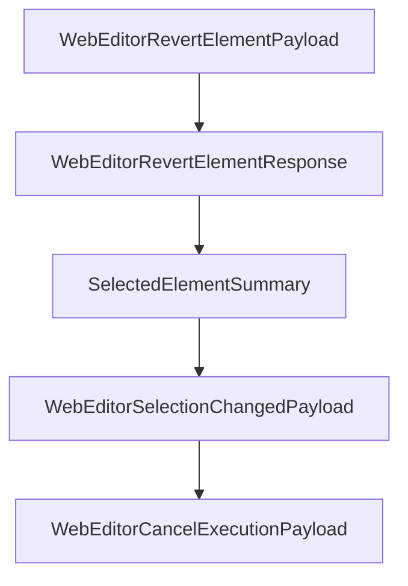

# Chapter 7: Troubleshooting, Permissions, and Security

Welcome to **Chapter 7: Troubleshooting, Permissions, and Security**. In this part of **MCP Chrome Tutorial: Control Your Real Chrome Browser Through MCP**, you will build an intuitive mental model first, then move into concrete implementation details and practical production tradeoffs.


Most MCP Chrome failures are installation or permission issues. This chapter turns those into a deterministic runbook.

## Learning Goals

- diagnose native host and registration failures quickly
- resolve platform-specific permission issues safely
- apply practical security boundaries in browser automation

## Common Failure Classes

| Class | Example |
|:------|:--------|
| registration failure | native host manifest missing or wrong path |
| permission error | execute permissions missing for bridge scripts |
| client transport mismatch | streamable HTTP config in stdio-only client |
| extension connectivity | native messaging host not detected |

## Security Practices

- treat browser automation tools as privileged operations
- keep extension permissions minimal and audited
- require human oversight for destructive or account-sensitive actions

## Source References

- [Troubleshooting](https://github.com/hangwin/mcp-chrome/blob/master/docs/TROUBLESHOOTING.md)
- [Native Install Guide](https://github.com/hangwin/mcp-chrome/blob/master/app/native-server/install.md)
- [Issue Template/Guide](https://github.com/hangwin/mcp-chrome/blob/master/docs/ISSUE.md)

## Summary

You now have a concrete troubleshooting and safety baseline for MCP Chrome operations.

Next: [Chapter 8: Contribution, Release, and Runtime Operations](08-contribution-release-and-runtime-operations.md)

## Depth Expansion Playbook

## Source Code Walkthrough

### `app/chrome-extension/common/web-editor-types.ts`

The `WebEditorRevertElementPayload` interface in [`app/chrome-extension/common/web-editor-types.ts`](https://github.com/hangwin/mcp-chrome/blob/HEAD/app/chrome-extension/common/web-editor-types.ts) handles a key part of this chapter's functionality:

```ts
 * Used for Phase 2 - Selective Undo (reverting individual element changes).
 */
export interface WebEditorRevertElementPayload {
  /** Target tab ID */
  tabId: number;
  /** Element key to revert */
  elementKey: WebEditorElementKey;
}

/**
 * Revert element response from content script.
 */
export interface WebEditorRevertElementResponse {
  /** Whether the revert was successful */
  success: boolean;
  /** What was reverted (for UI feedback) */
  reverted?: {
    style?: boolean;
    text?: boolean;
    class?: boolean;
  };
  /** Error message if revert failed */
  error?: string;
}

// =============================================================================
// Selection Sync Types
// =============================================================================

/**
 * Summary of currently selected element.
 * Lightweight payload for selection sync (no transaction data).
```

This interface is important because it defines how MCP Chrome Tutorial: Control Your Real Chrome Browser Through MCP implements the patterns covered in this chapter.

### `app/chrome-extension/common/web-editor-types.ts`

The `WebEditorRevertElementResponse` interface in [`app/chrome-extension/common/web-editor-types.ts`](https://github.com/hangwin/mcp-chrome/blob/HEAD/app/chrome-extension/common/web-editor-types.ts) handles a key part of this chapter's functionality:

```ts
 * Revert element response from content script.
 */
export interface WebEditorRevertElementResponse {
  /** Whether the revert was successful */
  success: boolean;
  /** What was reverted (for UI feedback) */
  reverted?: {
    style?: boolean;
    text?: boolean;
    class?: boolean;
  };
  /** Error message if revert failed */
  error?: string;
}

// =============================================================================
// Selection Sync Types
// =============================================================================

/**
 * Summary of currently selected element.
 * Lightweight payload for selection sync (no transaction data).
 */
export interface SelectedElementSummary {
  /** Stable element identifier */
  elementKey: WebEditorElementKey;
  /** Locator for element identification and highlighting */
  locator: ElementLocator;
  /** Short display label (e.g., "div#app") */
  label: string;
  /** Full label with context (e.g., "body > div#app") */
  fullLabel: string;
```

This interface is important because it defines how MCP Chrome Tutorial: Control Your Real Chrome Browser Through MCP implements the patterns covered in this chapter.

### `app/chrome-extension/common/web-editor-types.ts`

The `SelectedElementSummary` interface in [`app/chrome-extension/common/web-editor-types.ts`](https://github.com/hangwin/mcp-chrome/blob/HEAD/app/chrome-extension/common/web-editor-types.ts) handles a key part of this chapter's functionality:

```ts
 * Lightweight payload for selection sync (no transaction data).
 */
export interface SelectedElementSummary {
  /** Stable element identifier */
  elementKey: WebEditorElementKey;
  /** Locator for element identification and highlighting */
  locator: ElementLocator;
  /** Short display label (e.g., "div#app") */
  label: string;
  /** Full label with context (e.g., "body > div#app") */
  fullLabel: string;
  /** Tag name of the element */
  tagName: string;
  /** Timestamp for deduplication */
  updatedAt: number;
}

/**
 * Selection change broadcast payload.
 * Sent immediately when user selects/deselects elements (no debounce).
 */
export interface WebEditorSelectionChangedPayload {
  /** Source tab ID (filled by background from sender.tab.id) */
  tabId: number;
  /** Currently selected element, or null if deselected */
  selected: SelectedElementSummary | null;
  /** Page URL for context */
  pageUrl?: string;
}

// =============================================================================
// Execution Cancel Types
```

This interface is important because it defines how MCP Chrome Tutorial: Control Your Real Chrome Browser Through MCP implements the patterns covered in this chapter.

### `app/chrome-extension/common/web-editor-types.ts`

The `WebEditorSelectionChangedPayload` interface in [`app/chrome-extension/common/web-editor-types.ts`](https://github.com/hangwin/mcp-chrome/blob/HEAD/app/chrome-extension/common/web-editor-types.ts) handles a key part of this chapter's functionality:

```ts
 * Sent immediately when user selects/deselects elements (no debounce).
 */
export interface WebEditorSelectionChangedPayload {
  /** Source tab ID (filled by background from sender.tab.id) */
  tabId: number;
  /** Currently selected element, or null if deselected */
  selected: SelectedElementSummary | null;
  /** Page URL for context */
  pageUrl?: string;
}

// =============================================================================
// Execution Cancel Types
// =============================================================================

/**
 * Payload for canceling an ongoing Apply execution.
 * Sent from web-editor toolbar or sidepanel to background.
 */
export interface WebEditorCancelExecutionPayload {
  /** Session ID of the execution to cancel */
  sessionId: string;
  /** Request ID of the execution to cancel */
  requestId: string;
}

/**
 * Response from cancel execution request.
 */
export interface WebEditorCancelExecutionResponse {
  /** Whether the cancel request was successful */
  success: boolean;
```

This interface is important because it defines how MCP Chrome Tutorial: Control Your Real Chrome Browser Through MCP implements the patterns covered in this chapter.


## How These Components Connect


