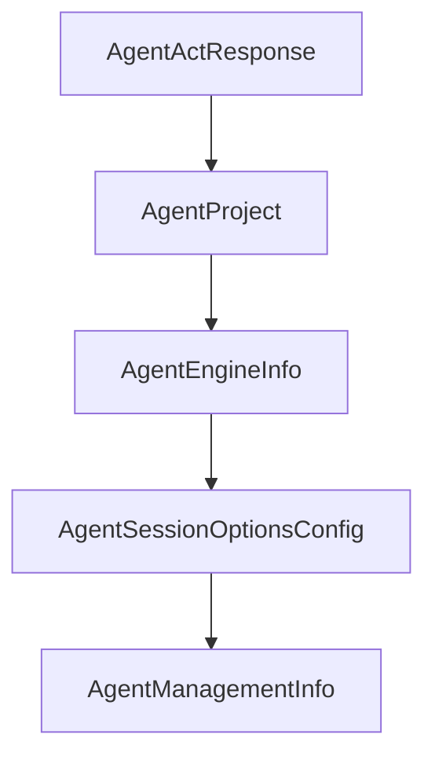

# Chapter 7: Troubleshooting, Permissions, and Security

Welcome to **Chapter 7: Troubleshooting, Permissions, and Security**. In this part of **MCP Chrome Tutorial: Control Your Real Chrome Browser Through MCP**, you will build an intuitive mental model first, then move into concrete implementation details and practical production tradeoffs.


Most MCP Chrome failures are installation or permission issues. This chapter turns those into a deterministic runbook.

## Learning Goals

- diagnose native host and registration failures quickly
- resolve platform-specific permission issues safely
- apply practical security boundaries in browser automation

## Common Failure Classes

| Class | Example |
|:------|:--------|
| registration failure | native host manifest missing or wrong path |
| permission error | execute permissions missing for bridge scripts |
| client transport mismatch | streamable HTTP config in stdio-only client |
| extension connectivity | native messaging host not detected |

## Security Practices

- treat browser automation tools as privileged operations
- keep extension permissions minimal and audited
- require human oversight for destructive or account-sensitive actions

## Source References

- [Troubleshooting](https://github.com/hangwin/mcp-chrome/blob/master/docs/TROUBLESHOOTING.md)
- [Native Install Guide](https://github.com/hangwin/mcp-chrome/blob/master/app/native-server/install.md)
- [Issue Template/Guide](https://github.com/hangwin/mcp-chrome/blob/master/docs/ISSUE.md)

## Summary

You now have a concrete troubleshooting and safety baseline for MCP Chrome operations.

Next: [Chapter 8: Contribution, Release, and Runtime Operations](08-contribution-release-and-runtime-operations.md)

## Source Code Walkthrough

### `packages/shared/src/agent-types.ts`

The `AgentActResponse` interface in [`packages/shared/src/agent-types.ts`](https://github.com/hangwin/mcp-chrome/blob/HEAD/packages/shared/src/agent-types.ts) handles a key part of this chapter's functionality:

```ts
}

export interface AgentActResponse {
  requestId: string;
  sessionId: string;
  status: 'accepted';
}

// ============================================================
// Project & Engine Types
// ============================================================

export interface AgentProject {
  id: string;
  name: string;
  description?: string;
  /**
   * Absolute filesystem path for this project workspace.
   */
  rootPath: string;
  preferredCli?: AgentCliPreference;
  selectedModel?: string;
  /**
   * Active Claude session ID (UUID format) for session resumption.
   * Captured from SDK's system/init message and used for the 'resume' parameter.
   */
  activeClaudeSessionId?: string;
  /**
   * Whether to use Claude Code Router (CCR) for this project.
   * When enabled, the engine will auto-detect CCR configuration.
   */
  useCcr?: boolean;
```

This interface is important because it defines how MCP Chrome Tutorial: Control Your Real Chrome Browser Through MCP implements the patterns covered in this chapter.

### `packages/shared/src/agent-types.ts`

The `AgentProject` interface in [`packages/shared/src/agent-types.ts`](https://github.com/hangwin/mcp-chrome/blob/HEAD/packages/shared/src/agent-types.ts) handles a key part of this chapter's functionality:

```ts
// ============================================================

export interface AgentProject {
  id: string;
  name: string;
  description?: string;
  /**
   * Absolute filesystem path for this project workspace.
   */
  rootPath: string;
  preferredCli?: AgentCliPreference;
  selectedModel?: string;
  /**
   * Active Claude session ID (UUID format) for session resumption.
   * Captured from SDK's system/init message and used for the 'resume' parameter.
   */
  activeClaudeSessionId?: string;
  /**
   * Whether to use Claude Code Router (CCR) for this project.
   * When enabled, the engine will auto-detect CCR configuration.
   */
  useCcr?: boolean;
  /**
   * Whether to enable Chrome MCP integration for this project.
   * Default: true
   */
  enableChromeMcp?: boolean;
  createdAt: string;
  updatedAt: string;
  lastActiveAt?: string;
}

```

This interface is important because it defines how MCP Chrome Tutorial: Control Your Real Chrome Browser Through MCP implements the patterns covered in this chapter.

### `packages/shared/src/agent-types.ts`

The `AgentEngineInfo` interface in [`packages/shared/src/agent-types.ts`](https://github.com/hangwin/mcp-chrome/blob/HEAD/packages/shared/src/agent-types.ts) handles a key part of this chapter's functionality:

```ts
}

export interface AgentEngineInfo {
  name: string;
  supportsMcp?: boolean;
}

// ============================================================
// Session Types
// ============================================================

/**
 * System prompt configuration for a session.
 */
export type AgentSystemPromptConfig =
  | { type: 'custom'; text: string }
  | { type: 'preset'; preset: 'claude_code'; append?: string };

/**
 * Tools configuration - can be a list of tool names or a preset.
 */
export type AgentToolsConfig = string[] | { type: 'preset'; preset: 'claude_code' };

/**
 * Session options configuration.
 */
export interface AgentSessionOptionsConfig {
  settingSources?: string[];
  allowedTools?: string[];
  disallowedTools?: string[];
  tools?: AgentToolsConfig;
  betas?: string[];
```

This interface is important because it defines how MCP Chrome Tutorial: Control Your Real Chrome Browser Through MCP implements the patterns covered in this chapter.

### `packages/shared/src/agent-types.ts`

The `AgentSessionOptionsConfig` interface in [`packages/shared/src/agent-types.ts`](https://github.com/hangwin/mcp-chrome/blob/HEAD/packages/shared/src/agent-types.ts) handles a key part of this chapter's functionality:

```ts
 * Session options configuration.
 */
export interface AgentSessionOptionsConfig {
  settingSources?: string[];
  allowedTools?: string[];
  disallowedTools?: string[];
  tools?: AgentToolsConfig;
  betas?: string[];
  maxThinkingTokens?: number;
  maxTurns?: number;
  maxBudgetUsd?: number;
  mcpServers?: Record<string, unknown>;
  outputFormat?: Record<string, unknown>;
  enableFileCheckpointing?: boolean;
  sandbox?: Record<string, unknown>;
  env?: Record<string, string>;
  /**
   * Optional Codex-specific configuration overrides.
   * Only applicable when using CodexEngine.
   */
  codexConfig?: Partial<CodexEngineConfig>;
}

/**
 * Cached management information from Claude SDK.
 */
export interface AgentManagementInfo {
  tools?: string[];
  agents?: string[];
  plugins?: Array<{ name: string; path?: string }>;
  skills?: string[];
  mcpServers?: Array<{ name: string; status: string }>;
```

This interface is important because it defines how MCP Chrome Tutorial: Control Your Real Chrome Browser Through MCP implements the patterns covered in this chapter.


## How These Components Connect


