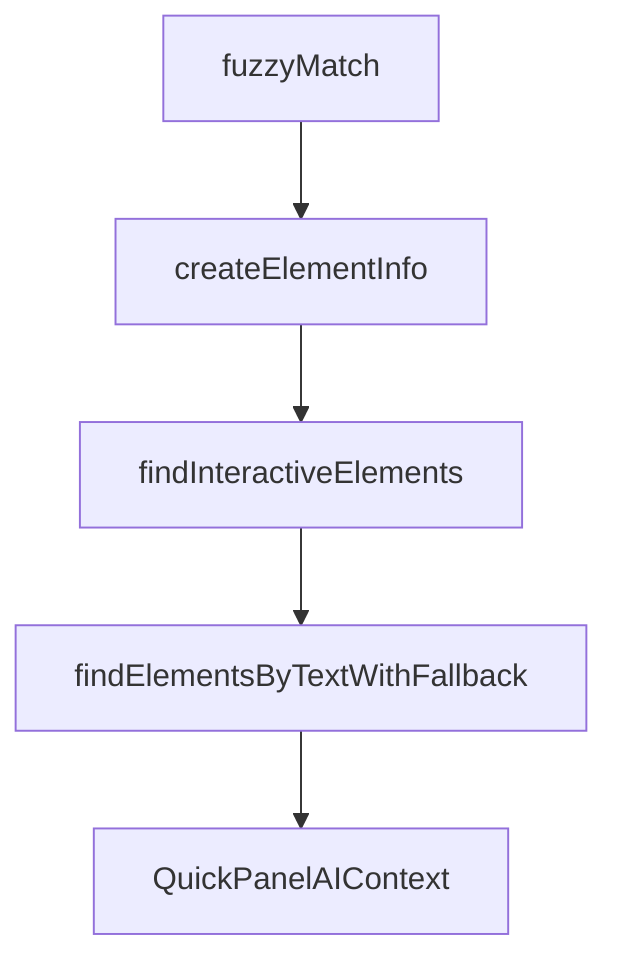

# Chapter 8: Contribution, Release, and Runtime Operations

Welcome to **Chapter 8: Contribution, Release, and Runtime Operations**. In this part of **MCP Chrome Tutorial: Control Your Real Chrome Browser Through MCP**, you will build an intuitive mental model first, then move into concrete implementation details and practical production tradeoffs.


This chapter closes with contribution mechanics and release-aware operations for teams maintaining MCP Chrome deployments.

## Learning Goals

- follow contribution standards and project structure conventions
- use changelog/release signals to plan safe upgrades
- define long-term operational ownership

## Operations Checklist

1. monitor release notes and changelog before upgrades
2. test native registration and key tools in staging
3. track client compatibility for transport and schema changes
4. document rollback path for bridge/runtime failures

## Source References

- [Contributing Guide](https://github.com/hangwin/mcp-chrome/blob/master/docs/CONTRIBUTING.md)
- [Changelog](https://github.com/hangwin/mcp-chrome/blob/master/docs/CHANGELOG.md)
- [Releases](https://github.com/hangwin/mcp-chrome/releases)

## Summary

You now have an end-to-end model for operating and evolving MCP Chrome in production workflows.

Next: extend your MCP operations strategy with [MCP Inspector](../mcp-inspector-tutorial/) and [Firecrawl MCP Server](../firecrawl-mcp-server-tutorial/).

## Depth Expansion Playbook

## Source Code Walkthrough

### `app/chrome-extension/inject-scripts/interactive-elements-helper.js`

The `fuzzyMatch` function in [`app/chrome-extension/inject-scripts/interactive-elements-helper.js`](https://github.com/hangwin/mcp-chrome/blob/HEAD/app/chrome-extension/inject-scripts/interactive-elements-helper.js) handles a key part of this chapter's functionality:

```js
   * @returns {boolean}
   */
  function fuzzyMatch(text, query) {
    if (!text || !query) return false;
    const lowerText = text.toLowerCase();
    const lowerQuery = query.toLowerCase();
    let textIndex = 0;
    let queryIndex = 0;
    while (textIndex < lowerText.length && queryIndex < lowerQuery.length) {
      if (lowerText[textIndex] === lowerQuery[queryIndex]) {
        queryIndex++;
      }
      textIndex++;
    }
    return queryIndex === lowerQuery.length;
  }

  /**
   * Creates the standardized info object for an element.
   * Modified to handle the new 'text' type from the final fallback.
   */
  function createElementInfo(el, type, includeCoordinates, isInteractiveOverride = null) {
    const isActuallyInteractive = isElementInteractive(el);
    const info = {
      type,
      selector: generateSelector(el),
      text: getAccessibleName(el) || el.textContent?.trim(),
      isInteractive: isInteractiveOverride !== null ? isInteractiveOverride : isActuallyInteractive,
      disabled: el.hasAttribute('disabled') || el.getAttribute('aria-disabled') === 'true',
    };
    if (includeCoordinates) {
      const rect = el.getBoundingClientRect();
```

This function is important because it defines how MCP Chrome Tutorial: Control Your Real Chrome Browser Through MCP implements the patterns covered in this chapter.

### `app/chrome-extension/inject-scripts/interactive-elements-helper.js`

The `createElementInfo` function in [`app/chrome-extension/inject-scripts/interactive-elements-helper.js`](https://github.com/hangwin/mcp-chrome/blob/HEAD/app/chrome-extension/inject-scripts/interactive-elements-helper.js) handles a key part of this chapter's functionality:

```js
   * Modified to handle the new 'text' type from the final fallback.
   */
  function createElementInfo(el, type, includeCoordinates, isInteractiveOverride = null) {
    const isActuallyInteractive = isElementInteractive(el);
    const info = {
      type,
      selector: generateSelector(el),
      text: getAccessibleName(el) || el.textContent?.trim(),
      isInteractive: isInteractiveOverride !== null ? isInteractiveOverride : isActuallyInteractive,
      disabled: el.hasAttribute('disabled') || el.getAttribute('aria-disabled') === 'true',
    };
    if (includeCoordinates) {
      const rect = el.getBoundingClientRect();
      info.coordinates = {
        x: rect.left + rect.width / 2,
        y: rect.top + rect.height / 2,
        rect: {
          x: rect.x,
          y: rect.y,
          width: rect.width,
          height: rect.height,
          top: rect.top,
          right: rect.right,
          bottom: rect.bottom,
          left: rect.left,
        },
      };
    }
    return info;
  }

  /**
```

This function is important because it defines how MCP Chrome Tutorial: Control Your Real Chrome Browser Through MCP implements the patterns covered in this chapter.

### `app/chrome-extension/inject-scripts/interactive-elements-helper.js`

The `findInteractiveElements` function in [`app/chrome-extension/inject-scripts/interactive-elements-helper.js`](https://github.com/hangwin/mcp-chrome/blob/HEAD/app/chrome-extension/inject-scripts/interactive-elements-helper.js) handles a key part of this chapter's functionality:

```js
   * This is our high-performance Layer 1 search function.
   */
  function findInteractiveElements(options = {}) {
    const { textQuery, includeCoordinates = true, types = Object.keys(ELEMENT_CONFIG) } = options;

    const selectorsToFind = types
      .map((type) => ELEMENT_CONFIG[type])
      .filter(Boolean)
      .join(', ');
    if (!selectorsToFind) return [];

    const targetElements = querySelectorAllDeep(selectorsToFind);
    const uniqueElements = new Set(targetElements);
    const results = [];

    for (const el of uniqueElements) {
      if (!isElementVisible(el) || !isElementInteractive(el)) continue;

      const accessibleName = getAccessibleName(el);
      if (textQuery && !fuzzyMatch(accessibleName, textQuery)) continue;

      let elementType = 'unknown';
      for (const [type, typeSelector] of Object.entries(ELEMENT_CONFIG)) {
        if (el.matches(typeSelector)) {
          elementType = type;
          break;
        }
      }
      results.push(createElementInfo(el, elementType, includeCoordinates));
    }
    return results;
  }
```

This function is important because it defines how MCP Chrome Tutorial: Control Your Real Chrome Browser Through MCP implements the patterns covered in this chapter.

### `app/chrome-extension/inject-scripts/interactive-elements-helper.js`

The `findElementsByTextWithFallback` function in [`app/chrome-extension/inject-scripts/interactive-elements-helper.js`](https://github.com/hangwin/mcp-chrome/blob/HEAD/app/chrome-extension/inject-scripts/interactive-elements-helper.js) handles a key part of this chapter's functionality:

```js
   * @returns {ElementInfo[]}
   */
  function findElementsByTextWithFallback(options = {}) {
    const { textQuery, includeCoordinates = true } = options;

    if (!textQuery) {
      return findInteractiveElements({ ...options, types: Object.keys(ELEMENT_CONFIG) });
    }

    // --- Layer 1: High-reliability search for interactive elements matching text ---
    let results = findInteractiveElements({ ...options, types: Object.keys(ELEMENT_CONFIG) });
    if (results.length > 0) {
      return results;
    }

    // --- Layer 2: Find text, then find its interactive ancestor ---
    const lowerCaseText = textQuery.toLowerCase();
    const xPath = `//text()[contains(translate(., 'ABCDEFGHIJKLMNOPQRSTUVWXYZ', 'abcdefghijklmnopqrstuvwxyz'), '${lowerCaseText}')]`;
    const textNodes = document.evaluate(
      xPath,
      document,
      null,
      XPathResult.ORDERED_NODE_SNAPSHOT_TYPE,
      null,
    );

    const interactiveElements = new Set();
    if (textNodes.snapshotLength > 0) {
      for (let i = 0; i < textNodes.snapshotLength; i++) {
        const parentElement = textNodes.snapshotItem(i).parentElement;
        if (parentElement) {
          const interactiveAncestor = parentElement.closest(ANY_INTERACTIVE_SELECTOR);
```

This function is important because it defines how MCP Chrome Tutorial: Control Your Real Chrome Browser Through MCP implements the patterns covered in this chapter.


## How These Components Connect


