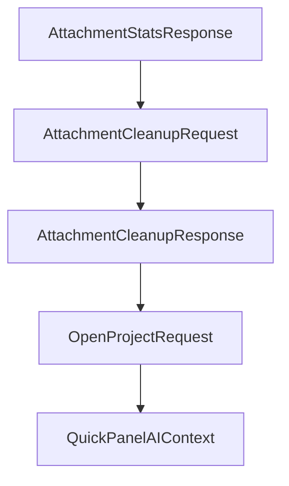

# Chapter 8: Contribution, Release, and Runtime Operations

Welcome to **Chapter 8: Contribution, Release, and Runtime Operations**. In this part of **MCP Chrome Tutorial: Control Your Real Chrome Browser Through MCP**, you will build an intuitive mental model first, then move into concrete implementation details and practical production tradeoffs.


This chapter closes with contribution mechanics and release-aware operations for teams maintaining MCP Chrome deployments.

## Learning Goals

- follow contribution standards and project structure conventions
- use changelog/release signals to plan safe upgrades
- define long-term operational ownership

## Operations Checklist

1. monitor release notes and changelog before upgrades
2. test native registration and key tools in staging
3. track client compatibility for transport and schema changes
4. document rollback path for bridge/runtime failures

## Source References

- [Contributing Guide](https://github.com/hangwin/mcp-chrome/blob/master/docs/CONTRIBUTING.md)
- [Changelog](https://github.com/hangwin/mcp-chrome/blob/master/docs/CHANGELOG.md)
- [Releases](https://github.com/hangwin/mcp-chrome/releases)

## Summary

You now have an end-to-end model for operating and evolving MCP Chrome in production workflows.

Next: extend your MCP operations strategy with [MCP Inspector](../mcp-inspector-tutorial/) and [Firecrawl MCP Server](../firecrawl-mcp-server-tutorial/).

## Source Code Walkthrough

### `packages/shared/src/agent-types.ts`

The `AttachmentStatsResponse` interface in [`packages/shared/src/agent-types.ts`](https://github.com/hangwin/mcp-chrome/blob/HEAD/packages/shared/src/agent-types.ts) handles a key part of this chapter's functionality:

```ts
 * Response for attachment statistics endpoint.
 */
export interface AttachmentStatsResponse {
  success: boolean;
  rootDir: string;
  totalFiles: number;
  totalBytes: number;
  projects: Array<
    AttachmentProjectStats & {
      projectName?: string;
      existsInDb: boolean;
    }
  >;
  orphanProjectIds: string[];
}

/**
 * Request body for attachment cleanup endpoint.
 */
export interface AttachmentCleanupRequest {
  /** If provided, cleanup only these projects. Otherwise cleanup all. */
  projectIds?: string[];
}

/**
 * Response for attachment cleanup endpoint.
 */
export interface AttachmentCleanupResponse {
  success: boolean;
  scope: 'project' | 'selected' | 'all';
  removedFiles: number;
  removedBytes: number;
```

This interface is important because it defines how MCP Chrome Tutorial: Control Your Real Chrome Browser Through MCP implements the patterns covered in this chapter.

### `packages/shared/src/agent-types.ts`

The `AttachmentCleanupRequest` interface in [`packages/shared/src/agent-types.ts`](https://github.com/hangwin/mcp-chrome/blob/HEAD/packages/shared/src/agent-types.ts) handles a key part of this chapter's functionality:

```ts
 * Request body for attachment cleanup endpoint.
 */
export interface AttachmentCleanupRequest {
  /** If provided, cleanup only these projects. Otherwise cleanup all. */
  projectIds?: string[];
}

/**
 * Response for attachment cleanup endpoint.
 */
export interface AttachmentCleanupResponse {
  success: boolean;
  scope: 'project' | 'selected' | 'all';
  removedFiles: number;
  removedBytes: number;
  results: CleanupProjectResult[];
}

// ============================================================
// Open Project Types
// ============================================================

/**
 * Target application for opening a project directory.
 */
export type OpenProjectTarget = 'vscode' | 'terminal';

/**
 * Request body for open-project endpoint.
 */
export interface OpenProjectRequest {
  /** Target application to open the project in */
```

This interface is important because it defines how MCP Chrome Tutorial: Control Your Real Chrome Browser Through MCP implements the patterns covered in this chapter.

### `packages/shared/src/agent-types.ts`

The `AttachmentCleanupResponse` interface in [`packages/shared/src/agent-types.ts`](https://github.com/hangwin/mcp-chrome/blob/HEAD/packages/shared/src/agent-types.ts) handles a key part of this chapter's functionality:

```ts
 * Response for attachment cleanup endpoint.
 */
export interface AttachmentCleanupResponse {
  success: boolean;
  scope: 'project' | 'selected' | 'all';
  removedFiles: number;
  removedBytes: number;
  results: CleanupProjectResult[];
}

// ============================================================
// Open Project Types
// ============================================================

/**
 * Target application for opening a project directory.
 */
export type OpenProjectTarget = 'vscode' | 'terminal';

/**
 * Request body for open-project endpoint.
 */
export interface OpenProjectRequest {
  /** Target application to open the project in */
  target: OpenProjectTarget;
}

/**
 * Response for open-project endpoint.
 */
export type OpenProjectResponse = { success: true } | { success: false; error: string };

```

This interface is important because it defines how MCP Chrome Tutorial: Control Your Real Chrome Browser Through MCP implements the patterns covered in this chapter.

### `packages/shared/src/agent-types.ts`

The `OpenProjectRequest` interface in [`packages/shared/src/agent-types.ts`](https://github.com/hangwin/mcp-chrome/blob/HEAD/packages/shared/src/agent-types.ts) handles a key part of this chapter's functionality:

```ts
 * Request body for open-project endpoint.
 */
export interface OpenProjectRequest {
  /** Target application to open the project in */
  target: OpenProjectTarget;
}

/**
 * Response for open-project endpoint.
 */
export type OpenProjectResponse = { success: true } | { success: false; error: string };

```

This interface is important because it defines how MCP Chrome Tutorial: Control Your Real Chrome Browser Through MCP implements the patterns covered in this chapter.


## How These Components Connect


