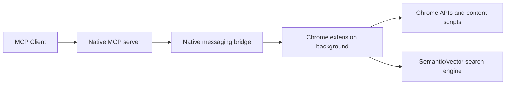

# MCP Chrome Tutorial: Control Your Real Chrome Browser Through MCP

> Learn how to use `hangwin/mcp-chrome` to expose browser automation, content analysis, and semantic tab search tools to MCP clients.

## Why This Track Matters

MCP Chrome is a practical bridge between AI assistants and a user's real Chrome session. It avoids separate browser sandboxes and enables automation against active tabs, history, bookmarks, network events, and semantic content search.

This track focuses on:

- setting up native bridge and extension components correctly
- understanding streamable HTTP and stdio transport options
- using the 20+ tool surface safely and effectively
- operating troubleshooting, permissions, and release workflows

## Current Snapshot (Verified February 12, 2026)

- repository: [`hangwin/mcp-chrome`](https://github.com/hangwin/mcp-chrome)
- stars: about **10.4k**
- latest release: [`v1.0.0`](https://github.com/hangwin/mcp-chrome/releases/tag/v1.0.0) (**December 29, 2025**)
- recent activity: updated on **January 6, 2026**
- positioning: Chrome extension + native bridge MCP server for browser automation and semantic tab intelligence

## Mental Model

## Chapter Guide

| Chapter | Key Question | Outcome |
|:--------|:-------------|:--------|
| [01 - Getting Started and Native Bridge Setup](01-getting-started-and-native-bridge-setup.md) | How do I install and connect MCP Chrome reliably? | Working local baseline |
| [02 - Architecture and Component Boundaries](02-architecture-and-component-boundaries.md) | How do native server, extension, and AI layers fit together? | Strong system model |
| [03 - Tool Surface: Browser, Network, and Interaction](03-tool-surface-browser-network-and-interaction.md) | What can the tool API do across tabs and pages? | Better tool selection |
| [04 - Semantic Search and Vector Processing](04-semantic-search-and-vector-processing.md) | How does semantic tab search work internally? | Higher signal retrieval |
| [05 - Transport Modes and Client Configuration](05-transport-modes-and-client-configuration.md) | When should I use streamable HTTP vs stdio? | Stable client integration |
| [06 - Visual Editor and Prompt Workflows](06-visual-editor-and-prompt-workflows.md) | How do visual workflows improve automation quality? | Faster iteration |
| [07 - Troubleshooting, Permissions, and Security](07-troubleshooting-permissions-and-security.md) | What usually breaks and how do we fix it safely? | Better operations |
| [08 - Contribution, Release, and Runtime Operations](08-contribution-release-and-runtime-operations.md) | How do teams maintain and extend MCP Chrome over time? | Long-term ownership |

## What You Will Learn

- how to install and register MCP Chrome for daily AI workflows
- how to map tool calls to browser-native capabilities safely
- how to configure transport and client wiring across environments
- how to handle security, troubleshooting, and release management

## Source References

- [Repository](https://github.com/hangwin/mcp-chrome)
- [README](https://github.com/hangwin/mcp-chrome/blob/master/README.md)
- [Architecture](https://github.com/hangwin/mcp-chrome/blob/master/docs/ARCHITECTURE.md)
- [Tools Reference](https://github.com/hangwin/mcp-chrome/blob/master/docs/TOOLS.md)
- [Troubleshooting](https://github.com/hangwin/mcp-chrome/blob/master/docs/TROUBLESHOOTING.md)
- [MCP CLI Config Guide](https://github.com/hangwin/mcp-chrome/blob/master/docs/mcp-cli-config.md)
- [Visual Editor](https://github.com/hangwin/mcp-chrome/blob/master/docs/VisualEditor.md)
- [Changelog](https://github.com/hangwin/mcp-chrome/blob/master/docs/CHANGELOG.md)

## Related Tutorials

- [Chrome DevTools MCP Tutorial](../chrome-devtools-mcp-tutorial/)
- [MCP Servers Tutorial](../mcp-servers-tutorial/)
- [MCP Inspector Tutorial](../mcp-inspector-tutorial/)
- [Firecrawl MCP Server Tutorial](../firecrawl-mcp-server-tutorial/)

---

Start with [Chapter 1: Getting Started and Native Bridge Setup](01-getting-started-and-native-bridge-setup.md).
