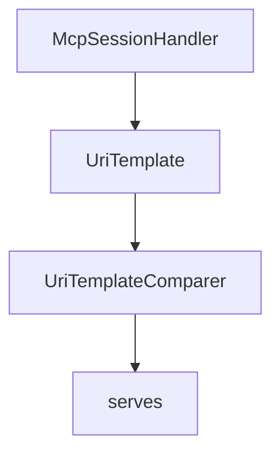

# Chapter 1: Getting Started and Package Selection

Welcome to **Chapter 1: Getting Started and Package Selection**. In this part of **MCP C# SDK Tutorial: Production MCP in .NET with Hosting, ASP.NET Core, and Task Workflows**, you will build an intuitive mental model first, then move into concrete implementation details and practical production tradeoffs.


This chapter establishes the right package boundary for your .NET MCP workload.

## Learning Goals

- pick between `ModelContextProtocol`, `.Core`, and `.AspNetCore`
- align package choice with hosting and transport requirements
- set baseline installation and first-run client/server validation
- avoid unnecessary dependency surface area

## Package Decision Guide

| Package | Best Fit |
|:--------|:---------|
| `ModelContextProtocol` | most projects using hosting + DI extensions |
| `ModelContextProtocol.Core` | minimal client/low-level server usage |
| `ModelContextProtocol.AspNetCore` | HTTP MCP server endpoints in ASP.NET Core |

## Baseline Setup

```bash
dotnet add package ModelContextProtocol --prerelease
```

Use `.AspNetCore` only when you need HTTP transport hosting; otherwise start with simpler stdio workflows.

## Source References

- [C# SDK Package Overview](https://github.com/modelcontextprotocol/csharp-sdk/blob/main/README.md#packages)
- [Core Package README](https://github.com/modelcontextprotocol/csharp-sdk/blob/main/src/ModelContextProtocol.Core/README.md)
- [AspNetCore Package README](https://github.com/modelcontextprotocol/csharp-sdk/blob/main/src/ModelContextProtocol.AspNetCore/README.md)

## Summary

You now have a package-level starting point that fits your runtime shape.

Next: [Chapter 2: Client/Server Hosting and stdio Basics](02-client-server-hosting-and-stdio-basics.md)

## Depth Expansion Playbook

## Source Code Walkthrough

### `src/ModelContextProtocol.Core/McpSessionHandler.cs`

The `McpSessionHandler` class in [`src/ModelContextProtocol.Core/McpSessionHandler.cs`](https://github.com/modelcontextprotocol/csharp-sdk/blob/HEAD/src/ModelContextProtocol.Core/McpSessionHandler.cs) handles a key part of this chapter's functionality:

```cs
/// Class for managing an MCP JSON-RPC session. This covers both MCP clients and servers.
/// </summary>
internal sealed partial class McpSessionHandler : IAsyncDisposable
{
    private static readonly Histogram<double> s_clientSessionDuration = Diagnostics.CreateDurationHistogram(
        "mcp.client.session.duration", "The duration of the MCP session as observed on the MCP client.");
    private static readonly Histogram<double> s_serverSessionDuration = Diagnostics.CreateDurationHistogram(
        "mcp.server.session.duration", "The duration of the MCP session as observed on the MCP server.");
    private static readonly Histogram<double> s_clientOperationDuration = Diagnostics.CreateDurationHistogram(
        "mcp.client.operation.duration", "The duration of the MCP request or notification as observed on the sender from the time it was sent until the response or ack is received.");
    private static readonly Histogram<double> s_serverOperationDuration = Diagnostics.CreateDurationHistogram(
        "mcp.server.operation.duration", "MCP request or notification duration as observed on the receiver from the time it was received until the result or ack is sent.");

    /// <summary>The latest version of the protocol supported by this implementation.</summary>
    internal const string LatestProtocolVersion = "2025-11-25";

    /// <summary>
    /// All protocol versions supported by this implementation.
    /// Keep in sync with s_supportedProtocolVersions in StreamableHttpHandler.
    /// </summary>
    internal static readonly string[] SupportedProtocolVersions =
    [
        "2024-11-05",
        "2025-03-26",
        "2025-06-18",
        LatestProtocolVersion,
    ];

    /// <summary>
    /// Checks if the given protocol version supports priming events.
    /// </summary>
    /// <param name="protocolVersion">The protocol version to check.</param>
```

This class is important because it defines how MCP C# SDK Tutorial: Production MCP in .NET with Hosting, ASP.NET Core, and Task Workflows implements the patterns covered in this chapter.

### `src/ModelContextProtocol.Core/UriTemplate.cs`

The `UriTemplate` class in [`src/ModelContextProtocol.Core/UriTemplate.cs`](https://github.com/modelcontextprotocol/csharp-sdk/blob/HEAD/src/ModelContextProtocol.Core/UriTemplate.cs) handles a key part of this chapter's functionality:

```cs
/// e.g. it may treat portions of invalid templates as literals rather than throwing.
/// </remarks>
internal static partial class UriTemplate
{
    /// <summary>Regex pattern for finding URI template expressions and parsing out the operator and varname.</summary>
    private const string UriTemplateExpressionPattern = """
        {                                                       # opening brace
            (?<operator>[+#./;?&]?)                             # optional operator
            (?<varname>
                (?:[A-Za-z0-9_]|%[0-9A-Fa-f]{2})                # varchar: letter, digit, underscore, or pct-encoded
                (?:\.?(?:[A-Za-z0-9_]|%[0-9A-Fa-f]{2}))*        # optionally dot-separated subsequent varchars
            )
            (?: :[1-9][0-9]{0,3} )?                             # optional prefix modifier (1–4 digits)
            \*?                                                 # optional explode
            (?:,                                                # comma separator, followed by the same as above
                (?<varname>
                    (?:[A-Za-z0-9_]|%[0-9A-Fa-f]{2})
                    (?:\.?(?:[A-Za-z0-9_]|%[0-9A-Fa-f]{2}))*
                )
                (?: :[1-9][0-9]{0,3} )?
                \*?
            )*                                                  # zero or more additional vars
        }                                                       # closing brace
        """;

    /// <summary>Gets a regex for finding URI template expressions and parsing out the operator and varname.</summary>
    /// <remarks>
    /// This regex is for parsing a static URI template.
    /// It is not for parsing a URI according to a template.
    /// </remarks>
#if NET
    [GeneratedRegex(UriTemplateExpressionPattern, RegexOptions.IgnorePatternWhitespace)]
```

This class is important because it defines how MCP C# SDK Tutorial: Production MCP in .NET with Hosting, ASP.NET Core, and Task Workflows implements the patterns covered in this chapter.

### `src/ModelContextProtocol.Core/UriTemplate.cs`

The `UriTemplateComparer` class in [`src/ModelContextProtocol.Core/UriTemplate.cs`](https://github.com/modelcontextprotocol/csharp-sdk/blob/HEAD/src/ModelContextProtocol.Core/UriTemplate.cs) handles a key part of this chapter's functionality:

```cs
    /// there to distinguish between different templates.
    /// </summary>
    internal sealed class UriTemplateComparer : IEqualityComparer<string>
    {
        public static IEqualityComparer<string> Instance { get; } = new UriTemplateComparer();

        public bool Equals(string? uriTemplate1, string? uriTemplate2)
        {
            if (TryParseAsNonTemplatedUri(uriTemplate1, out Uri? uri1) &&
                TryParseAsNonTemplatedUri(uriTemplate2, out Uri? uri2))
            {
                return uri1 == uri2;
            }

            return string.Equals(uriTemplate1, uriTemplate2, StringComparison.Ordinal);
        }

        public int GetHashCode([DisallowNull] string uriTemplate)
        {
            if (TryParseAsNonTemplatedUri(uriTemplate, out Uri? uri))
            {
                return uri.GetHashCode();
            }
            else
            {
                return StringComparer.Ordinal.GetHashCode(uriTemplate);
            }
        }

        private static bool TryParseAsNonTemplatedUri(string? uriTemplate, [NotNullWhen(true)] out Uri? uri)
        {
            if (uriTemplate is null || uriTemplate.Contains('{'))
```

This class is important because it defines how MCP C# SDK Tutorial: Production MCP in .NET with Hosting, ASP.NET Core, and Task Workflows implements the patterns covered in this chapter.

### `src/ModelContextProtocol.Core/AIContentExtensions.cs`

The `serves` class in [`src/ModelContextProtocol.Core/AIContentExtensions.cs`](https://github.com/modelcontextprotocol/csharp-sdk/blob/HEAD/src/ModelContextProtocol.Core/AIContentExtensions.cs) handles a key part of this chapter's functionality:

```cs
/// </summary>
/// <remarks>
/// This class serves as an adapter layer between Model Context Protocol (MCP) types and the <see cref="AIContent"/> model types
/// from the Microsoft.Extensions.AI namespace.
/// </remarks>
public static class AIContentExtensions
{
    /// <summary>
    /// Creates a sampling handler for use with <see cref="McpClientHandlers.SamplingHandler"/> that will
    /// satisfy sampling requests using the specified <see cref="IChatClient"/>.
    /// </summary>
    /// <param name="chatClient">The <see cref="IChatClient"/> with which to satisfy sampling requests.</param>
    /// <param name="serializerOptions">The <see cref="JsonSerializerOptions"/> to use for serializing user-provided objects. If <see langword="null"/>, <see cref="McpJsonUtilities.DefaultOptions"/> is used.</param>
    /// <returns>The created handler delegate that can be assigned to <see cref="McpClientHandlers.SamplingHandler"/>.</returns>
    /// <remarks>
    /// <para>
    /// This method creates a function that converts MCP message requests into chat client calls, enabling
    /// an MCP client to generate text or other content using an actual AI model via the provided chat client.
    /// </para>
    /// <para>
    /// The handler can process text messages, image messages, resource messages, and tool use/results as defined in the
    /// Model Context Protocol.
    /// </para>
    /// </remarks>
    /// <exception cref="ArgumentNullException"><paramref name="chatClient"/> is <see langword="null"/>.</exception>
    public static Func<CreateMessageRequestParams?, IProgress<ProgressNotificationValue>, CancellationToken, ValueTask<CreateMessageResult>> CreateSamplingHandler(
        this IChatClient chatClient,
        JsonSerializerOptions? serializerOptions = null)
    {
        Throw.IfNull(chatClient);

        serializerOptions ??= McpJsonUtilities.DefaultOptions;
```

This class is important because it defines how MCP C# SDK Tutorial: Production MCP in .NET with Hosting, ASP.NET Core, and Task Workflows implements the patterns covered in this chapter.


## How These Components Connect


