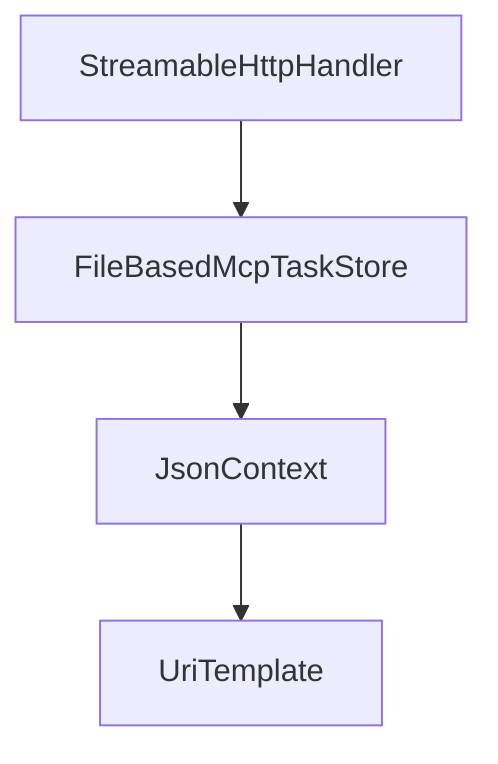

# Chapter 1: Getting Started and Package Selection

Welcome to **Chapter 1: Getting Started and Package Selection**. In this part of **MCP C# SDK Tutorial: Production MCP in .NET with Hosting, ASP.NET Core, and Task Workflows**, you will build an intuitive mental model first, then move into concrete implementation details and practical production tradeoffs.


This chapter establishes the right package boundary for your .NET MCP workload.

## Learning Goals

- pick between `ModelContextProtocol`, `.Core`, and `.AspNetCore`
- align package choice with hosting and transport requirements
- set baseline installation and first-run client/server validation
- avoid unnecessary dependency surface area

## Package Decision Guide

| Package | Best Fit |
|:--------|:---------|
| `ModelContextProtocol` | most projects using hosting + DI extensions |
| `ModelContextProtocol.Core` | minimal client/low-level server usage |
| `ModelContextProtocol.AspNetCore` | HTTP MCP server endpoints in ASP.NET Core |

## Baseline Setup

```bash
dotnet add package ModelContextProtocol --prerelease
```

Use `.AspNetCore` only when you need HTTP transport hosting; otherwise start with simpler stdio workflows.

## Source References

- [C# SDK Package Overview](https://github.com/modelcontextprotocol/csharp-sdk/blob/main/README.md#packages)
- [Core Package README](https://github.com/modelcontextprotocol/csharp-sdk/blob/main/src/ModelContextProtocol.Core/README.md)
- [AspNetCore Package README](https://github.com/modelcontextprotocol/csharp-sdk/blob/main/src/ModelContextProtocol.AspNetCore/README.md)

## Summary

You now have a package-level starting point that fits your runtime shape.

Next: [Chapter 2: Client/Server Hosting and stdio Basics](02-client-server-hosting-and-stdio-basics.md)

## Source Code Walkthrough

### `src/ModelContextProtocol.AspNetCore/StreamableHttpHandler.cs`

The `StreamableHttpHandler` class in [`src/ModelContextProtocol.AspNetCore/StreamableHttpHandler.cs`](https://github.com/modelcontextprotocol/csharp-sdk/blob/HEAD/src/ModelContextProtocol.AspNetCore/StreamableHttpHandler.cs) handles a key part of this chapter's functionality:

```cs
namespace ModelContextProtocol.AspNetCore;

internal sealed class StreamableHttpHandler(
    IOptions<McpServerOptions> mcpServerOptionsSnapshot,
    IOptionsFactory<McpServerOptions> mcpServerOptionsFactory,
    IOptions<HttpServerTransportOptions> httpServerTransportOptions,
    StatefulSessionManager sessionManager,
    IHostApplicationLifetime hostApplicationLifetime,
    IServiceProvider applicationServices,
    ILoggerFactory loggerFactory)
{
    private const string McpSessionIdHeaderName = "Mcp-Session-Id";
    private const string McpProtocolVersionHeaderName = "MCP-Protocol-Version";
    private const string LastEventIdHeaderName = "Last-Event-ID";

    /// <summary>
    /// All protocol versions supported by this implementation.
    /// Keep in sync with McpSessionHandler.SupportedProtocolVersions in ModelContextProtocol.Core.
    /// </summary>
    private static readonly HashSet<string> s_supportedProtocolVersions =
    [
        "2024-11-05",
        "2025-03-26",
        "2025-06-18",
        "2025-11-25",
    ];

    private static readonly JsonTypeInfo<JsonRpcMessage> s_messageTypeInfo = GetRequiredJsonTypeInfo<JsonRpcMessage>();
    private static readonly JsonTypeInfo<JsonRpcError> s_errorTypeInfo = GetRequiredJsonTypeInfo<JsonRpcError>();

    private static bool AllowNewSessionForNonInitializeRequests { get; } =
        AppContext.TryGetSwitch("ModelContextProtocol.AspNetCore.AllowNewSessionForNonInitializeRequests", out var enabled) && enabled;
```

This class is important because it defines how MCP C# SDK Tutorial: Production MCP in .NET with Hosting, ASP.NET Core, and Task Workflows implements the patterns covered in this chapter.

### `samples/LongRunningTasks/FileBasedMcpTaskStore.cs`

The `FileBasedMcpTaskStore` class in [`samples/LongRunningTasks/FileBasedMcpTaskStore.cs`](https://github.com/modelcontextprotocol/csharp-sdk/blob/HEAD/samples/LongRunningTasks/FileBasedMcpTaskStore.cs) handles a key part of this chapter's functionality:

```cs
/// </para>
/// </remarks>
public sealed partial class FileBasedMcpTaskStore : IMcpTaskStore
{
    private readonly string _storePath;
    private readonly TimeSpan _executionTime;

    /// <summary>
    /// Initializes a new instance of the <see cref="FileBasedMcpTaskStore"/> class.
    /// </summary>
    /// <param name="storePath">The directory path where task files will be stored.</param>
    /// <param name="executionTime">
    /// The fixed execution time for all tasks. Tasks are reported as completed once this
    /// duration has elapsed since creation. Defaults to 5 seconds.
    /// </param>
    public FileBasedMcpTaskStore(string storePath, TimeSpan? executionTime = null)
    {
        _storePath = storePath ?? throw new ArgumentNullException(nameof(storePath));
        _executionTime = executionTime ?? TimeSpan.FromSeconds(5);
        Directory.CreateDirectory(_storePath);
    }

    /// <inheritdoc/>
    public async Task<McpTask> CreateTaskAsync(
        McpTaskMetadata taskParams,
        RequestId requestId,
        JsonRpcRequest request,
        string? sessionId = null,
        CancellationToken cancellationToken = default)
    {
        var taskId = Guid.NewGuid().ToString("N");
        var now = DateTimeOffset.UtcNow;
```

This class is important because it defines how MCP C# SDK Tutorial: Production MCP in .NET with Hosting, ASP.NET Core, and Task Workflows implements the patterns covered in this chapter.

### `samples/LongRunningTasks/FileBasedMcpTaskStore.cs`

The `JsonContext` class in [`samples/LongRunningTasks/FileBasedMcpTaskStore.cs`](https://github.com/modelcontextprotocol/csharp-sdk/blob/HEAD/samples/LongRunningTasks/FileBasedMcpTaskStore.cs) handles a key part of this chapter's functionality:

```cs
            ExecutionTime = _executionTime,
            TimeToLive = taskParams.TimeToLive,
            Result = JsonSerializer.SerializeToElement(request.Params, JsonContext.Default.JsonNode)
        };

        await WriteTaskEntryAsync(GetTaskFilePath(taskId), entry);

        return ToMcpTask(entry);
    }

    /// <inheritdoc/>
    public async Task<McpTask?> GetTaskAsync(
        string taskId,
        string? sessionId = null,
        CancellationToken cancellationToken = default)
    {
        var entry = await ReadTaskEntryAsync(taskId);
        if (entry is null)
        {
            return null;
        }

        // Session isolation
        if (sessionId is not null && entry.SessionId != sessionId)
        {
            return null;
        }

        // Skip if TTL has expired
        if (IsExpired(entry))
        {
            return null;
```

This class is important because it defines how MCP C# SDK Tutorial: Production MCP in .NET with Hosting, ASP.NET Core, and Task Workflows implements the patterns covered in this chapter.

### `src/ModelContextProtocol.Core/UriTemplate.cs`

The `UriTemplate` class in [`src/ModelContextProtocol.Core/UriTemplate.cs`](https://github.com/modelcontextprotocol/csharp-sdk/blob/HEAD/src/ModelContextProtocol.Core/UriTemplate.cs) handles a key part of this chapter's functionality:

```cs
/// e.g. it may treat portions of invalid templates as literals rather than throwing.
/// </remarks>
internal static partial class UriTemplate
{
    /// <summary>Regex pattern for finding URI template expressions and parsing out the operator and varname.</summary>
    private const string UriTemplateExpressionPattern = """
        {                                                       # opening brace
            (?<operator>[+#./;?&]?)                             # optional operator
            (?<varname>
                (?:[A-Za-z0-9_]|%[0-9A-Fa-f]{2})                # varchar: letter, digit, underscore, or pct-encoded
                (?:\.?(?:[A-Za-z0-9_]|%[0-9A-Fa-f]{2}))*        # optionally dot-separated subsequent varchars
            )
            (?: :[1-9][0-9]{0,3} )?                             # optional prefix modifier (1–4 digits)
            \*?                                                 # optional explode
            (?:,                                                # comma separator, followed by the same as above
                (?<varname>
                    (?:[A-Za-z0-9_]|%[0-9A-Fa-f]{2})
                    (?:\.?(?:[A-Za-z0-9_]|%[0-9A-Fa-f]{2}))*
                )
                (?: :[1-9][0-9]{0,3} )?
                \*?
            )*                                                  # zero or more additional vars
        }                                                       # closing brace
        """;

    /// <summary>Gets a regex for finding URI template expressions and parsing out the operator and varname.</summary>
    /// <remarks>
    /// This regex is for parsing a static URI template.
    /// It is not for parsing a URI according to a template.
    /// </remarks>
#if NET
    [GeneratedRegex(UriTemplateExpressionPattern, RegexOptions.IgnorePatternWhitespace)]
```

This class is important because it defines how MCP C# SDK Tutorial: Production MCP in .NET with Hosting, ASP.NET Core, and Task Workflows implements the patterns covered in this chapter.


## How These Components Connect


