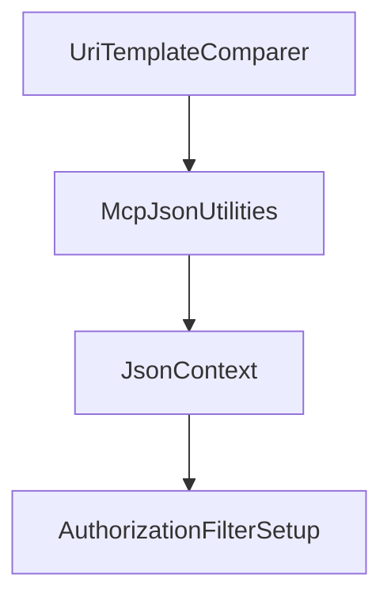

# Chapter 2: Client/Server Hosting and stdio Basics

Welcome to **Chapter 2: Client/Server Hosting and stdio Basics**. In this part of **MCP C# SDK Tutorial: Production MCP in .NET with Hosting, ASP.NET Core, and Task Workflows**, you will build an intuitive mental model first, then move into concrete implementation details and practical production tradeoffs.


This chapter covers practical onboarding for clients and servers using standard .NET hosting patterns.

## Learning Goals

- build a client with `McpClient.CreateAsync` and stdio transport
- bootstrap a server with host builder + tool discovery from assemblies
- wire logging to stderr for protocol-safe stdio behavior
- understand where low-level server handlers fit when you need more control

## Hosting Flow

1. instantiate transport (`StdioClientTransport` or stdio server transport)
2. create client/server using SDK host abstractions
3. register tools/prompts/resources through attributes or explicit handlers
4. run server and verify tool list/call paths end to end

## Source References

- [C# SDK README - Getting Started Client/Server](https://github.com/modelcontextprotocol/csharp-sdk/blob/main/README.md)
- [Core README - Client/Server](https://github.com/modelcontextprotocol/csharp-sdk/blob/main/src/ModelContextProtocol.Core/README.md)

## Summary

You now have a working stdio baseline for .NET MCP development.

Next: [Chapter 3: ASP.NET Core HTTP Transport and Session Routing](03-aspnetcore-http-transport-and-session-routing.md)

## Source Code Walkthrough

### `src/ModelContextProtocol.Core/UriTemplate.cs`

The `UriTemplateComparer` class in [`src/ModelContextProtocol.Core/UriTemplate.cs`](https://github.com/modelcontextprotocol/csharp-sdk/blob/HEAD/src/ModelContextProtocol.Core/UriTemplate.cs) handles a key part of this chapter's functionality:

```cs
    /// there to distinguish between different templates.
    /// </summary>
    internal sealed class UriTemplateComparer : IEqualityComparer<string>
    {
        public static IEqualityComparer<string> Instance { get; } = new UriTemplateComparer();

        public bool Equals(string? uriTemplate1, string? uriTemplate2)
        {
            if (TryParseAsNonTemplatedUri(uriTemplate1, out Uri? uri1) &&
                TryParseAsNonTemplatedUri(uriTemplate2, out Uri? uri2))
            {
                return uri1 == uri2;
            }

            return string.Equals(uriTemplate1, uriTemplate2, StringComparison.Ordinal);
        }

        public int GetHashCode([DisallowNull] string uriTemplate)
        {
            if (TryParseAsNonTemplatedUri(uriTemplate, out Uri? uri))
            {
                return uri.GetHashCode();
            }
            else
            {
                return StringComparer.Ordinal.GetHashCode(uriTemplate);
            }
        }

        private static bool TryParseAsNonTemplatedUri(string? uriTemplate, [NotNullWhen(true)] out Uri? uri)
        {
            if (uriTemplate is null || uriTemplate.Contains('{'))
```

This class is important because it defines how MCP C# SDK Tutorial: Production MCP in .NET with Hosting, ASP.NET Core, and Task Workflows implements the patterns covered in this chapter.

### `src/ModelContextProtocol.Core/McpJsonUtilities.cs`

The `McpJsonUtilities` class in [`src/ModelContextProtocol.Core/McpJsonUtilities.cs`](https://github.com/modelcontextprotocol/csharp-sdk/blob/HEAD/src/ModelContextProtocol.Core/McpJsonUtilities.cs) handles a key part of this chapter's functionality:

```cs

/// <summary>Provides a collection of utility methods for working with JSON data in the context of MCP.</summary>
public static partial class McpJsonUtilities
{
    /// <summary>
    /// Gets the <see cref="JsonSerializerOptions"/> singleton used as the default in JSON serialization operations.
    /// </summary>
    /// <remarks>
    /// <para>
    /// For Native AOT or applications disabling <see cref="JsonSerializer.IsReflectionEnabledByDefault"/>, this instance
    /// includes source generated contracts for all common exchange types contained in the ModelContextProtocol library.
    /// </para>
    /// <para>
    /// It additionally turns on the following settings:
    /// <list type="number">
    /// <item>Enables <see cref="JsonSerializerDefaults.Web"/> defaults.</item>
    /// <item>Enables <see cref="JsonIgnoreCondition.WhenWritingNull"/> as the default ignore condition for properties.</item>
    /// <item>Enables <see cref="JsonNumberHandling.AllowReadingFromString"/> as the default number handling for number types.</item>
    /// </list>
    /// </para>
    /// </remarks>
    public static JsonSerializerOptions DefaultOptions { get; } = CreateDefaultOptions();

    /// <summary>
    /// Creates default options to use for MCP-related serialization.
    /// </summary>
    /// <returns>The configured options.</returns>
    [UnconditionalSuppressMessage("ReflectionAnalysis", "IL3050:RequiresDynamicCode", Justification = "Converter is guarded by IsReflectionEnabledByDefault check.")]
    [UnconditionalSuppressMessage("Trimming", "IL2026:Members annotated with 'RequiresUnreferencedCodeAttribute' require dynamic access", Justification = "Converter is guarded by IsReflectionEnabledByDefault check.")]
    private static JsonSerializerOptions CreateDefaultOptions()
    {
        // Copy the configuration from the source generated context.
```

This class is important because it defines how MCP C# SDK Tutorial: Production MCP in .NET with Hosting, ASP.NET Core, and Task Workflows implements the patterns covered in this chapter.

### `src/ModelContextProtocol.Core/McpJsonUtilities.cs`

The `JsonContext` class in [`src/ModelContextProtocol.Core/McpJsonUtilities.cs`](https://github.com/modelcontextprotocol/csharp-sdk/blob/HEAD/src/ModelContextProtocol.Core/McpJsonUtilities.cs) handles a key part of this chapter's functionality:

```cs
    {
        // Copy the configuration from the source generated context.
        JsonSerializerOptions options = new(JsonContext.Default.Options);

        // Chain with all supported types from MEAI.
        options.TypeInfoResolverChain.Add(AIJsonUtilities.DefaultOptions.TypeInfoResolver!);

        // Add a converter for user-defined enums, if reflection is enabled by default.
        if (JsonSerializer.IsReflectionEnabledByDefault)
        {
            options.Converters.Add(new JsonStringEnumConverter());
        }

        options.MakeReadOnly();
        return options;
    }

    internal static JsonTypeInfo<T> GetTypeInfo<T>(this JsonSerializerOptions options) =>
        (JsonTypeInfo<T>)options.GetTypeInfo(typeof(T));

    internal static JsonElement DefaultMcpToolSchema { get; } = ParseJsonElement("""{"type":"object"}"""u8);
    internal static object? AsObject(this JsonElement element) => element.ValueKind is JsonValueKind.Null ? null : element;

    internal static bool IsValidMcpToolSchema(JsonElement element)
    {
        if (element.ValueKind is not JsonValueKind.Object)
        {
            return false;
        }

        foreach (JsonProperty property in element.EnumerateObject())
        {
```

This class is important because it defines how MCP C# SDK Tutorial: Production MCP in .NET with Hosting, ASP.NET Core, and Task Workflows implements the patterns covered in this chapter.

### `src/ModelContextProtocol.AspNetCore/AuthorizationFilterSetup.cs`

The `AuthorizationFilterSetup` class in [`src/ModelContextProtocol.AspNetCore/AuthorizationFilterSetup.cs`](https://github.com/modelcontextprotocol/csharp-sdk/blob/HEAD/src/ModelContextProtocol.AspNetCore/AuthorizationFilterSetup.cs) handles a key part of this chapter's functionality:

```cs
/// Evaluates authorization policies from endpoint metadata.
/// </summary>
internal sealed class AuthorizationFilterSetup(IAuthorizationPolicyProvider? policyProvider = null) : IConfigureOptions<McpServerOptions>, IPostConfigureOptions<McpServerOptions>
{
    private static readonly string AuthorizationFilterInvokedKey = "ModelContextProtocol.AspNetCore.AuthorizationFilter.Invoked";

    public void Configure(McpServerOptions options)
    {
        ConfigureListToolsFilter(options);
        ConfigureCallToolFilter(options);

        ConfigureListResourcesFilter(options);
        ConfigureListResourceTemplatesFilter(options);
        ConfigureReadResourceFilter(options);

        ConfigureListPromptsFilter(options);
        ConfigureGetPromptFilter(options);
    }

    public void PostConfigure(string? name, McpServerOptions options)
    {
        CheckListToolsFilter(options);
        CheckCallToolFilter(options);

        CheckListResourcesFilter(options);
        CheckListResourceTemplatesFilter(options);
        CheckReadResourceFilter(options);

        CheckListPromptsFilter(options);
        CheckGetPromptFilter(options);
    }

```

This class is important because it defines how MCP C# SDK Tutorial: Production MCP in .NET with Hosting, ASP.NET Core, and Task Workflows implements the patterns covered in this chapter.


## How These Components Connect


