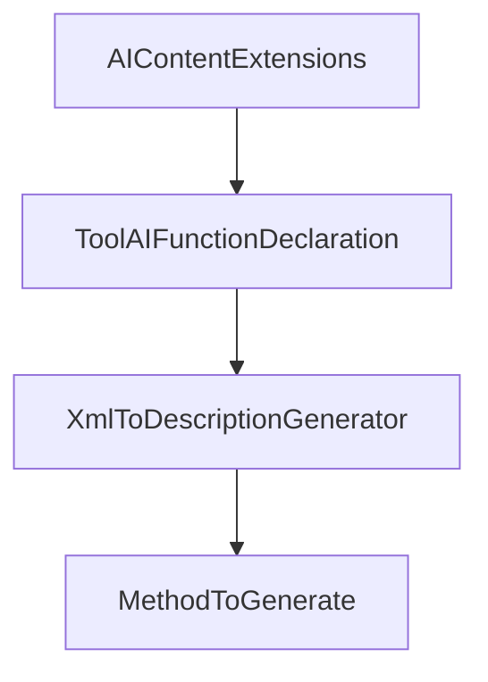

# Chapter 2: Client/Server Hosting and stdio Basics

Welcome to **Chapter 2: Client/Server Hosting and stdio Basics**. In this part of **MCP C# SDK Tutorial: Production MCP in .NET with Hosting, ASP.NET Core, and Task Workflows**, you will build an intuitive mental model first, then move into concrete implementation details and practical production tradeoffs.


This chapter covers practical onboarding for clients and servers using standard .NET hosting patterns.

## Learning Goals

- build a client with `McpClient.CreateAsync` and stdio transport
- bootstrap a server with host builder + tool discovery from assemblies
- wire logging to stderr for protocol-safe stdio behavior
- understand where low-level server handlers fit when you need more control

## Hosting Flow

1. instantiate transport (`StdioClientTransport` or stdio server transport)
2. create client/server using SDK host abstractions
3. register tools/prompts/resources through attributes or explicit handlers
4. run server and verify tool list/call paths end to end

## Source References

- [C# SDK README - Getting Started Client/Server](https://github.com/modelcontextprotocol/csharp-sdk/blob/main/README.md)
- [Core README - Client/Server](https://github.com/modelcontextprotocol/csharp-sdk/blob/main/src/ModelContextProtocol.Core/README.md)

## Summary

You now have a working stdio baseline for .NET MCP development.

Next: [Chapter 3: ASP.NET Core HTTP Transport and Session Routing](03-aspnetcore-http-transport-and-session-routing.md)

## Depth Expansion Playbook

## Source Code Walkthrough

### `src/ModelContextProtocol.Core/AIContentExtensions.cs`

The `AIContentExtensions` class in [`src/ModelContextProtocol.Core/AIContentExtensions.cs`](https://github.com/modelcontextprotocol/csharp-sdk/blob/HEAD/src/ModelContextProtocol.Core/AIContentExtensions.cs) handles a key part of this chapter's functionality:

```cs
/// from the Microsoft.Extensions.AI namespace.
/// </remarks>
public static class AIContentExtensions
{
    /// <summary>
    /// Creates a sampling handler for use with <see cref="McpClientHandlers.SamplingHandler"/> that will
    /// satisfy sampling requests using the specified <see cref="IChatClient"/>.
    /// </summary>
    /// <param name="chatClient">The <see cref="IChatClient"/> with which to satisfy sampling requests.</param>
    /// <param name="serializerOptions">The <see cref="JsonSerializerOptions"/> to use for serializing user-provided objects. If <see langword="null"/>, <see cref="McpJsonUtilities.DefaultOptions"/> is used.</param>
    /// <returns>The created handler delegate that can be assigned to <see cref="McpClientHandlers.SamplingHandler"/>.</returns>
    /// <remarks>
    /// <para>
    /// This method creates a function that converts MCP message requests into chat client calls, enabling
    /// an MCP client to generate text or other content using an actual AI model via the provided chat client.
    /// </para>
    /// <para>
    /// The handler can process text messages, image messages, resource messages, and tool use/results as defined in the
    /// Model Context Protocol.
    /// </para>
    /// </remarks>
    /// <exception cref="ArgumentNullException"><paramref name="chatClient"/> is <see langword="null"/>.</exception>
    public static Func<CreateMessageRequestParams?, IProgress<ProgressNotificationValue>, CancellationToken, ValueTask<CreateMessageResult>> CreateSamplingHandler(
        this IChatClient chatClient,
        JsonSerializerOptions? serializerOptions = null)
    {
        Throw.IfNull(chatClient);

        serializerOptions ??= McpJsonUtilities.DefaultOptions;

        return async (requestParams, progress, cancellationToken) =>
        {
```

This class is important because it defines how MCP C# SDK Tutorial: Production MCP in .NET with Hosting, ASP.NET Core, and Task Workflows implements the patterns covered in this chapter.

### `src/ModelContextProtocol.Core/AIContentExtensions.cs`

The `ToolAIFunctionDeclaration` class in [`src/ModelContextProtocol.Core/AIContentExtensions.cs`](https://github.com/modelcontextprotocol/csharp-sdk/blob/HEAD/src/ModelContextProtocol.Core/AIContentExtensions.cs) handles a key part of this chapter's functionality:

```cs
                    foreach (var tool in tools)
                    {
                        ((options ??= new()).Tools ??= []).Add(new ToolAIFunctionDeclaration(tool));
                    }

                    if (options.Tools is { Count: > 0 } && requestParams.ToolChoice is { } toolChoice)
                    {
                        options.ToolMode = toolChoice.Mode switch
                        {
                            ToolChoice.ModeAuto => ChatToolMode.Auto,
                            ToolChoice.ModeRequired => ChatToolMode.RequireAny,
                            ToolChoice.ModeNone => ChatToolMode.None,
                            _ => null,
                        };
                    }
                }

                List<ChatMessage> messages = [];
                foreach (var sm in requestParams.Messages)
                {
                    if (sm.Content?.Select(b => b.ToAIContent(serializerOptions)).OfType<AIContent>().ToList() is { Count: > 0 } aiContents)
                    {
                        ChatRole role =
                            aiContents.All(static c => c is FunctionResultContent) ? ChatRole.Tool :
                            sm.Role is Role.Assistant ? ChatRole.Assistant :
                            ChatRole.User;
                        messages.Add(new ChatMessage(role, aiContents));
                    }
                }

                return (messages, options);
            }
```

This class is important because it defines how MCP C# SDK Tutorial: Production MCP in .NET with Hosting, ASP.NET Core, and Task Workflows implements the patterns covered in this chapter.

### `src/ModelContextProtocol.Analyzers/XmlToDescriptionGenerator.cs`

The `XmlToDescriptionGenerator` class in [`src/ModelContextProtocol.Analyzers/XmlToDescriptionGenerator.cs`](https://github.com/modelcontextprotocol/csharp-sdk/blob/HEAD/src/ModelContextProtocol.Analyzers/XmlToDescriptionGenerator.cs) handles a key part of this chapter's functionality:

```cs
/// </summary>
[Generator]
public sealed class XmlToDescriptionGenerator : IIncrementalGenerator
{
    private const string GeneratedFileName = "ModelContextProtocol.Descriptions.g.cs";

    /// <summary>
    /// A display format that produces fully-qualified type names with "global::" prefix
    /// and includes nullability annotations.
    /// </summary>
    private static readonly SymbolDisplayFormat s_fullyQualifiedFormatWithNullability =
        SymbolDisplayFormat.FullyQualifiedFormat.AddMiscellaneousOptions(
            SymbolDisplayMiscellaneousOptions.IncludeNullableReferenceTypeModifier);

    public void Initialize(IncrementalGeneratorInitializationContext context)
    {
        // Extract method information for all MCP tools, prompts, and resources.
        // The transform extracts all necessary data upfront so the output doesn't depend on the compilation.
        var allMethods = CreateProviderForAttribute(context, McpAttributeNames.McpServerToolAttribute).Collect()
            .Combine(CreateProviderForAttribute(context, McpAttributeNames.McpServerPromptAttribute).Collect())
            .Combine(CreateProviderForAttribute(context, McpAttributeNames.McpServerResourceAttribute).Collect())
            .Select(static (tuple, _) =>
            {
                var ((tools, prompts), resources) = tuple;
                return new EquatableArray<MethodToGenerate>(tools.Concat(prompts).Concat(resources));
            });

        // Report diagnostics for all methods.
        context.RegisterSourceOutput(
            allMethods, 
            static (spc, methods) =>
            {
```

This class is important because it defines how MCP C# SDK Tutorial: Production MCP in .NET with Hosting, ASP.NET Core, and Task Workflows implements the patterns covered in this chapter.

### `src/ModelContextProtocol.Analyzers/XmlToDescriptionGenerator.cs`

The `MethodToGenerate` interface in [`src/ModelContextProtocol.Analyzers/XmlToDescriptionGenerator.cs`](https://github.com/modelcontextprotocol/csharp-sdk/blob/HEAD/src/ModelContextProtocol.Analyzers/XmlToDescriptionGenerator.cs) handles a key part of this chapter's functionality:

```cs
            {
                var ((tools, prompts), resources) = tuple;
                return new EquatableArray<MethodToGenerate>(tools.Concat(prompts).Concat(resources));
            });

        // Report diagnostics for all methods.
        context.RegisterSourceOutput(
            allMethods, 
            static (spc, methods) =>
            {
                foreach (var method in methods)
                {
                    foreach (var diagnostic in method.Diagnostics)
                    {
                        spc.ReportDiagnostic(CreateDiagnostic(diagnostic));
                    }
                }
            });

        // Generate source code only for methods that need generation.
        context.RegisterSourceOutput(
            allMethods.Select(static (methods, _) => new EquatableArray<MethodToGenerate>(methods.Where(m => m.NeedsGeneration))),
            static (spc, methods) =>
            {
                if (methods.Length > 0)
                {
                    spc.AddSource(GeneratedFileName, SourceText.From(GenerateSourceFile(methods), Encoding.UTF8));
                }
            });
    }

    private static Diagnostic CreateDiagnostic(DiagnosticInfo info) =>
```

This interface is important because it defines how MCP C# SDK Tutorial: Production MCP in .NET with Hosting, ASP.NET Core, and Task Workflows implements the patterns covered in this chapter.


## How These Components Connect


