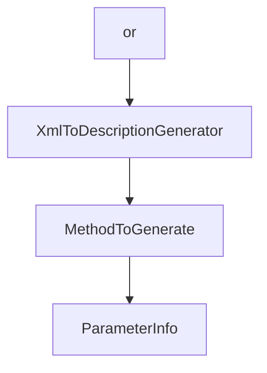

# Chapter 3: ASP.NET Core HTTP Transport and Session Routing

Welcome to **Chapter 3: ASP.NET Core HTTP Transport and Session Routing**. In this part of **MCP C# SDK Tutorial: Production MCP in .NET with Hosting, ASP.NET Core, and Task Workflows**, you will build an intuitive mental model first, then move into concrete implementation details and practical production tradeoffs.


HTTP deployment patterns in C# should be explicit about route scoping and per-session behavior.

## Learning Goals

- deploy MCP endpoints with ASP.NET Core integration
- design per-route/per-session tool availability safely
- avoid overexposing tool catalogs across endpoint surfaces
- align HTTP topology with policy and tenant boundaries

## Route and Session Strategy

- expose focused MCP routes for distinct tool domains when possible
- keep all-tools endpoints gated and monitored
- use route-aware filtering for session-specific tool narrowing
- document endpoint semantics so clients can discover expected capability scope

## Source References

- [AspNetCore Package README](https://github.com/modelcontextprotocol/csharp-sdk/blob/main/src/ModelContextProtocol.AspNetCore/README.md)
- [Per-Session Tools Sample](https://github.com/modelcontextprotocol/csharp-sdk/blob/main/samples/AspNetCoreMcpPerSessionTools/README.md)
- [Docs Concepts - HTTP Context](https://github.com/modelcontextprotocol/csharp-sdk/blob/main/docs/concepts/httpcontext/httpcontext.md)

## Summary

You now have an HTTP architecture model for route-scoped MCP services in ASP.NET Core.

Next: [Chapter 4: Tools, Prompts, Resources, and Filter Pipelines](04-tools-prompts-resources-and-filter-pipelines.md)

## Source Code Walkthrough

### `src/ModelContextProtocol.AspNetCore/AuthorizationFilterSetup.cs`

The `or` class in [`src/ModelContextProtocol.AspNetCore/AuthorizationFilterSetup.cs`](https://github.com/modelcontextprotocol/csharp-sdk/blob/HEAD/src/ModelContextProtocol.AspNetCore/AuthorizationFilterSetup.cs) handles a key part of this chapter's functionality:

```cs
using System.Diagnostics.CodeAnalysis;
using System.Security.Claims;
using Microsoft.AspNetCore.Authorization;
using Microsoft.Extensions.DependencyInjection;
using Microsoft.Extensions.Options;
using ModelContextProtocol.Protocol;
using ModelContextProtocol.Server;

namespace ModelContextProtocol.AspNetCore;

/// <summary>
/// Evaluates authorization policies from endpoint metadata.
/// </summary>
internal sealed class AuthorizationFilterSetup(IAuthorizationPolicyProvider? policyProvider = null) : IConfigureOptions<McpServerOptions>, IPostConfigureOptions<McpServerOptions>
{
    private static readonly string AuthorizationFilterInvokedKey = "ModelContextProtocol.AspNetCore.AuthorizationFilter.Invoked";

    public void Configure(McpServerOptions options)
    {
        ConfigureListToolsFilter(options);
        ConfigureCallToolFilter(options);

        ConfigureListResourcesFilter(options);
        ConfigureListResourceTemplatesFilter(options);
        ConfigureReadResourceFilter(options);

        ConfigureListPromptsFilter(options);
        ConfigureGetPromptFilter(options);
    }

    public void PostConfigure(string? name, McpServerOptions options)
    {
```

This class is important because it defines how MCP C# SDK Tutorial: Production MCP in .NET with Hosting, ASP.NET Core, and Task Workflows implements the patterns covered in this chapter.

### `src/ModelContextProtocol.Analyzers/XmlToDescriptionGenerator.cs`

The `XmlToDescriptionGenerator` class in [`src/ModelContextProtocol.Analyzers/XmlToDescriptionGenerator.cs`](https://github.com/modelcontextprotocol/csharp-sdk/blob/HEAD/src/ModelContextProtocol.Analyzers/XmlToDescriptionGenerator.cs) handles a key part of this chapter's functionality:

```cs
/// </summary>
[Generator]
public sealed class XmlToDescriptionGenerator : IIncrementalGenerator
{
    private const string GeneratedFileName = "ModelContextProtocol.Descriptions.g.cs";

    /// <summary>
    /// A display format that produces fully-qualified type names with "global::" prefix
    /// and includes nullability annotations.
    /// </summary>
    private static readonly SymbolDisplayFormat s_fullyQualifiedFormatWithNullability =
        SymbolDisplayFormat.FullyQualifiedFormat.AddMiscellaneousOptions(
            SymbolDisplayMiscellaneousOptions.IncludeNullableReferenceTypeModifier);

    public void Initialize(IncrementalGeneratorInitializationContext context)
    {
        // Extract method information for all MCP tools, prompts, and resources.
        // The transform extracts all necessary data upfront so the output doesn't depend on the compilation.
        var allMethods = CreateProviderForAttribute(context, McpAttributeNames.McpServerToolAttribute).Collect()
            .Combine(CreateProviderForAttribute(context, McpAttributeNames.McpServerPromptAttribute).Collect())
            .Combine(CreateProviderForAttribute(context, McpAttributeNames.McpServerResourceAttribute).Collect())
            .Select(static (tuple, _) =>
            {
                var ((tools, prompts), resources) = tuple;
                return new EquatableArray<MethodToGenerate>(tools.Concat(prompts).Concat(resources));
            });

        // Report diagnostics for all methods.
        context.RegisterSourceOutput(
            allMethods, 
            static (spc, methods) =>
            {
```

This class is important because it defines how MCP C# SDK Tutorial: Production MCP in .NET with Hosting, ASP.NET Core, and Task Workflows implements the patterns covered in this chapter.

### `src/ModelContextProtocol.Analyzers/XmlToDescriptionGenerator.cs`

The `MethodToGenerate` interface in [`src/ModelContextProtocol.Analyzers/XmlToDescriptionGenerator.cs`](https://github.com/modelcontextprotocol/csharp-sdk/blob/HEAD/src/ModelContextProtocol.Analyzers/XmlToDescriptionGenerator.cs) handles a key part of this chapter's functionality:

```cs
            {
                var ((tools, prompts), resources) = tuple;
                return new EquatableArray<MethodToGenerate>(tools.Concat(prompts).Concat(resources));
            });

        // Report diagnostics for all methods.
        context.RegisterSourceOutput(
            allMethods, 
            static (spc, methods) =>
            {
                foreach (var method in methods)
                {
                    foreach (var diagnostic in method.Diagnostics)
                    {
                        spc.ReportDiagnostic(CreateDiagnostic(diagnostic));
                    }
                }
            });

        // Generate source code only for methods that need generation.
        context.RegisterSourceOutput(
            allMethods.Select(static (methods, _) => new EquatableArray<MethodToGenerate>(methods.Where(m => m.NeedsGeneration))),
            static (spc, methods) =>
            {
                if (methods.Length > 0)
                {
                    spc.AddSource(GeneratedFileName, SourceText.From(GenerateSourceFile(methods), Encoding.UTF8));
                }
            });
    }

    private static Diagnostic CreateDiagnostic(DiagnosticInfo info) =>
```

This interface is important because it defines how MCP C# SDK Tutorial: Production MCP in .NET with Hosting, ASP.NET Core, and Task Workflows implements the patterns covered in this chapter.

### `src/ModelContextProtocol.Analyzers/XmlToDescriptionGenerator.cs`

The `ParameterInfo` interface in [`src/ModelContextProtocol.Analyzers/XmlToDescriptionGenerator.cs`](https://github.com/modelcontextprotocol/csharp-sdk/blob/HEAD/src/ModelContextProtocol.Analyzers/XmlToDescriptionGenerator.cs) handles a key part of this chapter's functionality:

```cs
        // Extract parameters
        var parameterSyntaxList = methodDeclaration.ParameterList.Parameters;
        ParameterInfo[] parameters = new ParameterInfo[methodSymbol.Parameters.Length];
        for (int i = 0; i < methodSymbol.Parameters.Length; i++)
        {
            var param = methodSymbol.Parameters[i];
            var paramSyntax = i < parameterSyntaxList.Count ? parameterSyntaxList[i] : null;

            parameters[i] = new ParameterInfo(
                ParameterType: param.Type.ToDisplayString(s_fullyQualifiedFormatWithNullability),
                Name: param.Name,
                HasDescriptionAttribute: descriptionAttribute is not null && HasAttribute(param, descriptionAttribute),
                XmlDescription: xmlDocs?.Parameters.TryGetValue(param.Name, out var pd) == true && !string.IsNullOrWhiteSpace(pd) ? pd : null,
                DefaultValue: paramSyntax?.Default?.ToFullString().Trim());
        }

        return new MethodToGenerate(
            NeedsGeneration: true,
            TypeInfo: ExtractTypeInfo(methodSymbol.ContainingType),
            Modifiers: modifiersStr,
            ReturnType: returnType,
            MethodName: methodName,
            Parameters: new EquatableArray<ParameterInfo>(parameters),
            MethodDescription: needsMethodDescription ? xmlDocs?.MethodDescription : null,
            ReturnDescription: needsReturnDescription ? xmlDocs?.Returns : null,
            Diagnostics: diagnostics);
    }

    /// <summary>Checks if XML documentation would generate any Description attributes for a method.</summary>
    private static bool HasGeneratableContent(XmlDocumentation xmlDocs, IMethodSymbol methodSymbol, INamedTypeSymbol descriptionAttribute)
    {
        if (!string.IsNullOrWhiteSpace(xmlDocs.MethodDescription) && !HasAttribute(methodSymbol, descriptionAttribute))
```

This interface is important because it defines how MCP C# SDK Tutorial: Production MCP in .NET with Hosting, ASP.NET Core, and Task Workflows implements the patterns covered in this chapter.


## How These Components Connect


