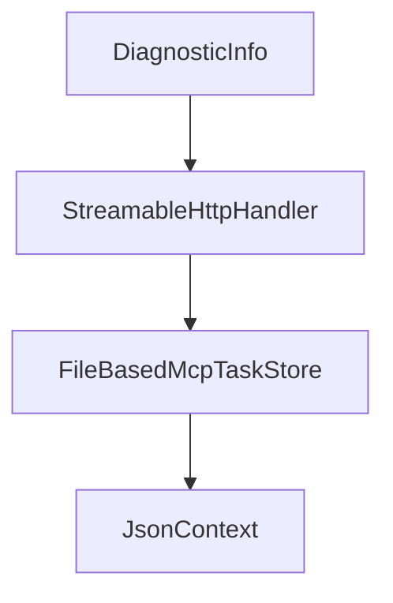

# Chapter 4: Tools, Prompts, Resources, and Filter Pipelines

Welcome to **Chapter 4: Tools, Prompts, Resources, and Filter Pipelines**. In this part of **MCP C# SDK Tutorial: Production MCP in .NET with Hosting, ASP.NET Core, and Task Workflows**, you will build an intuitive mental model first, then move into concrete implementation details and practical production tradeoffs.


Filter pipelines are a major differentiator in the C# SDK for cross-cutting control.

## Learning Goals

- define tools/prompts/resources with clear metadata and constraints
- apply request-specific and message-level filters correctly
- order filters to enforce authorization and observability goals
- avoid hidden behavior interactions between filters and handlers

## Filter Design Rules

| Filter Type | Best Use |
|:------------|:---------|
| request-specific filters | validate/transform behavior for one primitive category |
| incoming message filters | protocol-level interception before handler dispatch |
| outgoing message filters | response/notification shaping and telemetry |

## Source References

- [Filter Concepts](https://github.com/modelcontextprotocol/csharp-sdk/blob/main/docs/concepts/filters.md)
- [C# SDK README - Tool/Prompt/Resource Examples](https://github.com/modelcontextprotocol/csharp-sdk/blob/main/README.md)
- [Core README - Server APIs](https://github.com/modelcontextprotocol/csharp-sdk/blob/main/src/ModelContextProtocol.Core/README.md)

## Summary

You now have an extensibility model for primitives and filters that stays predictable under growth.

Next: [Chapter 5: Logging, Progress, Elicitation, and Tasks](05-logging-progress-elicitation-and-tasks.md)

## Depth Expansion Playbook

## Source Code Walkthrough

### `src/ModelContextProtocol.Analyzers/XmlToDescriptionGenerator.cs`

The `DiagnosticInfo` interface in [`src/ModelContextProtocol.Analyzers/XmlToDescriptionGenerator.cs`](https://github.com/modelcontextprotocol/csharp-sdk/blob/HEAD/src/ModelContextProtocol.Analyzers/XmlToDescriptionGenerator.cs) handles a key part of this chapter's functionality:

```cs
    }

    private static Diagnostic CreateDiagnostic(DiagnosticInfo info) =>
        Diagnostic.Create(info.Id switch
        {
            "MCP001" => Diagnostics.InvalidXmlDocumentation,
            "MCP002" => Diagnostics.McpMethodMustBePartial,
            _ => throw new InvalidOperationException($"Unknown diagnostic ID: {info.Id}")
        }, info.Location?.ToLocation(), info.MessageArgs);

    private static IncrementalValuesProvider<MethodToGenerate> CreateProviderForAttribute(
        IncrementalGeneratorInitializationContext context,
        string attributeMetadataName) =>
        context.SyntaxProvider.ForAttributeWithMetadataName(
            attributeMetadataName,
            static (node, _) => node is MethodDeclarationSyntax,
            static (ctx, _) => ExtractMethodInfo((MethodDeclarationSyntax)ctx.TargetNode, (IMethodSymbol)ctx.TargetSymbol, ctx.SemanticModel.Compilation));

    private static MethodToGenerate ExtractMethodInfo(
        MethodDeclarationSyntax methodDeclaration,
        IMethodSymbol methodSymbol,
        Compilation compilation)
    {
        bool isPartial = methodDeclaration.Modifiers.Any(SyntaxKind.PartialKeyword);
        var descriptionAttribute = compilation.GetTypeByMetadataName(McpAttributeNames.DescriptionAttribute);

        // Try to extract XML documentation
        var (xmlDocs, hasInvalidXml) = TryExtractXmlDocumentation(methodSymbol);
        
        // For non-partial methods, check if we should report a diagnostic
        if (!isPartial)
        {
```

This interface is important because it defines how MCP C# SDK Tutorial: Production MCP in .NET with Hosting, ASP.NET Core, and Task Workflows implements the patterns covered in this chapter.

### `src/ModelContextProtocol.AspNetCore/StreamableHttpHandler.cs`

The `StreamableHttpHandler` class in [`src/ModelContextProtocol.AspNetCore/StreamableHttpHandler.cs`](https://github.com/modelcontextprotocol/csharp-sdk/blob/HEAD/src/ModelContextProtocol.AspNetCore/StreamableHttpHandler.cs) handles a key part of this chapter's functionality:

```cs
namespace ModelContextProtocol.AspNetCore;

internal sealed class StreamableHttpHandler(
    IOptions<McpServerOptions> mcpServerOptionsSnapshot,
    IOptionsFactory<McpServerOptions> mcpServerOptionsFactory,
    IOptions<HttpServerTransportOptions> httpServerTransportOptions,
    StatefulSessionManager sessionManager,
    IHostApplicationLifetime hostApplicationLifetime,
    IServiceProvider applicationServices,
    ILoggerFactory loggerFactory)
{
    private const string McpSessionIdHeaderName = "Mcp-Session-Id";
    private const string McpProtocolVersionHeaderName = "MCP-Protocol-Version";
    private const string LastEventIdHeaderName = "Last-Event-ID";

    /// <summary>
    /// All protocol versions supported by this implementation.
    /// Keep in sync with McpSessionHandler.SupportedProtocolVersions in ModelContextProtocol.Core.
    /// </summary>
    private static readonly HashSet<string> s_supportedProtocolVersions =
    [
        "2024-11-05",
        "2025-03-26",
        "2025-06-18",
        "2025-11-25",
    ];

    private static readonly JsonTypeInfo<JsonRpcMessage> s_messageTypeInfo = GetRequiredJsonTypeInfo<JsonRpcMessage>();
    private static readonly JsonTypeInfo<JsonRpcError> s_errorTypeInfo = GetRequiredJsonTypeInfo<JsonRpcError>();

    private static bool AllowNewSessionForNonInitializeRequests { get; } =
        AppContext.TryGetSwitch("ModelContextProtocol.AspNetCore.AllowNewSessionForNonInitializeRequests", out var enabled) && enabled;
```

This class is important because it defines how MCP C# SDK Tutorial: Production MCP in .NET with Hosting, ASP.NET Core, and Task Workflows implements the patterns covered in this chapter.

### `samples/LongRunningTasks/FileBasedMcpTaskStore.cs`

The `FileBasedMcpTaskStore` class in [`samples/LongRunningTasks/FileBasedMcpTaskStore.cs`](https://github.com/modelcontextprotocol/csharp-sdk/blob/HEAD/samples/LongRunningTasks/FileBasedMcpTaskStore.cs) handles a key part of this chapter's functionality:

```cs
/// </para>
/// </remarks>
public sealed partial class FileBasedMcpTaskStore : IMcpTaskStore
{
    private readonly string _storePath;
    private readonly TimeSpan _executionTime;

    /// <summary>
    /// Initializes a new instance of the <see cref="FileBasedMcpTaskStore"/> class.
    /// </summary>
    /// <param name="storePath">The directory path where task files will be stored.</param>
    /// <param name="executionTime">
    /// The fixed execution time for all tasks. Tasks are reported as completed once this
    /// duration has elapsed since creation. Defaults to 5 seconds.
    /// </param>
    public FileBasedMcpTaskStore(string storePath, TimeSpan? executionTime = null)
    {
        _storePath = storePath ?? throw new ArgumentNullException(nameof(storePath));
        _executionTime = executionTime ?? TimeSpan.FromSeconds(5);
        Directory.CreateDirectory(_storePath);
    }

    /// <inheritdoc/>
    public async Task<McpTask> CreateTaskAsync(
        McpTaskMetadata taskParams,
        RequestId requestId,
        JsonRpcRequest request,
        string? sessionId = null,
        CancellationToken cancellationToken = default)
    {
        var taskId = Guid.NewGuid().ToString("N");
        var now = DateTimeOffset.UtcNow;
```

This class is important because it defines how MCP C# SDK Tutorial: Production MCP in .NET with Hosting, ASP.NET Core, and Task Workflows implements the patterns covered in this chapter.

### `samples/LongRunningTasks/FileBasedMcpTaskStore.cs`

The `JsonContext` class in [`samples/LongRunningTasks/FileBasedMcpTaskStore.cs`](https://github.com/modelcontextprotocol/csharp-sdk/blob/HEAD/samples/LongRunningTasks/FileBasedMcpTaskStore.cs) handles a key part of this chapter's functionality:

```cs
            ExecutionTime = _executionTime,
            TimeToLive = taskParams.TimeToLive,
            Result = JsonSerializer.SerializeToElement(request.Params, JsonContext.Default.JsonNode)
        };

        await WriteTaskEntryAsync(GetTaskFilePath(taskId), entry);

        return ToMcpTask(entry);
    }

    /// <inheritdoc/>
    public async Task<McpTask?> GetTaskAsync(
        string taskId,
        string? sessionId = null,
        CancellationToken cancellationToken = default)
    {
        var entry = await ReadTaskEntryAsync(taskId);
        if (entry is null)
        {
            return null;
        }

        // Session isolation
        if (sessionId is not null && entry.SessionId != sessionId)
        {
            return null;
        }

        // Skip if TTL has expired
        if (IsExpired(entry))
        {
            return null;
```

This class is important because it defines how MCP C# SDK Tutorial: Production MCP in .NET with Hosting, ASP.NET Core, and Task Workflows implements the patterns covered in this chapter.


## How These Components Connect


