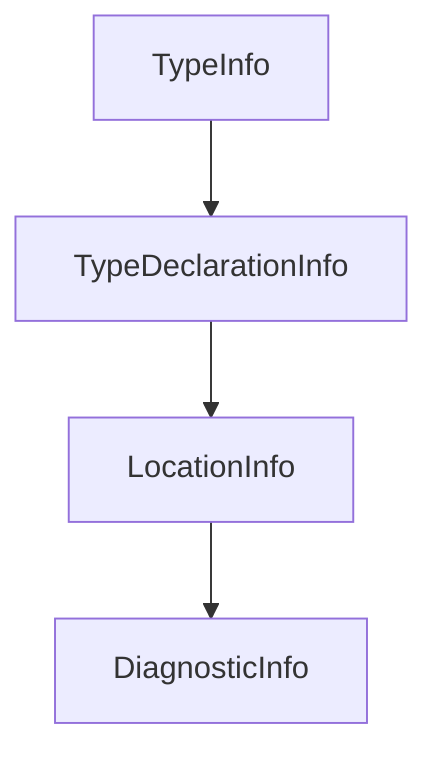

# Chapter 4: Tools, Prompts, Resources, and Filter Pipelines

Welcome to **Chapter 4: Tools, Prompts, Resources, and Filter Pipelines**. In this part of **MCP C# SDK Tutorial: Production MCP in .NET with Hosting, ASP.NET Core, and Task Workflows**, you will build an intuitive mental model first, then move into concrete implementation details and practical production tradeoffs.


Filter pipelines are a major differentiator in the C# SDK for cross-cutting control.

## Learning Goals

- define tools/prompts/resources with clear metadata and constraints
- apply request-specific and message-level filters correctly
- order filters to enforce authorization and observability goals
- avoid hidden behavior interactions between filters and handlers

## Filter Design Rules

| Filter Type | Best Use |
|:------------|:---------|
| request-specific filters | validate/transform behavior for one primitive category |
| incoming message filters | protocol-level interception before handler dispatch |
| outgoing message filters | response/notification shaping and telemetry |

## Source References

- [Filter Concepts](https://github.com/modelcontextprotocol/csharp-sdk/blob/main/docs/concepts/filters.md)
- [C# SDK README - Tool/Prompt/Resource Examples](https://github.com/modelcontextprotocol/csharp-sdk/blob/main/README.md)
- [Core README - Server APIs](https://github.com/modelcontextprotocol/csharp-sdk/blob/main/src/ModelContextProtocol.Core/README.md)

## Summary

You now have an extensibility model for primitives and filters that stays predictable under growth.

Next: [Chapter 5: Logging, Progress, Elicitation, and Tasks](05-logging-progress-elicitation-and-tasks.md)

## Source Code Walkthrough

### `src/ModelContextProtocol.Analyzers/XmlToDescriptionGenerator.cs`

The `TypeInfo` interface in [`src/ModelContextProtocol.Analyzers/XmlToDescriptionGenerator.cs`](https://github.com/modelcontextprotocol/csharp-sdk/blob/HEAD/src/ModelContextProtocol.Analyzers/XmlToDescriptionGenerator.cs) handles a key part of this chapter's functionality:

```cs
        return new MethodToGenerate(
            NeedsGeneration: true,
            TypeInfo: ExtractTypeInfo(methodSymbol.ContainingType),
            Modifiers: modifiersStr,
            ReturnType: returnType,
            MethodName: methodName,
            Parameters: new EquatableArray<ParameterInfo>(parameters),
            MethodDescription: needsMethodDescription ? xmlDocs?.MethodDescription : null,
            ReturnDescription: needsReturnDescription ? xmlDocs?.Returns : null,
            Diagnostics: diagnostics);
    }

    /// <summary>Checks if XML documentation would generate any Description attributes for a method.</summary>
    private static bool HasGeneratableContent(XmlDocumentation xmlDocs, IMethodSymbol methodSymbol, INamedTypeSymbol descriptionAttribute)
    {
        if (!string.IsNullOrWhiteSpace(xmlDocs.MethodDescription) && !HasAttribute(methodSymbol, descriptionAttribute))
        {
            return true;
        }

        if (!string.IsNullOrWhiteSpace(xmlDocs.Returns) &&
            methodSymbol.GetReturnTypeAttributes().All(attr => !SymbolEqualityComparer.Default.Equals(attr.AttributeClass, descriptionAttribute)))
        {
            return true;
        }

        foreach (var param in methodSymbol.Parameters)
        {
            if (!HasAttribute(param, descriptionAttribute) &&
                xmlDocs.Parameters.TryGetValue(param.Name, out var paramDoc) &&
                !string.IsNullOrWhiteSpace(paramDoc))
            {
```

This interface is important because it defines how MCP C# SDK Tutorial: Production MCP in .NET with Hosting, ASP.NET Core, and Task Workflows implements the patterns covered in this chapter.

### `src/ModelContextProtocol.Analyzers/XmlToDescriptionGenerator.cs`

The `TypeDeclarationInfo` interface in [`src/ModelContextProtocol.Analyzers/XmlToDescriptionGenerator.cs`](https://github.com/modelcontextprotocol/csharp-sdk/blob/HEAD/src/ModelContextProtocol.Analyzers/XmlToDescriptionGenerator.cs) handles a key part of this chapter's functionality:

```cs

        // Build list of nested types from innermost to outermost
        var typesBuilder = ImmutableArray.CreateBuilder<TypeDeclarationInfo>();
        for (var current = typeSymbol; current is not null; current = current.ContainingType)
        {
            var typeDecl = current.DeclaringSyntaxReferences.FirstOrDefault()?.GetSyntax() as TypeDeclarationSyntax;
            string typeKeyword;
            if (typeDecl is RecordDeclarationSyntax rds)
            {
                string classOrStruct = rds.ClassOrStructKeyword.ValueText;
                if (string.IsNullOrEmpty(classOrStruct))
                {
                    classOrStruct = "class";
                }
                typeKeyword = $"{typeDecl.Keyword.ValueText} {classOrStruct}";
            }
            else
            {
                typeKeyword = typeDecl?.Keyword.ValueText ?? "class";
            }

            typesBuilder.Add(new TypeDeclarationInfo(current.Name, typeKeyword));
        }

        // Reverse to get outermost first
        typesBuilder.Reverse();
        
        string ns = typeSymbol.ContainingNamespace.IsGlobalNamespace ? "" : typeSymbol.ContainingNamespace.ToDisplayString();
        return new TypeInfo(ns, new EquatableArray<TypeDeclarationInfo>(typesBuilder.ToImmutable()));
    }

    private static (XmlDocumentation? Docs, bool HasInvalidXml) TryExtractXmlDocumentation(IMethodSymbol methodSymbol)
```

This interface is important because it defines how MCP C# SDK Tutorial: Production MCP in .NET with Hosting, ASP.NET Core, and Task Workflows implements the patterns covered in this chapter.

### `src/ModelContextProtocol.Analyzers/XmlToDescriptionGenerator.cs`

The `LocationInfo` interface in [`src/ModelContextProtocol.Analyzers/XmlToDescriptionGenerator.cs`](https://github.com/modelcontextprotocol/csharp-sdk/blob/HEAD/src/ModelContextProtocol.Analyzers/XmlToDescriptionGenerator.cs) handles a key part of this chapter's functionality:

```cs
    /// causes issues when the generator returns cached data with locations from earlier compilations.
    /// </remarks>
    private readonly record struct LocationInfo(string FilePath, TextSpan TextSpan, LinePositionSpan LineSpan)
    {
        public static LocationInfo? FromLocation(Location? location) =>
            location is null || !location.IsInSource ? null :
            new LocationInfo(location.SourceTree?.FilePath ?? "", location.SourceSpan, location.GetLineSpan().Span);

        public Location ToLocation() =>
            Location.Create(FilePath, TextSpan, LineSpan);
    }

    /// <summary>Holds diagnostic information to be reported.</summary>
    private readonly record struct DiagnosticInfo(string Id, LocationInfo? Location, string MethodName)
    {
        public static DiagnosticInfo Create(string id, Location? location, string methodName) =>
            new(id, LocationInfo.FromLocation(location), methodName);

        public object?[] MessageArgs => [MethodName];
    }

    /// <summary>Holds extracted XML documentation for a method (used only during extraction, not cached).</summary>
    private sealed record XmlDocumentation(string MethodDescription, string Returns, Dictionary<string, string> Parameters);
}

```

This interface is important because it defines how MCP C# SDK Tutorial: Production MCP in .NET with Hosting, ASP.NET Core, and Task Workflows implements the patterns covered in this chapter.

### `src/ModelContextProtocol.Analyzers/XmlToDescriptionGenerator.cs`

The `DiagnosticInfo` interface in [`src/ModelContextProtocol.Analyzers/XmlToDescriptionGenerator.cs`](https://github.com/modelcontextprotocol/csharp-sdk/blob/HEAD/src/ModelContextProtocol.Analyzers/XmlToDescriptionGenerator.cs) handles a key part of this chapter's functionality:

```cs
    }

    private static Diagnostic CreateDiagnostic(DiagnosticInfo info) =>
        Diagnostic.Create(info.Id switch
        {
            "MCP001" => Diagnostics.InvalidXmlDocumentation,
            "MCP002" => Diagnostics.McpMethodMustBePartial,
            _ => throw new InvalidOperationException($"Unknown diagnostic ID: {info.Id}")
        }, info.Location?.ToLocation(), info.MessageArgs);

    private static IncrementalValuesProvider<MethodToGenerate> CreateProviderForAttribute(
        IncrementalGeneratorInitializationContext context,
        string attributeMetadataName) =>
        context.SyntaxProvider.ForAttributeWithMetadataName(
            attributeMetadataName,
            static (node, _) => node is MethodDeclarationSyntax,
            static (ctx, _) => ExtractMethodInfo((MethodDeclarationSyntax)ctx.TargetNode, (IMethodSymbol)ctx.TargetSymbol, ctx.SemanticModel.Compilation));

    private static MethodToGenerate ExtractMethodInfo(
        MethodDeclarationSyntax methodDeclaration,
        IMethodSymbol methodSymbol,
        Compilation compilation)
    {
        bool isPartial = methodDeclaration.Modifiers.Any(SyntaxKind.PartialKeyword);
        var descriptionAttribute = compilation.GetTypeByMetadataName(McpAttributeNames.DescriptionAttribute);

        // Try to extract XML documentation
        var (xmlDocs, hasInvalidXml) = TryExtractXmlDocumentation(methodSymbol);
        
        // For non-partial methods, check if we should report a diagnostic
        if (!isPartial)
        {
```

This interface is important because it defines how MCP C# SDK Tutorial: Production MCP in .NET with Hosting, ASP.NET Core, and Task Workflows implements the patterns covered in this chapter.


## How These Components Connect


