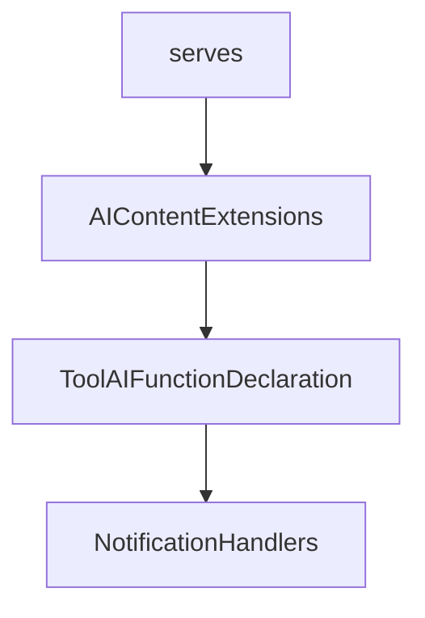

# Chapter 5: Logging, Progress, Elicitation, and Tasks

Welcome to **Chapter 5: Logging, Progress, Elicitation, and Tasks**. In this part of **MCP C# SDK Tutorial: Production MCP in .NET with Hosting, ASP.NET Core, and Task Workflows**, you will build an intuitive mental model first, then move into concrete implementation details and practical production tradeoffs.


This chapter covers advanced capability flows that usually fail first in production.

## Learning Goals

- configure logging and level controls for host/client observability
- implement progress updates for long-running tool operations
- use form and URL elicitation paths safely
- design durable task workflows and task stores

## Capability Guidance

- logging: map SDK log levels to your centralized .NET logging pipeline
- progress: emit meaningful milestones, not noisy micro-events
- elicitation: reserve URL mode for flows needing out-of-band trust boundaries
- tasks: use durable task store implementations for restart resilience

## Source References

- [Logging Concepts](https://github.com/modelcontextprotocol/csharp-sdk/blob/main/docs/concepts/logging/logging.md)
- [Progress Concepts](https://github.com/modelcontextprotocol/csharp-sdk/blob/main/docs/concepts/progress/progress.md)
- [Elicitation Concepts](https://github.com/modelcontextprotocol/csharp-sdk/blob/main/docs/concepts/elicitation/elicitation.md)
- [Tasks Concepts](https://github.com/modelcontextprotocol/csharp-sdk/blob/main/docs/concepts/tasks/tasks.md)
- [Long Running Tasks Sample](https://github.com/modelcontextprotocol/csharp-sdk/blob/main/samples/LongRunningTasks/README.md)

## Summary

You now have a plan for operating advanced MCP capability flows with better durability and control.

Next: [Chapter 6: OAuth-Protected MCP Servers and Clients](06-oauth-protected-mcp-servers-and-clients.md)

## Source Code Walkthrough

### `src/ModelContextProtocol.Core/AIContentExtensions.cs`

The `serves` class in [`src/ModelContextProtocol.Core/AIContentExtensions.cs`](https://github.com/modelcontextprotocol/csharp-sdk/blob/HEAD/src/ModelContextProtocol.Core/AIContentExtensions.cs) handles a key part of this chapter's functionality:

```cs
/// </summary>
/// <remarks>
/// This class serves as an adapter layer between Model Context Protocol (MCP) types and the <see cref="AIContent"/> model types
/// from the Microsoft.Extensions.AI namespace.
/// </remarks>
public static class AIContentExtensions
{
    /// <summary>
    /// Creates a sampling handler for use with <see cref="McpClientHandlers.SamplingHandler"/> that will
    /// satisfy sampling requests using the specified <see cref="IChatClient"/>.
    /// </summary>
    /// <param name="chatClient">The <see cref="IChatClient"/> with which to satisfy sampling requests.</param>
    /// <param name="serializerOptions">The <see cref="JsonSerializerOptions"/> to use for serializing user-provided objects. If <see langword="null"/>, <see cref="McpJsonUtilities.DefaultOptions"/> is used.</param>
    /// <returns>The created handler delegate that can be assigned to <see cref="McpClientHandlers.SamplingHandler"/>.</returns>
    /// <remarks>
    /// <para>
    /// This method creates a function that converts MCP message requests into chat client calls, enabling
    /// an MCP client to generate text or other content using an actual AI model via the provided chat client.
    /// </para>
    /// <para>
    /// The handler can process text messages, image messages, resource messages, and tool use/results as defined in the
    /// Model Context Protocol.
    /// </para>
    /// </remarks>
    /// <exception cref="ArgumentNullException"><paramref name="chatClient"/> is <see langword="null"/>.</exception>
    public static Func<CreateMessageRequestParams?, IProgress<ProgressNotificationValue>, CancellationToken, ValueTask<CreateMessageResult>> CreateSamplingHandler(
        this IChatClient chatClient,
        JsonSerializerOptions? serializerOptions = null)
    {
        Throw.IfNull(chatClient);

        serializerOptions ??= McpJsonUtilities.DefaultOptions;
```

This class is important because it defines how MCP C# SDK Tutorial: Production MCP in .NET with Hosting, ASP.NET Core, and Task Workflows implements the patterns covered in this chapter.

### `src/ModelContextProtocol.Core/AIContentExtensions.cs`

The `AIContentExtensions` class in [`src/ModelContextProtocol.Core/AIContentExtensions.cs`](https://github.com/modelcontextprotocol/csharp-sdk/blob/HEAD/src/ModelContextProtocol.Core/AIContentExtensions.cs) handles a key part of this chapter's functionality:

```cs
/// from the Microsoft.Extensions.AI namespace.
/// </remarks>
public static class AIContentExtensions
{
    /// <summary>
    /// Creates a sampling handler for use with <see cref="McpClientHandlers.SamplingHandler"/> that will
    /// satisfy sampling requests using the specified <see cref="IChatClient"/>.
    /// </summary>
    /// <param name="chatClient">The <see cref="IChatClient"/> with which to satisfy sampling requests.</param>
    /// <param name="serializerOptions">The <see cref="JsonSerializerOptions"/> to use for serializing user-provided objects. If <see langword="null"/>, <see cref="McpJsonUtilities.DefaultOptions"/> is used.</param>
    /// <returns>The created handler delegate that can be assigned to <see cref="McpClientHandlers.SamplingHandler"/>.</returns>
    /// <remarks>
    /// <para>
    /// This method creates a function that converts MCP message requests into chat client calls, enabling
    /// an MCP client to generate text or other content using an actual AI model via the provided chat client.
    /// </para>
    /// <para>
    /// The handler can process text messages, image messages, resource messages, and tool use/results as defined in the
    /// Model Context Protocol.
    /// </para>
    /// </remarks>
    /// <exception cref="ArgumentNullException"><paramref name="chatClient"/> is <see langword="null"/>.</exception>
    public static Func<CreateMessageRequestParams?, IProgress<ProgressNotificationValue>, CancellationToken, ValueTask<CreateMessageResult>> CreateSamplingHandler(
        this IChatClient chatClient,
        JsonSerializerOptions? serializerOptions = null)
    {
        Throw.IfNull(chatClient);

        serializerOptions ??= McpJsonUtilities.DefaultOptions;

        return async (requestParams, progress, cancellationToken) =>
        {
```

This class is important because it defines how MCP C# SDK Tutorial: Production MCP in .NET with Hosting, ASP.NET Core, and Task Workflows implements the patterns covered in this chapter.

### `src/ModelContextProtocol.Core/AIContentExtensions.cs`

The `ToolAIFunctionDeclaration` class in [`src/ModelContextProtocol.Core/AIContentExtensions.cs`](https://github.com/modelcontextprotocol/csharp-sdk/blob/HEAD/src/ModelContextProtocol.Core/AIContentExtensions.cs) handles a key part of this chapter's functionality:

```cs
                    foreach (var tool in tools)
                    {
                        ((options ??= new()).Tools ??= []).Add(new ToolAIFunctionDeclaration(tool));
                    }

                    if (options.Tools is { Count: > 0 } && requestParams.ToolChoice is { } toolChoice)
                    {
                        options.ToolMode = toolChoice.Mode switch
                        {
                            ToolChoice.ModeAuto => ChatToolMode.Auto,
                            ToolChoice.ModeRequired => ChatToolMode.RequireAny,
                            ToolChoice.ModeNone => ChatToolMode.None,
                            _ => null,
                        };
                    }
                }

                List<ChatMessage> messages = [];
                foreach (var sm in requestParams.Messages)
                {
                    if (sm.Content?.Select(b => b.ToAIContent(serializerOptions)).OfType<AIContent>().ToList() is { Count: > 0 } aiContents)
                    {
                        ChatRole role =
                            aiContents.All(static c => c is FunctionResultContent) ? ChatRole.Tool :
                            sm.Role is Role.Assistant ? ChatRole.Assistant :
                            ChatRole.User;
                        messages.Add(new ChatMessage(role, aiContents));
                    }
                }

                return (messages, options);
            }
```

This class is important because it defines how MCP C# SDK Tutorial: Production MCP in .NET with Hosting, ASP.NET Core, and Task Workflows implements the patterns covered in this chapter.

### `src/ModelContextProtocol.Core/NotificationHandlers.cs`

The `NotificationHandlers` class in [`src/ModelContextProtocol.Core/NotificationHandlers.cs`](https://github.com/modelcontextprotocol/csharp-sdk/blob/HEAD/src/ModelContextProtocol.Core/NotificationHandlers.cs) handles a key part of this chapter's functionality:

```cs

/// <summary>Provides thread-safe storage for notification handlers.</summary>
internal sealed class NotificationHandlers
{
    /// <summary>A dictionary of linked lists of registrations, indexed by the notification method.</summary>
    private readonly Dictionary<string, Registration> _handlers = [];

    /// <summary>Gets the object to be used for all synchronization.</summary>
    private object SyncObj => _handlers;

    /// <summary>
    /// Registers a collection of notification handlers at once.
    /// </summary>
    /// <param name="handlers">
    /// A collection of notification method names paired with their corresponding handler functions.
    /// Each key in the collection is a notification method name, and each value is a handler function
    /// that will be invoked when a notification with that method name is received.
    /// </param>
    /// <remarks>
    /// <para>
    /// This method is typically used during client or server initialization to register
    /// all notification handlers provided in capabilities.
    /// </para>
    /// <para>
    /// Registrations completed with this method are permanent and non-removable.
    /// This differs from handlers registered with <see cref="Register"/> which can be temporary.
    /// </para>
    /// <para>
    /// When multiple handlers are registered for the same method, all handlers will be invoked
    /// in reverse order of registration (newest first) when a notification is received.
    /// </para>
    /// <para>
```

This class is important because it defines how MCP C# SDK Tutorial: Production MCP in .NET with Hosting, ASP.NET Core, and Task Workflows implements the patterns covered in this chapter.


## How These Components Connect


