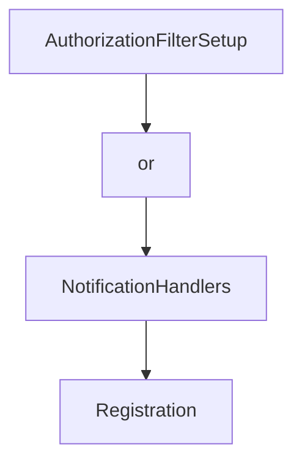

# Chapter 5: Logging, Progress, Elicitation, and Tasks

Welcome to **Chapter 5: Logging, Progress, Elicitation, and Tasks**. In this part of **MCP C# SDK Tutorial: Production MCP in .NET with Hosting, ASP.NET Core, and Task Workflows**, you will build an intuitive mental model first, then move into concrete implementation details and practical production tradeoffs.


This chapter covers advanced capability flows that usually fail first in production.

## Learning Goals

- configure logging and level controls for host/client observability
- implement progress updates for long-running tool operations
- use form and URL elicitation paths safely
- design durable task workflows and task stores

## Capability Guidance

- logging: map SDK log levels to your centralized .NET logging pipeline
- progress: emit meaningful milestones, not noisy micro-events
- elicitation: reserve URL mode for flows needing out-of-band trust boundaries
- tasks: use durable task store implementations for restart resilience

## Source References

- [Logging Concepts](https://github.com/modelcontextprotocol/csharp-sdk/blob/main/docs/concepts/logging/logging.md)
- [Progress Concepts](https://github.com/modelcontextprotocol/csharp-sdk/blob/main/docs/concepts/progress/progress.md)
- [Elicitation Concepts](https://github.com/modelcontextprotocol/csharp-sdk/blob/main/docs/concepts/elicitation/elicitation.md)
- [Tasks Concepts](https://github.com/modelcontextprotocol/csharp-sdk/blob/main/docs/concepts/tasks/tasks.md)
- [Long Running Tasks Sample](https://github.com/modelcontextprotocol/csharp-sdk/blob/main/samples/LongRunningTasks/README.md)

## Summary

You now have a plan for operating advanced MCP capability flows with better durability and control.

Next: [Chapter 6: OAuth-Protected MCP Servers and Clients](06-oauth-protected-mcp-servers-and-clients.md)

## Depth Expansion Playbook

## Source Code Walkthrough

### `src/ModelContextProtocol.AspNetCore/AuthorizationFilterSetup.cs`

The `AuthorizationFilterSetup` class in [`src/ModelContextProtocol.AspNetCore/AuthorizationFilterSetup.cs`](https://github.com/modelcontextprotocol/csharp-sdk/blob/HEAD/src/ModelContextProtocol.AspNetCore/AuthorizationFilterSetup.cs) handles a key part of this chapter's functionality:

```cs
/// Evaluates authorization policies from endpoint metadata.
/// </summary>
internal sealed class AuthorizationFilterSetup(IAuthorizationPolicyProvider? policyProvider = null) : IConfigureOptions<McpServerOptions>, IPostConfigureOptions<McpServerOptions>
{
    private static readonly string AuthorizationFilterInvokedKey = "ModelContextProtocol.AspNetCore.AuthorizationFilter.Invoked";

    public void Configure(McpServerOptions options)
    {
        ConfigureListToolsFilter(options);
        ConfigureCallToolFilter(options);

        ConfigureListResourcesFilter(options);
        ConfigureListResourceTemplatesFilter(options);
        ConfigureReadResourceFilter(options);

        ConfigureListPromptsFilter(options);
        ConfigureGetPromptFilter(options);
    }

    public void PostConfigure(string? name, McpServerOptions options)
    {
        CheckListToolsFilter(options);
        CheckCallToolFilter(options);

        CheckListResourcesFilter(options);
        CheckListResourceTemplatesFilter(options);
        CheckReadResourceFilter(options);

        CheckListPromptsFilter(options);
        CheckGetPromptFilter(options);
    }

```

This class is important because it defines how MCP C# SDK Tutorial: Production MCP in .NET with Hosting, ASP.NET Core, and Task Workflows implements the patterns covered in this chapter.

### `src/ModelContextProtocol.AspNetCore/AuthorizationFilterSetup.cs`

The `or` class in [`src/ModelContextProtocol.AspNetCore/AuthorizationFilterSetup.cs`](https://github.com/modelcontextprotocol/csharp-sdk/blob/HEAD/src/ModelContextProtocol.AspNetCore/AuthorizationFilterSetup.cs) handles a key part of this chapter's functionality:

```cs
using System.Diagnostics.CodeAnalysis;
using System.Security.Claims;
using Microsoft.AspNetCore.Authorization;
using Microsoft.Extensions.DependencyInjection;
using Microsoft.Extensions.Options;
using ModelContextProtocol.Protocol;
using ModelContextProtocol.Server;

namespace ModelContextProtocol.AspNetCore;

/// <summary>
/// Evaluates authorization policies from endpoint metadata.
/// </summary>
internal sealed class AuthorizationFilterSetup(IAuthorizationPolicyProvider? policyProvider = null) : IConfigureOptions<McpServerOptions>, IPostConfigureOptions<McpServerOptions>
{
    private static readonly string AuthorizationFilterInvokedKey = "ModelContextProtocol.AspNetCore.AuthorizationFilter.Invoked";

    public void Configure(McpServerOptions options)
    {
        ConfigureListToolsFilter(options);
        ConfigureCallToolFilter(options);

        ConfigureListResourcesFilter(options);
        ConfigureListResourceTemplatesFilter(options);
        ConfigureReadResourceFilter(options);

        ConfigureListPromptsFilter(options);
        ConfigureGetPromptFilter(options);
    }

    public void PostConfigure(string? name, McpServerOptions options)
    {
```

This class is important because it defines how MCP C# SDK Tutorial: Production MCP in .NET with Hosting, ASP.NET Core, and Task Workflows implements the patterns covered in this chapter.

### `src/ModelContextProtocol.Core/NotificationHandlers.cs`

The `NotificationHandlers` class in [`src/ModelContextProtocol.Core/NotificationHandlers.cs`](https://github.com/modelcontextprotocol/csharp-sdk/blob/HEAD/src/ModelContextProtocol.Core/NotificationHandlers.cs) handles a key part of this chapter's functionality:

```cs

/// <summary>Provides thread-safe storage for notification handlers.</summary>
internal sealed class NotificationHandlers
{
    /// <summary>A dictionary of linked lists of registrations, indexed by the notification method.</summary>
    private readonly Dictionary<string, Registration> _handlers = [];

    /// <summary>Gets the object to be used for all synchronization.</summary>
    private object SyncObj => _handlers;

    /// <summary>
    /// Registers a collection of notification handlers at once.
    /// </summary>
    /// <param name="handlers">
    /// A collection of notification method names paired with their corresponding handler functions.
    /// Each key in the collection is a notification method name, and each value is a handler function
    /// that will be invoked when a notification with that method name is received.
    /// </param>
    /// <remarks>
    /// <para>
    /// This method is typically used during client or server initialization to register
    /// all notification handlers provided in capabilities.
    /// </para>
    /// <para>
    /// Registrations completed with this method are permanent and non-removable.
    /// This differs from handlers registered with <see cref="Register"/> which can be temporary.
    /// </para>
    /// <para>
    /// When multiple handlers are registered for the same method, all handlers will be invoked
    /// in reverse order of registration (newest first) when a notification is received.
    /// </para>
    /// <para>
```

This class is important because it defines how MCP C# SDK Tutorial: Production MCP in .NET with Hosting, ASP.NET Core, and Task Workflows implements the patterns covered in this chapter.

### `src/ModelContextProtocol.Core/NotificationHandlers.cs`

The `Registration` class in [`src/ModelContextProtocol.Core/NotificationHandlers.cs`](https://github.com/modelcontextprotocol/csharp-sdk/blob/HEAD/src/ModelContextProtocol.Core/NotificationHandlers.cs) handles a key part of this chapter's functionality:

```cs
{
    /// <summary>A dictionary of linked lists of registrations, indexed by the notification method.</summary>
    private readonly Dictionary<string, Registration> _handlers = [];

    /// <summary>Gets the object to be used for all synchronization.</summary>
    private object SyncObj => _handlers;

    /// <summary>
    /// Registers a collection of notification handlers at once.
    /// </summary>
    /// <param name="handlers">
    /// A collection of notification method names paired with their corresponding handler functions.
    /// Each key in the collection is a notification method name, and each value is a handler function
    /// that will be invoked when a notification with that method name is received.
    /// </param>
    /// <remarks>
    /// <para>
    /// This method is typically used during client or server initialization to register
    /// all notification handlers provided in capabilities.
    /// </para>
    /// <para>
    /// Registrations completed with this method are permanent and non-removable.
    /// This differs from handlers registered with <see cref="Register"/> which can be temporary.
    /// </para>
    /// <para>
    /// When multiple handlers are registered for the same method, all handlers will be invoked
    /// in reverse order of registration (newest first) when a notification is received.
    /// </para>
    /// <para>
    /// The registered handlers will be invoked by <see cref="InvokeHandlers"/> when a notification
    /// with the corresponding method name is received.
    /// </para>
```

This class is important because it defines how MCP C# SDK Tutorial: Production MCP in .NET with Hosting, ASP.NET Core, and Task Workflows implements the patterns covered in this chapter.


## How These Components Connect


