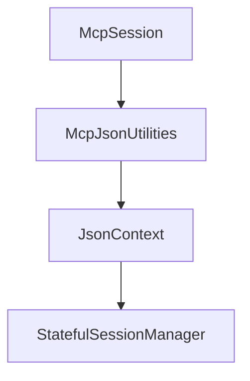

# Chapter 6: OAuth-Protected MCP Servers and Clients

Welcome to **Chapter 6: OAuth-Protected MCP Servers and Clients**. In this part of **MCP C# SDK Tutorial: Production MCP in .NET with Hosting, ASP.NET Core, and Task Workflows**, you will build an intuitive mental model first, then move into concrete implementation details and practical production tradeoffs.


Protected MCP deployments in .NET require explicit server and client auth choreography.

## Learning Goals

- implement OAuth-protected MCP server endpoints in ASP.NET Core
- configure protected client flows for token acquisition and tool invocation
- validate scope/audience behavior in protected requests
- harden certificate and local dev environment flows for fewer auth surprises

## Security Implementation Checklist

1. protect MCP endpoints with JWT bearer auth and audience validation
2. expose OAuth protected resource metadata endpoint
3. enforce per-tool scope checks where blast radius differs
4. test client authorization-code flow against protected server repeatedly

## Source References

- [Protected MCP Server Sample](https://github.com/modelcontextprotocol/csharp-sdk/blob/main/samples/ProtectedMcpServer/README.md)
- [Protected MCP Client Sample](https://github.com/modelcontextprotocol/csharp-sdk/blob/main/samples/ProtectedMcpClient/README.md)
- [Security Policy](https://github.com/modelcontextprotocol/csharp-sdk/blob/main/SECURITY.md)

## Summary

You now have a concrete pattern for securing C# MCP servers and clients with OAuth-aligned flows.

Next: [Chapter 7: Diagnostics, Versioning, and Breaking-Change Management](07-diagnostics-versioning-and-breaking-change-management.md)

## Depth Expansion Playbook

## Source Code Walkthrough

### `src/ModelContextProtocol.Core/McpSession.Methods.cs`

The `McpSession` class in [`src/ModelContextProtocol.Core/McpSession.Methods.cs`](https://github.com/modelcontextprotocol/csharp-sdk/blob/HEAD/src/ModelContextProtocol.Core/McpSession.Methods.cs) handles a key part of this chapter's functionality:

```cs
namespace ModelContextProtocol;

public abstract partial class McpSession : IAsyncDisposable
{
    /// <summary>
    /// Sends a JSON-RPC request and attempts to deserialize the result to <typeparamref name="TResult"/>.
    /// </summary>
    /// <typeparam name="TParameters">The type of the request parameters to serialize from.</typeparam>
    /// <typeparam name="TResult">The type of the result to deserialize to.</typeparam>
    /// <param name="method">The JSON-RPC method name to invoke.</param>
    /// <param name="parameters">The request parameters.</param>
    /// <param name="requestId">The request ID for the request.</param>
    /// <param name="serializerOptions">The options governing request serialization.</param>
    /// <param name="cancellationToken">The <see cref="CancellationToken"/> to monitor for cancellation requests. The default is <see cref="CancellationToken.None"/>.</param>
    /// <returns>A task that represents the asynchronous operation. The task result contains the deserialized result.</returns>
    /// <exception cref="ArgumentNullException"><paramref name="method"/> is <see langword="null"/>.</exception>
    /// <exception cref="ArgumentException"><paramref name="method"/> is empty or composed entirely of whitespace.</exception>
    /// <exception cref="McpException">The request failed or the server returned an error response.</exception>
    public ValueTask<TResult> SendRequestAsync<TParameters, TResult>(
        string method,
        TParameters parameters,
        JsonSerializerOptions? serializerOptions = null,
        RequestId requestId = default,
        CancellationToken cancellationToken = default)
        where TResult : notnull
    {
        serializerOptions ??= McpJsonUtilities.DefaultOptions;
        serializerOptions.MakeReadOnly();

        return SendRequestAsync(
            method, 
            parameters,
```

This class is important because it defines how MCP C# SDK Tutorial: Production MCP in .NET with Hosting, ASP.NET Core, and Task Workflows implements the patterns covered in this chapter.

### `src/ModelContextProtocol.Core/McpJsonUtilities.cs`

The `McpJsonUtilities` class in [`src/ModelContextProtocol.Core/McpJsonUtilities.cs`](https://github.com/modelcontextprotocol/csharp-sdk/blob/HEAD/src/ModelContextProtocol.Core/McpJsonUtilities.cs) handles a key part of this chapter's functionality:

```cs

/// <summary>Provides a collection of utility methods for working with JSON data in the context of MCP.</summary>
public static partial class McpJsonUtilities
{
    /// <summary>
    /// Gets the <see cref="JsonSerializerOptions"/> singleton used as the default in JSON serialization operations.
    /// </summary>
    /// <remarks>
    /// <para>
    /// For Native AOT or applications disabling <see cref="JsonSerializer.IsReflectionEnabledByDefault"/>, this instance
    /// includes source generated contracts for all common exchange types contained in the ModelContextProtocol library.
    /// </para>
    /// <para>
    /// It additionally turns on the following settings:
    /// <list type="number">
    /// <item>Enables <see cref="JsonSerializerDefaults.Web"/> defaults.</item>
    /// <item>Enables <see cref="JsonIgnoreCondition.WhenWritingNull"/> as the default ignore condition for properties.</item>
    /// <item>Enables <see cref="JsonNumberHandling.AllowReadingFromString"/> as the default number handling for number types.</item>
    /// </list>
    /// </para>
    /// </remarks>
    public static JsonSerializerOptions DefaultOptions { get; } = CreateDefaultOptions();

    /// <summary>
    /// Creates default options to use for MCP-related serialization.
    /// </summary>
    /// <returns>The configured options.</returns>
    [UnconditionalSuppressMessage("ReflectionAnalysis", "IL3050:RequiresDynamicCode", Justification = "Converter is guarded by IsReflectionEnabledByDefault check.")]
    [UnconditionalSuppressMessage("Trimming", "IL2026:Members annotated with 'RequiresUnreferencedCodeAttribute' require dynamic access", Justification = "Converter is guarded by IsReflectionEnabledByDefault check.")]
    private static JsonSerializerOptions CreateDefaultOptions()
    {
        // Copy the configuration from the source generated context.
```

This class is important because it defines how MCP C# SDK Tutorial: Production MCP in .NET with Hosting, ASP.NET Core, and Task Workflows implements the patterns covered in this chapter.

### `src/ModelContextProtocol.Core/McpJsonUtilities.cs`

The `JsonContext` class in [`src/ModelContextProtocol.Core/McpJsonUtilities.cs`](https://github.com/modelcontextprotocol/csharp-sdk/blob/HEAD/src/ModelContextProtocol.Core/McpJsonUtilities.cs) handles a key part of this chapter's functionality:

```cs
    {
        // Copy the configuration from the source generated context.
        JsonSerializerOptions options = new(JsonContext.Default.Options);

        // Chain with all supported types from MEAI.
        options.TypeInfoResolverChain.Add(AIJsonUtilities.DefaultOptions.TypeInfoResolver!);

        // Add a converter for user-defined enums, if reflection is enabled by default.
        if (JsonSerializer.IsReflectionEnabledByDefault)
        {
            options.Converters.Add(new JsonStringEnumConverter());
        }

        options.MakeReadOnly();
        return options;
    }

    internal static JsonTypeInfo<T> GetTypeInfo<T>(this JsonSerializerOptions options) =>
        (JsonTypeInfo<T>)options.GetTypeInfo(typeof(T));

    internal static JsonElement DefaultMcpToolSchema { get; } = ParseJsonElement("""{"type":"object"}"""u8);
    internal static object? AsObject(this JsonElement element) => element.ValueKind is JsonValueKind.Null ? null : element;

    internal static bool IsValidMcpToolSchema(JsonElement element)
    {
        if (element.ValueKind is not JsonValueKind.Object)
        {
            return false;
        }

        foreach (JsonProperty property in element.EnumerateObject())
        {
```

This class is important because it defines how MCP C# SDK Tutorial: Production MCP in .NET with Hosting, ASP.NET Core, and Task Workflows implements the patterns covered in this chapter.

### `src/ModelContextProtocol.AspNetCore/StatefulSessionManager.cs`

The `StatefulSessionManager` class in [`src/ModelContextProtocol.AspNetCore/StatefulSessionManager.cs`](https://github.com/modelcontextprotocol/csharp-sdk/blob/HEAD/src/ModelContextProtocol.AspNetCore/StatefulSessionManager.cs) handles a key part of this chapter's functionality:

```cs
namespace ModelContextProtocol.AspNetCore;

internal sealed partial class StatefulSessionManager(
    IOptions<HttpServerTransportOptions> httpServerTransportOptions,
    ILogger<StatefulSessionManager> logger)
{
    // Workaround for https://github.com/dotnet/runtime/issues/91121. This is fixed in .NET 9 and later.
    private readonly ILogger _logger = logger;

    private readonly ConcurrentDictionary<string, StreamableHttpSession> _sessions = new(StringComparer.Ordinal);

    private readonly TimeProvider _timeProvider = httpServerTransportOptions.Value.TimeProvider;
    private readonly TimeSpan _idleTimeout = httpServerTransportOptions.Value.IdleTimeout;
    private readonly long _idleTimeoutTicks = GetIdleTimeoutInTimestampTicks(httpServerTransportOptions.Value.IdleTimeout, httpServerTransportOptions.Value.TimeProvider);
    private readonly int _maxIdleSessionCount = httpServerTransportOptions.Value.MaxIdleSessionCount;

    private readonly object _idlePruningLock = new();
    private readonly List<long> _idleTimestamps = [];
    private readonly List<string> _idleSessionIds = [];
    private int _nextIndexToPrune;

    private long _currentIdleSessionCount;

    public TimeProvider TimeProvider => _timeProvider;

    public void IncrementIdleSessionCount() => Interlocked.Increment(ref _currentIdleSessionCount);
    public void DecrementIdleSessionCount() => Interlocked.Decrement(ref _currentIdleSessionCount);

    public bool TryGetValue(string key, [NotNullWhen(true)] out StreamableHttpSession? value) => _sessions.TryGetValue(key, out value);
    public bool TryRemove(string key, [NotNullWhen(true)] out StreamableHttpSession? value) => _sessions.TryRemove(key, out value);

    public async ValueTask StartNewSessionAsync(StreamableHttpSession newSession, CancellationToken cancellationToken)
```

This class is important because it defines how MCP C# SDK Tutorial: Production MCP in .NET with Hosting, ASP.NET Core, and Task Workflows implements the patterns covered in this chapter.


## How These Components Connect


