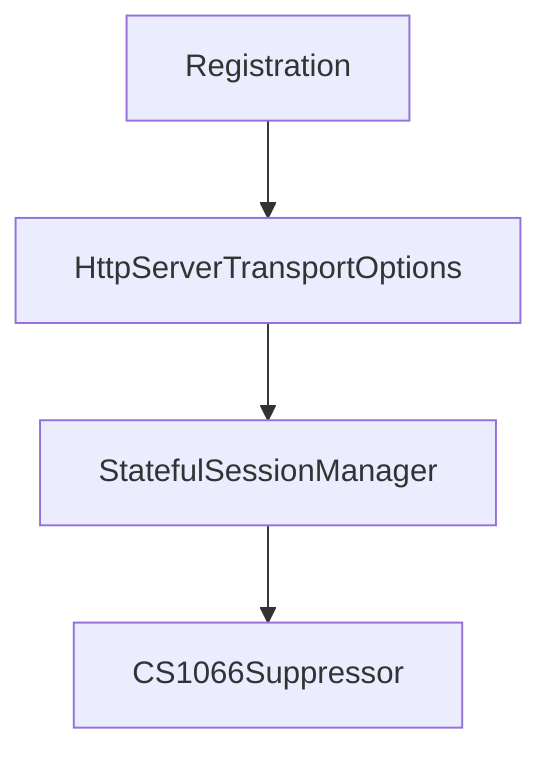

# Chapter 6: OAuth-Protected MCP Servers and Clients

Welcome to **Chapter 6: OAuth-Protected MCP Servers and Clients**. In this part of **MCP C# SDK Tutorial: Production MCP in .NET with Hosting, ASP.NET Core, and Task Workflows**, you will build an intuitive mental model first, then move into concrete implementation details and practical production tradeoffs.


Protected MCP deployments in .NET require explicit server and client auth choreography.

## Learning Goals

- implement OAuth-protected MCP server endpoints in ASP.NET Core
- configure protected client flows for token acquisition and tool invocation
- validate scope/audience behavior in protected requests
- harden certificate and local dev environment flows for fewer auth surprises

## Security Implementation Checklist

1. protect MCP endpoints with JWT bearer auth and audience validation
2. expose OAuth protected resource metadata endpoint
3. enforce per-tool scope checks where blast radius differs
4. test client authorization-code flow against protected server repeatedly

## Source References

- [Protected MCP Server Sample](https://github.com/modelcontextprotocol/csharp-sdk/blob/main/samples/ProtectedMcpServer/README.md)
- [Protected MCP Client Sample](https://github.com/modelcontextprotocol/csharp-sdk/blob/main/samples/ProtectedMcpClient/README.md)
- [Security Policy](https://github.com/modelcontextprotocol/csharp-sdk/blob/main/SECURITY.md)

## Summary

You now have a concrete pattern for securing C# MCP servers and clients with OAuth-aligned flows.

Next: [Chapter 7: Diagnostics, Versioning, and Breaking-Change Management](07-diagnostics-versioning-and-breaking-change-management.md)

## Source Code Walkthrough

### `src/ModelContextProtocol.Core/NotificationHandlers.cs`

The `Registration` class in [`src/ModelContextProtocol.Core/NotificationHandlers.cs`](https://github.com/modelcontextprotocol/csharp-sdk/blob/HEAD/src/ModelContextProtocol.Core/NotificationHandlers.cs) handles a key part of this chapter's functionality:

```cs
{
    /// <summary>A dictionary of linked lists of registrations, indexed by the notification method.</summary>
    private readonly Dictionary<string, Registration> _handlers = [];

    /// <summary>Gets the object to be used for all synchronization.</summary>
    private object SyncObj => _handlers;

    /// <summary>
    /// Registers a collection of notification handlers at once.
    /// </summary>
    /// <param name="handlers">
    /// A collection of notification method names paired with their corresponding handler functions.
    /// Each key in the collection is a notification method name, and each value is a handler function
    /// that will be invoked when a notification with that method name is received.
    /// </param>
    /// <remarks>
    /// <para>
    /// This method is typically used during client or server initialization to register
    /// all notification handlers provided in capabilities.
    /// </para>
    /// <para>
    /// Registrations completed with this method are permanent and non-removable.
    /// This differs from handlers registered with <see cref="Register"/> which can be temporary.
    /// </para>
    /// <para>
    /// When multiple handlers are registered for the same method, all handlers will be invoked
    /// in reverse order of registration (newest first) when a notification is received.
    /// </para>
    /// <para>
    /// The registered handlers will be invoked by <see cref="InvokeHandlers"/> when a notification
    /// with the corresponding method name is received.
    /// </para>
```

This class is important because it defines how MCP C# SDK Tutorial: Production MCP in .NET with Hosting, ASP.NET Core, and Task Workflows implements the patterns covered in this chapter.

### `src/ModelContextProtocol.AspNetCore/HttpServerTransportOptions.cs`

The `HttpServerTransportOptions` class in [`src/ModelContextProtocol.AspNetCore/HttpServerTransportOptions.cs`](https://github.com/modelcontextprotocol/csharp-sdk/blob/HEAD/src/ModelContextProtocol.AspNetCore/HttpServerTransportOptions.cs) handles a key part of this chapter's functionality:

```cs
/// For details on the Streamable HTTP transport, see the <see href="https://modelcontextprotocol.io/specification/2025-11-25/basic/transports#streamable-http">protocol specification</see>.
/// </remarks>
public class HttpServerTransportOptions
{
    /// <summary>
    /// Gets or sets an optional asynchronous callback to configure per-session <see cref="McpServerOptions"/>
    /// with access to the <see cref="HttpContext"/> of the request that initiated the session.
    /// </summary>
    /// <remarks>
    /// In stateful mode (the default), this callback is invoked once per session when the client sends the
    /// <c>initialize</c> request. In <see cref="Stateless"/> mode, it is invoked on <b>every HTTP request</b>
    /// because each request creates a fresh server context.
    /// </remarks>
    public Func<HttpContext, McpServerOptions, CancellationToken, Task>? ConfigureSessionOptions { get; set; }

    /// <summary>
    /// Gets or sets an optional asynchronous callback for running new MCP sessions manually.
    /// </summary>
    /// <remarks>
    /// This callback is useful for running logic before a session starts and after it completes.
    /// <para>
    /// The <see cref="HttpContext"/> parameter comes from the request that initiated the session (e.g., the
    /// initialize request) and may not be usable after <see cref="McpServer.RunAsync"/> starts, since that
    /// request will have already completed.
    /// </para>
    /// <para>
    /// Consider using <see cref="ConfigureSessionOptions"/> instead, which provides access to the
    /// <see cref="HttpContext"/> of the initializing request with fewer known issues.
    /// </para>
    /// <para>
    /// This API is experimental and may be removed or change signatures in a future release.
    /// </para>
```

This class is important because it defines how MCP C# SDK Tutorial: Production MCP in .NET with Hosting, ASP.NET Core, and Task Workflows implements the patterns covered in this chapter.

### `src/ModelContextProtocol.AspNetCore/StatefulSessionManager.cs`

The `StatefulSessionManager` class in [`src/ModelContextProtocol.AspNetCore/StatefulSessionManager.cs`](https://github.com/modelcontextprotocol/csharp-sdk/blob/HEAD/src/ModelContextProtocol.AspNetCore/StatefulSessionManager.cs) handles a key part of this chapter's functionality:

```cs
namespace ModelContextProtocol.AspNetCore;

internal sealed partial class StatefulSessionManager(
    IOptions<HttpServerTransportOptions> httpServerTransportOptions,
    ILogger<StatefulSessionManager> logger)
{
    // Workaround for https://github.com/dotnet/runtime/issues/91121. This is fixed in .NET 9 and later.
    private readonly ILogger _logger = logger;

    private readonly ConcurrentDictionary<string, StreamableHttpSession> _sessions = new(StringComparer.Ordinal);

    private readonly TimeProvider _timeProvider = httpServerTransportOptions.Value.TimeProvider;
    private readonly TimeSpan _idleTimeout = httpServerTransportOptions.Value.IdleTimeout;
    private readonly long _idleTimeoutTicks = GetIdleTimeoutInTimestampTicks(httpServerTransportOptions.Value.IdleTimeout, httpServerTransportOptions.Value.TimeProvider);
    private readonly int _maxIdleSessionCount = httpServerTransportOptions.Value.MaxIdleSessionCount;

    private readonly object _idlePruningLock = new();
    private readonly List<long> _idleTimestamps = [];
    private readonly List<string> _idleSessionIds = [];
    private int _nextIndexToPrune;

    private long _currentIdleSessionCount;

    public TimeProvider TimeProvider => _timeProvider;

    public void IncrementIdleSessionCount() => Interlocked.Increment(ref _currentIdleSessionCount);
    public void DecrementIdleSessionCount() => Interlocked.Decrement(ref _currentIdleSessionCount);

    public bool TryGetValue(string key, [NotNullWhen(true)] out StreamableHttpSession? value) => _sessions.TryGetValue(key, out value);
    public bool TryRemove(string key, [NotNullWhen(true)] out StreamableHttpSession? value) => _sessions.TryRemove(key, out value);

    public async ValueTask StartNewSessionAsync(StreamableHttpSession newSession, CancellationToken cancellationToken)
```

This class is important because it defines how MCP C# SDK Tutorial: Production MCP in .NET with Hosting, ASP.NET Core, and Task Workflows implements the patterns covered in this chapter.

### `src/ModelContextProtocol.Analyzers/CS1066Suppressor.cs`

The `CS1066Suppressor` class in [`src/ModelContextProtocol.Analyzers/CS1066Suppressor.cs`](https://github.com/modelcontextprotocol/csharp-sdk/blob/HEAD/src/ModelContextProtocol.Analyzers/CS1066Suppressor.cs) handles a key part of this chapter's functionality:

```cs
/// </remarks>
[DiagnosticAnalyzer(LanguageNames.CSharp)]
public sealed class CS1066Suppressor : DiagnosticSuppressor
{
    private static readonly SuppressionDescriptor McpToolSuppression = new(
        id: "MCP_CS1066_TOOL",
        suppressedDiagnosticId: "CS1066",
        justification: "Default values on MCP tool method implementing declarations are copied to the generated defining declaration by the source generator.");

    private static readonly SuppressionDescriptor McpPromptSuppression = new(
        id: "MCP_CS1066_PROMPT",
        suppressedDiagnosticId: "CS1066",
        justification: "Default values on MCP prompt method implementing declarations are copied to the generated defining declaration by the source generator.");

    private static readonly SuppressionDescriptor McpResourceSuppression = new(
        id: "MCP_CS1066_RESOURCE",
        suppressedDiagnosticId: "CS1066",
        justification: "Default values on MCP resource method implementing declarations are copied to the generated defining declaration by the source generator.");

    /// <inheritdoc/>
    public override ImmutableArray<SuppressionDescriptor> SupportedSuppressions =>
        ImmutableArray.Create(McpToolSuppression, McpPromptSuppression, McpResourceSuppression);

    /// <inheritdoc/>
    public override void ReportSuppressions(SuppressionAnalysisContext context)
    {
        // Cache semantic models and attribute symbols per syntax tree/compilation to avoid redundant calls
        Dictionary<SyntaxTree, SemanticModel>? semanticModelCache = null;
        INamedTypeSymbol? mcpToolAttribute = null;
        INamedTypeSymbol? mcpPromptAttribute = null;
        INamedTypeSymbol? mcpResourceAttribute = null;
        bool attributesResolved = false;
```

This class is important because it defines how MCP C# SDK Tutorial: Production MCP in .NET with Hosting, ASP.NET Core, and Task Workflows implements the patterns covered in this chapter.


## How These Components Connect


