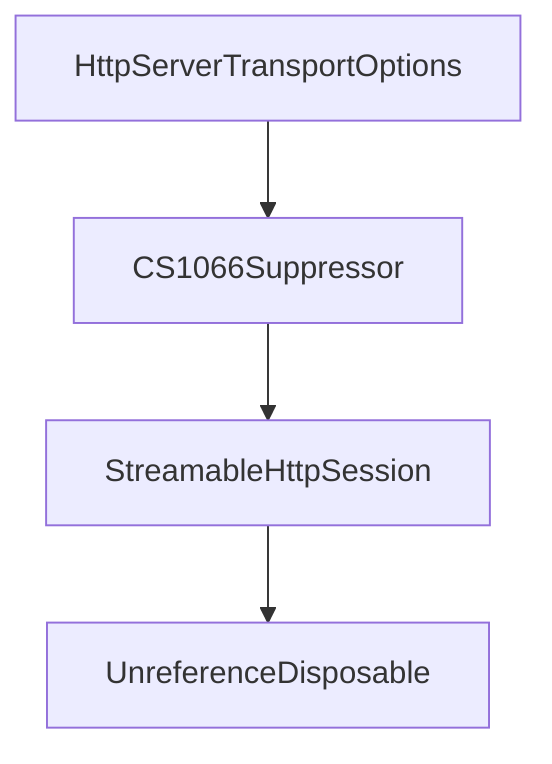

# Chapter 7: Diagnostics, Versioning, and Breaking-Change Management

Welcome to **Chapter 7: Diagnostics, Versioning, and Breaking-Change Management**. In this part of **MCP C# SDK Tutorial: Production MCP in .NET with Hosting, ASP.NET Core, and Task Workflows**, you will build an intuitive mental model first, then move into concrete implementation details and practical production tradeoffs.


Preview-stage SDKs need explicit guardrails for change management.

## Learning Goals

- use SDK diagnostics to catch misuse and compatibility risks early
- apply the repository's versioning policy in dependency planning
- separate protocol/schema shifts from SDK API changes
- reduce upgrade regressions with staged rollout patterns

## Risk-Control Strategy

- treat preview package updates as change events requiring regression testing
- track documented diagnostics and wire them into CI quality gates
- evaluate breaking changes against both API consumers and MCP behavior
- keep a compatibility note per service for protocol revision + SDK package versions

## Source References

- [Diagnostics List](https://github.com/modelcontextprotocol/csharp-sdk/blob/main/docs/list-of-diagnostics.md)
- [Versioning Policy](https://github.com/modelcontextprotocol/csharp-sdk/blob/main/docs/versioning.md)
- [Concepts Documentation Index](https://github.com/modelcontextprotocol/csharp-sdk/blob/main/docs/concepts/index.md)

## Summary

You now have a change-management model for keeping C# MCP deployments stable while the SDK evolves.

Next: [Chapter 8: Testing, Operations, and Contribution Workflows](08-testing-operations-and-contribution-workflows.md)

## Depth Expansion Playbook

## Source Code Walkthrough

### `src/ModelContextProtocol.AspNetCore/HttpServerTransportOptions.cs`

The `HttpServerTransportOptions` class in [`src/ModelContextProtocol.AspNetCore/HttpServerTransportOptions.cs`](https://github.com/modelcontextprotocol/csharp-sdk/blob/HEAD/src/ModelContextProtocol.AspNetCore/HttpServerTransportOptions.cs) handles a key part of this chapter's functionality:

```cs
/// For details on the Streamable HTTP transport, see the <see href="https://modelcontextprotocol.io/specification/2025-11-25/basic/transports#streamable-http">protocol specification</see>.
/// </remarks>
public class HttpServerTransportOptions
{
    /// <summary>
    /// Gets or sets an optional asynchronous callback to configure per-session <see cref="McpServerOptions"/>
    /// with access to the <see cref="HttpContext"/> of the request that initiated the session.
    /// </summary>
    public Func<HttpContext, McpServerOptions, CancellationToken, Task>? ConfigureSessionOptions { get; set; }

    /// <summary>
    /// Gets or sets an optional asynchronous callback for running new MCP sessions manually.
    /// </summary>
    /// <remarks>
    /// This callback is useful for running logic before a session starts and after it completes.
    /// <para>
    /// The <see cref="HttpContext"/> parameter comes from the request that initiated the session (e.g., the
    /// initialize request) and may not be usable after <see cref="McpServer.RunAsync"/> starts, since that
    /// request will have already completed.
    /// </para>
    /// <para>
    /// Consider using <see cref="ConfigureSessionOptions"/> instead, which provides access to the
    /// <see cref="HttpContext"/> of the initializing request with fewer known issues.
    /// </para>
    /// <para>
    /// This API is experimental and may be removed or change signatures in a future release.
    /// </para>
    /// </remarks>
    [System.Diagnostics.CodeAnalysis.Experimental(Experimentals.RunSessionHandler_DiagnosticId, UrlFormat = Experimentals.RunSessionHandler_Url)]
    public Func<HttpContext, McpServer, CancellationToken, Task>? RunSessionHandler { get; set; }

    /// <summary>
```

This class is important because it defines how MCP C# SDK Tutorial: Production MCP in .NET with Hosting, ASP.NET Core, and Task Workflows implements the patterns covered in this chapter.

### `src/ModelContextProtocol.Analyzers/CS1066Suppressor.cs`

The `CS1066Suppressor` class in [`src/ModelContextProtocol.Analyzers/CS1066Suppressor.cs`](https://github.com/modelcontextprotocol/csharp-sdk/blob/HEAD/src/ModelContextProtocol.Analyzers/CS1066Suppressor.cs) handles a key part of this chapter's functionality:

```cs
/// </remarks>
[DiagnosticAnalyzer(LanguageNames.CSharp)]
public sealed class CS1066Suppressor : DiagnosticSuppressor
{
    private static readonly SuppressionDescriptor McpToolSuppression = new(
        id: "MCP_CS1066_TOOL",
        suppressedDiagnosticId: "CS1066",
        justification: "Default values on MCP tool method implementing declarations are copied to the generated defining declaration by the source generator.");

    private static readonly SuppressionDescriptor McpPromptSuppression = new(
        id: "MCP_CS1066_PROMPT",
        suppressedDiagnosticId: "CS1066",
        justification: "Default values on MCP prompt method implementing declarations are copied to the generated defining declaration by the source generator.");

    private static readonly SuppressionDescriptor McpResourceSuppression = new(
        id: "MCP_CS1066_RESOURCE",
        suppressedDiagnosticId: "CS1066",
        justification: "Default values on MCP resource method implementing declarations are copied to the generated defining declaration by the source generator.");

    /// <inheritdoc/>
    public override ImmutableArray<SuppressionDescriptor> SupportedSuppressions =>
        ImmutableArray.Create(McpToolSuppression, McpPromptSuppression, McpResourceSuppression);

    /// <inheritdoc/>
    public override void ReportSuppressions(SuppressionAnalysisContext context)
    {
        // Cache semantic models and attribute symbols per syntax tree/compilation to avoid redundant calls
        Dictionary<SyntaxTree, SemanticModel>? semanticModelCache = null;
        INamedTypeSymbol? mcpToolAttribute = null;
        INamedTypeSymbol? mcpPromptAttribute = null;
        INamedTypeSymbol? mcpResourceAttribute = null;
        bool attributesResolved = false;
```

This class is important because it defines how MCP C# SDK Tutorial: Production MCP in .NET with Hosting, ASP.NET Core, and Task Workflows implements the patterns covered in this chapter.

### `src/ModelContextProtocol.AspNetCore/StreamableHttpSession.cs`

The `StreamableHttpSession` class in [`src/ModelContextProtocol.AspNetCore/StreamableHttpSession.cs`](https://github.com/modelcontextprotocol/csharp-sdk/blob/HEAD/src/ModelContextProtocol.AspNetCore/StreamableHttpSession.cs) handles a key part of this chapter's functionality:

```cs
namespace ModelContextProtocol.AspNetCore;

internal sealed class StreamableHttpSession(
    string sessionId,
    StreamableHttpServerTransport transport,
    McpServer server,
    UserIdClaim? userId,
    StatefulSessionManager sessionManager) : IAsyncDisposable
{
    private int _referenceCount;
    private SessionState _state;
    private readonly object _stateLock = new();

    private int _getRequestStarted;
    private readonly CancellationTokenSource _disposeCts = new();

    public string Id => sessionId;
    public StreamableHttpServerTransport Transport => transport;
    public McpServer Server => server;
    private StatefulSessionManager SessionManager => sessionManager;

    public CancellationToken SessionClosed => _disposeCts.Token;
    public bool IsActive => !SessionClosed.IsCancellationRequested && _referenceCount > 0;
    public long LastActivityTicks { get; private set; } = sessionManager.TimeProvider.GetTimestamp();

    public Task ServerRunTask { get; set; } = Task.CompletedTask;

    public async ValueTask<IAsyncDisposable> AcquireReferenceAsync(CancellationToken cancellationToken)
    {
        // The StreamableHttpSession is not stored between requests in stateless mode. Instead, the session is recreated from the MCP-Session-Id.
        // Stateless sessions are 1:1 with HTTP requests and are outlived by the MCP session tracked by the Mcp-Session-Id.
        // Non-stateless sessions are 1:1 with the Mcp-Session-Id and outlive the POST request.
```

This class is important because it defines how MCP C# SDK Tutorial: Production MCP in .NET with Hosting, ASP.NET Core, and Task Workflows implements the patterns covered in this chapter.

### `src/ModelContextProtocol.AspNetCore/StreamableHttpSession.cs`

The `UnreferenceDisposable` class in [`src/ModelContextProtocol.AspNetCore/StreamableHttpSession.cs`](https://github.com/modelcontextprotocol/csharp-sdk/blob/HEAD/src/ModelContextProtocol.AspNetCore/StreamableHttpSession.cs) handles a key part of this chapter's functionality:

```cs
        }

        return new UnreferenceDisposable(this);
    }

    /// <summary>
    /// Ensures the session is registered with the session manager without acquiring a reference.
    /// No-ops if the session is already started.
    /// </summary>
    public async ValueTask EnsureStartedAsync(CancellationToken cancellationToken)
    {
        bool needsStart;
        lock (_stateLock)
        {
            needsStart = _state == SessionState.Uninitialized;
            if (needsStart)
            {
                _state = SessionState.Started;
            }
        }

        if (needsStart)
        {
            await sessionManager.StartNewSessionAsync(this, cancellationToken);

            // Session is registered with 0 references (idle), so reflect that in the idle count.
            sessionManager.IncrementIdleSessionCount();
        }
    }

    public bool TryStartGetRequest() => Interlocked.Exchange(ref _getRequestStarted, 1) == 0;
    public bool HasSameUserId(ClaimsPrincipal user) => userId == StreamableHttpHandler.GetUserIdClaim(user);
```

This class is important because it defines how MCP C# SDK Tutorial: Production MCP in .NET with Hosting, ASP.NET Core, and Task Workflows implements the patterns covered in this chapter.


## How These Components Connect


