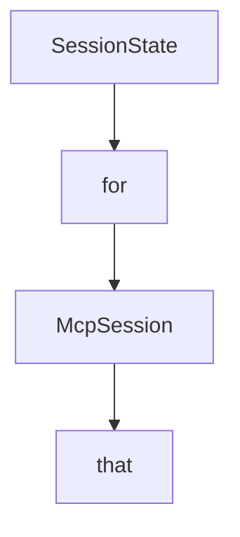

# Chapter 8: Testing, Operations, and Contribution Workflows

Welcome to **Chapter 8: Testing, Operations, and Contribution Workflows**. In this part of **MCP C# SDK Tutorial: Production MCP in .NET with Hosting, ASP.NET Core, and Task Workflows**, you will build an intuitive mental model first, then move into concrete implementation details and practical production tradeoffs.


This chapter closes with an operations model for sustained C# SDK usage.

## Learning Goals

- align test strategy with SDK and protocol risk surfaces
- run docs/build/test workflows expected by maintainers
- structure contributions for quick and accurate review
- operationalize incidents and improvement loops around MCP services

## Operations Baseline

- run full repository tests before upgrading package dependencies
- validate docs and sample paths that your teams rely on
- maintain service playbooks for auth, transport, and task workflows
- upstream reproducible bugs with minimal examples and protocol context

## Source References

- [Contributing Guide](https://github.com/modelcontextprotocol/csharp-sdk/blob/main/CONTRIBUTING.md)
- [Repository README](https://github.com/modelcontextprotocol/csharp-sdk/blob/main/README.md)
- [Docs Overview](https://github.com/modelcontextprotocol/csharp-sdk/blob/main/docs/index.md)

## Summary

You now have a practical operations and contribution framework for long-term C# MCP execution.

Next: Continue with [MCP Use Tutorial](../mcp-use-tutorial/)

## Depth Expansion Playbook

## Source Code Walkthrough

### `src/ModelContextProtocol.AspNetCore/StreamableHttpSession.cs`

The `SessionState` interface in [`src/ModelContextProtocol.AspNetCore/StreamableHttpSession.cs`](https://github.com/modelcontextprotocol/csharp-sdk/blob/HEAD/src/ModelContextProtocol.AspNetCore/StreamableHttpSession.cs) handles a key part of this chapter's functionality:

```cs
{
    private int _referenceCount;
    private SessionState _state;
    private readonly object _stateLock = new();

    private int _getRequestStarted;
    private readonly CancellationTokenSource _disposeCts = new();

    public string Id => sessionId;
    public StreamableHttpServerTransport Transport => transport;
    public McpServer Server => server;
    private StatefulSessionManager SessionManager => sessionManager;

    public CancellationToken SessionClosed => _disposeCts.Token;
    public bool IsActive => !SessionClosed.IsCancellationRequested && _referenceCount > 0;
    public long LastActivityTicks { get; private set; } = sessionManager.TimeProvider.GetTimestamp();

    public Task ServerRunTask { get; set; } = Task.CompletedTask;

    public async ValueTask<IAsyncDisposable> AcquireReferenceAsync(CancellationToken cancellationToken)
    {
        // The StreamableHttpSession is not stored between requests in stateless mode. Instead, the session is recreated from the MCP-Session-Id.
        // Stateless sessions are 1:1 with HTTP requests and are outlived by the MCP session tracked by the Mcp-Session-Id.
        // Non-stateless sessions are 1:1 with the Mcp-Session-Id and outlive the POST request.
        // Non-stateless sessions get disposed by a DELETE request or the IdleTrackingBackgroundService.
        if (transport.Stateless)
        {
            return this;
        }

        SessionState startingState;

```

This interface is important because it defines how MCP C# SDK Tutorial: Production MCP in .NET with Hosting, ASP.NET Core, and Task Workflows implements the patterns covered in this chapter.

### `src/ModelContextProtocol.Core/McpSession.cs`

The `for` class in [`src/ModelContextProtocol.Core/McpSession.cs`](https://github.com/modelcontextprotocol/csharp-sdk/blob/HEAD/src/ModelContextProtocol.Core/McpSession.cs) handles a key part of this chapter's functionality:

```cs
///   <item>Sending JSON-RPC requests and receiving responses.</item>
///   <item>Sending notifications to the connected session.</item>
///   <item>Registering handlers for receiving notifications.</item>
/// </list>
/// </para>
/// <para>
/// <see cref="McpSession"/> serves as the base class for both <see cref="McpClient"/> and
/// <see cref="McpServer"/>, providing the common functionality needed for MCP protocol
/// communication. Most applications will use these more specific interfaces rather than working with
/// <see cref="McpSession"/> directly.
/// </para>
/// <para>
/// All MCP sessions should be properly disposed after use as they implement <see cref="IAsyncDisposable"/>.
/// </para>
/// </remarks>
public abstract partial class McpSession : IAsyncDisposable
{
    /// <summary>Gets an identifier associated with the current MCP session.</summary>
    /// <remarks>
    /// Typically populated in transports supporting multiple sessions, such as Streamable HTTP or SSE.
    /// Can return <see langword="null"/> if the session hasn't initialized or if the transport doesn't
    /// support multiple sessions (as is the case with STDIO).
    /// </remarks>
    public abstract string? SessionId { get; }

    /// <summary>
    /// Gets the negotiated protocol version for the current MCP session.
    /// </summary>
    /// <remarks>
    /// Returns the protocol version negotiated during session initialization,
    /// or <see langword="null"/> if initialization hasn't yet occurred.
    /// </remarks>
```

This class is important because it defines how MCP C# SDK Tutorial: Production MCP in .NET with Hosting, ASP.NET Core, and Task Workflows implements the patterns covered in this chapter.

### `src/ModelContextProtocol.Core/McpSession.cs`

The `McpSession` class in [`src/ModelContextProtocol.Core/McpSession.cs`](https://github.com/modelcontextprotocol/csharp-sdk/blob/HEAD/src/ModelContextProtocol.Core/McpSession.cs) handles a key part of this chapter's functionality:

```cs
/// </para>
/// <para>
/// <see cref="McpSession"/> serves as the base class for both <see cref="McpClient"/> and
/// <see cref="McpServer"/>, providing the common functionality needed for MCP protocol
/// communication. Most applications will use these more specific interfaces rather than working with
/// <see cref="McpSession"/> directly.
/// </para>
/// <para>
/// All MCP sessions should be properly disposed after use as they implement <see cref="IAsyncDisposable"/>.
/// </para>
/// </remarks>
public abstract partial class McpSession : IAsyncDisposable
{
    /// <summary>Gets an identifier associated with the current MCP session.</summary>
    /// <remarks>
    /// Typically populated in transports supporting multiple sessions, such as Streamable HTTP or SSE.
    /// Can return <see langword="null"/> if the session hasn't initialized or if the transport doesn't
    /// support multiple sessions (as is the case with STDIO).
    /// </remarks>
    public abstract string? SessionId { get; }

    /// <summary>
    /// Gets the negotiated protocol version for the current MCP session.
    /// </summary>
    /// <remarks>
    /// Returns the protocol version negotiated during session initialization,
    /// or <see langword="null"/> if initialization hasn't yet occurred.
    /// </remarks>
    public abstract string? NegotiatedProtocolVersion { get; }

    /// <summary>
    /// Sends a JSON-RPC request to the connected session and waits for a response.
```

This class is important because it defines how MCP C# SDK Tutorial: Production MCP in .NET with Hosting, ASP.NET Core, and Task Workflows implements the patterns covered in this chapter.

### `src/ModelContextProtocol.Core/McpSession.cs`

The `that` class in [`src/ModelContextProtocol.Core/McpSession.cs`](https://github.com/modelcontextprotocol/csharp-sdk/blob/HEAD/src/ModelContextProtocol.Core/McpSession.cs) handles a key part of this chapter's functionality:

```cs
    /// <remarks>
    /// This method provides low-level access to send raw JSON-RPC requests. For most use cases,
    /// consider using the strongly-typed methods that provide a more convenient API.
    /// </remarks>
    public abstract Task<JsonRpcResponse> SendRequestAsync(JsonRpcRequest request, CancellationToken cancellationToken = default);

    /// <summary>
    /// Sends a JSON-RPC message to the connected session.
    /// </summary>
    /// <param name="message">
    /// The JSON-RPC message to send. This can be any type that implements JsonRpcMessage, such as
    /// JsonRpcRequest, JsonRpcResponse, JsonRpcNotification, or JsonRpcError.
    /// </param>
    /// <param name="cancellationToken">The <see cref="CancellationToken"/> to monitor for cancellation requests. The default is <see cref="CancellationToken.None"/>.</param>
    /// <returns>A task that represents the asynchronous send operation.</returns>
    /// <exception cref="InvalidOperationException">The transport is not connected.</exception>
    /// <exception cref="ArgumentNullException"><paramref name="message"/> is <see langword="null"/>.</exception>
    /// <remarks>
    /// <para>
    /// This method provides low-level access to send any JSON-RPC message. For specific message types,
    /// consider using the higher-level methods such as <see cref="SendRequestAsync"/> or methods
    /// on this class that provide a simpler API.
    /// </para>
    /// <para>
    /// The method serializes the message and transmits it using the underlying transport mechanism.
    /// </para>
    /// </remarks>
    public abstract Task SendMessageAsync(JsonRpcMessage message, CancellationToken cancellationToken = default);

    /// <summary>Registers a handler to be invoked when a notification for the specified method is received.</summary>
    /// <param name="method">The notification method.</param>
    /// <param name="handler">The handler to be invoked.</param>
```

This class is important because it defines how MCP C# SDK Tutorial: Production MCP in .NET with Hosting, ASP.NET Core, and Task Workflows implements the patterns covered in this chapter.


## How These Components Connect


