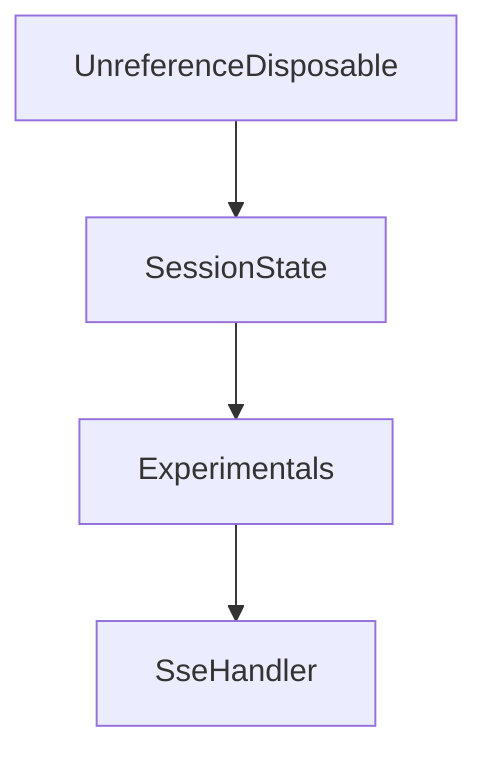

# Chapter 8: Testing, Operations, and Contribution Workflows

Welcome to **Chapter 8: Testing, Operations, and Contribution Workflows**. In this part of **MCP C# SDK Tutorial: Production MCP in .NET with Hosting, ASP.NET Core, and Task Workflows**, you will build an intuitive mental model first, then move into concrete implementation details and practical production tradeoffs.


This chapter closes with an operations model for sustained C# SDK usage.

## Learning Goals

- align test strategy with SDK and protocol risk surfaces
- run docs/build/test workflows expected by maintainers
- structure contributions for quick and accurate review
- operationalize incidents and improvement loops around MCP services

## Operations Baseline

- run full repository tests before upgrading package dependencies
- validate docs and sample paths that your teams rely on
- maintain service playbooks for auth, transport, and task workflows
- upstream reproducible bugs with minimal examples and protocol context

## Source References

- [Contributing Guide](https://github.com/modelcontextprotocol/csharp-sdk/blob/main/CONTRIBUTING.md)
- [Repository README](https://github.com/modelcontextprotocol/csharp-sdk/blob/main/README.md)
- [Docs Overview](https://github.com/modelcontextprotocol/csharp-sdk/blob/main/docs/index.md)

## Summary

You now have a practical operations and contribution framework for long-term C# MCP execution.

Next: Continue with [MCP Use Tutorial](../mcp-use-tutorial/)

## Source Code Walkthrough

### `src/ModelContextProtocol.AspNetCore/StreamableHttpSession.cs`

The `UnreferenceDisposable` class in [`src/ModelContextProtocol.AspNetCore/StreamableHttpSession.cs`](https://github.com/modelcontextprotocol/csharp-sdk/blob/HEAD/src/ModelContextProtocol.AspNetCore/StreamableHttpSession.cs) handles a key part of this chapter's functionality:

```cs
        }

        return new UnreferenceDisposable(this);
    }

    /// <summary>
    /// Ensures the session is registered with the session manager without acquiring a reference.
    /// No-ops if the session is already started.
    /// </summary>
    public async ValueTask EnsureStartedAsync(CancellationToken cancellationToken)
    {
        bool needsStart;
        lock (_stateLock)
        {
            needsStart = _state == SessionState.Uninitialized;
            if (needsStart)
            {
                _state = SessionState.Started;
            }
        }

        if (needsStart)
        {
            await sessionManager.StartNewSessionAsync(this, cancellationToken);

            // Session is registered with 0 references (idle), so reflect that in the idle count.
            sessionManager.IncrementIdleSessionCount();
        }
    }

    public bool TryStartGetRequest() => Interlocked.Exchange(ref _getRequestStarted, 1) == 0;
    public bool HasSameUserId(ClaimsPrincipal user) => userId == StreamableHttpHandler.GetUserIdClaim(user);
```

This class is important because it defines how MCP C# SDK Tutorial: Production MCP in .NET with Hosting, ASP.NET Core, and Task Workflows implements the patterns covered in this chapter.

### `src/ModelContextProtocol.AspNetCore/StreamableHttpSession.cs`

The `SessionState` interface in [`src/ModelContextProtocol.AspNetCore/StreamableHttpSession.cs`](https://github.com/modelcontextprotocol/csharp-sdk/blob/HEAD/src/ModelContextProtocol.AspNetCore/StreamableHttpSession.cs) handles a key part of this chapter's functionality:

```cs
{
    private int _referenceCount;
    private SessionState _state;
    private readonly object _stateLock = new();

    private int _getRequestStarted;
    private readonly CancellationTokenSource _disposeCts = new();

    public string Id => sessionId;
    public StreamableHttpServerTransport Transport => transport;
    public McpServer Server => server;
    private StatefulSessionManager SessionManager => sessionManager;

    public CancellationToken SessionClosed => _disposeCts.Token;
    public bool IsActive => !SessionClosed.IsCancellationRequested && _referenceCount > 0;
    public long LastActivityTicks { get; private set; } = sessionManager.TimeProvider.GetTimestamp();

    public Task ServerRunTask { get; set; } = Task.CompletedTask;

    public async ValueTask<IAsyncDisposable> AcquireReferenceAsync(CancellationToken cancellationToken)
    {
        // The StreamableHttpSession is not stored between requests in stateless mode. Instead, the session is recreated from the MCP-Session-Id.
        // Stateless sessions are 1:1 with HTTP requests and are outlived by the MCP session tracked by the Mcp-Session-Id.
        // Non-stateless sessions are 1:1 with the Mcp-Session-Id and outlive the POST request.
        // Non-stateless sessions get disposed by a DELETE request or the IdleTrackingBackgroundService.
        if (transport.Stateless)
        {
            return this;
        }

        SessionState startingState;

```

This interface is important because it defines how MCP C# SDK Tutorial: Production MCP in .NET with Hosting, ASP.NET Core, and Task Workflows implements the patterns covered in this chapter.

### `src/Common/Experimentals.cs`

The `Experimentals` class in [`src/Common/Experimentals.cs`](https://github.com/modelcontextprotocol/csharp-sdk/blob/HEAD/src/Common/Experimentals.cs) handles a key part of this chapter's functionality:

```cs
/// </para>
/// </remarks>
internal static class Experimentals
{
    /// <summary>
    /// Diagnostic ID for the experimental MCP Tasks feature.
    /// </summary>
    public const string Tasks_DiagnosticId = "MCPEXP001";

    /// <summary>
    /// Message for the experimental MCP Tasks feature.
    /// </summary>
    public const string Tasks_Message = "The Tasks feature is experimental per the MCP specification and is subject to change.";

    /// <summary>
    /// URL for the experimental MCP Tasks feature.
    /// </summary>
    public const string Tasks_Url = "https://github.com/modelcontextprotocol/csharp-sdk/blob/main/docs/list-of-diagnostics.md#mcpexp001";

    /// <summary>
    /// Diagnostic ID for the experimental MCP Extensions feature.
    /// </summary>
    /// <remarks>
    /// This uses the same diagnostic ID as <see cref="Tasks_DiagnosticId"/> because both
    /// Tasks and Extensions are covered by the same MCPEXP001 diagnostic for experimental
    /// MCP features. Having separate constants improves code clarity while maintaining a
    /// single diagnostic suppression point.
    /// </remarks>
    public const string Extensions_DiagnosticId = "MCPEXP001";

    /// <summary>
    /// Message for the experimental MCP Extensions feature.
```

This class is important because it defines how MCP C# SDK Tutorial: Production MCP in .NET with Hosting, ASP.NET Core, and Task Workflows implements the patterns covered in this chapter.

### `src/ModelContextProtocol.AspNetCore/SseHandler.cs`

The `SseHandler` class in [`src/ModelContextProtocol.AspNetCore/SseHandler.cs`](https://github.com/modelcontextprotocol/csharp-sdk/blob/HEAD/src/ModelContextProtocol.AspNetCore/SseHandler.cs) handles a key part of this chapter's functionality:

```cs
namespace ModelContextProtocol.AspNetCore;

internal sealed class SseHandler(
    IOptions<McpServerOptions> mcpServerOptionsSnapshot,
    IOptionsFactory<McpServerOptions> mcpServerOptionsFactory,
    IOptions<HttpServerTransportOptions> httpMcpServerOptions,
    IHostApplicationLifetime hostApplicationLifetime,
    ILoggerFactory loggerFactory)
{
    private readonly ConcurrentDictionary<string, SseSession> _sessions = new(StringComparer.Ordinal);

    public async Task HandleSseRequestAsync(HttpContext context)
    {
        var sessionId = StreamableHttpHandler.MakeNewSessionId();

        // If the server is shutting down, we need to cancel all SSE connections immediately without waiting for HostOptions.ShutdownTimeout
        // which defaults to 30 seconds.
        using var sseCts = CancellationTokenSource.CreateLinkedTokenSource(context.RequestAborted, hostApplicationLifetime.ApplicationStopping);
        var cancellationToken = sseCts.Token;

        StreamableHttpHandler.InitializeSseResponse(context);

        var requestPath = (context.Request.PathBase + context.Request.Path).ToString();
        var endpointPattern = requestPath[..(requestPath.LastIndexOf('/') + 1)];
        await using var transport = new SseResponseStreamTransport(context.Response.Body, $"{endpointPattern}message?sessionId={sessionId}", sessionId);

        var userIdClaim = StreamableHttpHandler.GetUserIdClaim(context.User);
        var sseSession = new SseSession(transport, userIdClaim);

        if (!_sessions.TryAdd(sessionId, sseSession))
        {
            throw new UnreachableException($"Unreachable given good entropy! Session with ID '{sessionId}' has already been created.");
```

This class is important because it defines how MCP C# SDK Tutorial: Production MCP in .NET with Hosting, ASP.NET Core, and Task Workflows implements the patterns covered in this chapter.


## How These Components Connect


